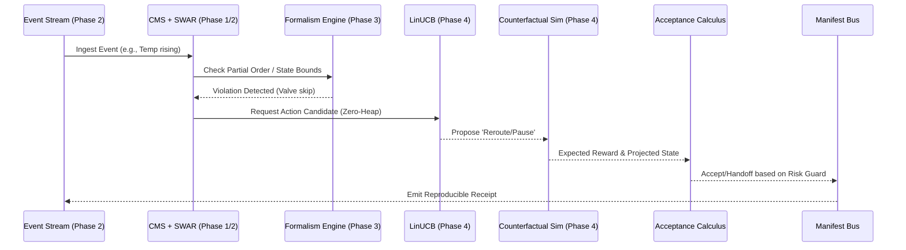

# dteam Vision 2030: Autonomic Enterprise Roadmap

## 1. Executive Summary
The `dteam` engine, currently optimized for bounded WASM and deterministic K-Tier execution, requires a structural evolution to handle petabyte-scale, messy enterprise event streams. This roadmap leverages the advanced algorithms from the `pictl` and `bcinr` research repositories to transition `dteam` from a fast academic tool into a hardware-accelerated, autonomic enterprise intelligence platform.

## 2. Phase 1: Hardware-Sympathetic Kernel (Q1 2027)
**Goal:** Saturate modern CPU and GPU architectures by eliminating branching and utilizing SIMD/SWAR instructions for petabyte-scale token replay and marking updates.

*   **SIMD & SWAR Integration**: Replace scalar bitset operations with vectorized equivalents.
    *   *Reference Files*: `/Users/sac/chatmangpt/bcinr/crates/bcinr-logic/src/simd.rs`, `/Users/sac/chatmangpt/bcinr/crates/bcinr-logic/src/swar.rs`, `/Users/sac/chatmangpt/pictl/wasm4pm/src/simd_token_replay.rs`
*   **GPU Offloading**: Utilize WebGPU bindings for massively parallel matrix operations (e.g., incidence matrix calculations, ILP constraints).
    *   *Reference Files*: `/Users/sac/chatmangpt/pictl/wasm4pm/src/gpu/wgpu_binding.rs`
*   **Constant Latency Loops**: Ensure WCET (Worst-Case Execution Time) guarantees for real-time edge processing.
    *   *Reference Files*: `/Users/sac/chatmangpt/pictl/wasm4pm/benches/constant_latency_loops.rs`

## 3. Phase 2: Infinite Stream Mining (Q3 2027)
**Goal:** Break free from static `.xes` batch processing. Enable real-time process discovery over unbounded event streams using probabilistic data structures.

*   **Streaming DFG & Heuristics**: Incrementally update process models without holding the entire log in memory.
    *   *Reference Files*: `/Users/sac/chatmangpt/pictl/wasm4pm/src/streaming/streaming_dfg.rs`, `/Users/sac/chatmangpt/pictl/wasm4pm/src/streaming/streaming_heuristic.rs`
*   **Probabilistic Bounding**: Use sketches to estimate footprint matrices and activity frequencies within the strict K-Tier memory limits.
    *   *Reference Files*: `/Users/sac/chatmangpt/pictl/wasm4pm/src/probabilistic/bloom.rs`, `/Users/sac/chatmangpt/pictl/wasm4pm/src/probabilistic/hyperloglog.rs`, `/Users/sac/chatmangpt/bcinr/crates/bcinr-logic/src/sketch.rs`

## 4. Phase 3: Advanced Formalisms (POWL) (Q1 2028)
**Goal:** Solve the "Spaghetti Process" problem. Move beyond strict Petri nets to Partially Ordered Workflow Models (POWL) to handle concurrency, complex choices, and unstructured enterprise reality without deadlocks.

*   **POWL Core & Discovery**: Implement the POWL data structures and discover them from event logs.
    *   *Reference Files*: `/Users/sac/chatmangpt/pictl/wasm4pm/src/powl_models.rs`, `/Users/sac/chatmangpt/pictl/wasm4pm/src/powl/discovery/mod.rs`
*   **POWL to Petri Net Conversion**: Maintain backward compatibility with the high-speed token replayer by compiling POWL back to WF-nets.
    *   *Reference Files*: `/Users/sac/chatmangpt/pictl/wasm4pm/src/powl/conversion/to_petri_net.rs`
*   **Genetic & ILP Metaheuristics**: For complex structural repairs when greedy RL fails.
    *   *Reference Files*: `/Users/sac/chatmangpt/pictl/wasm4pm/src/genetic_discovery.rs`, `/Users/sac/chatmangpt/pictl/wasm4pm/src/ilp_discovery.rs`

## 5. Phase 4: Predictive & Agentic Autonomy (Q3 2028)
**Goal:** Upgrade the RL agent from a reactive model-builder to a proactive, contextual AI that anticipates bottlenecks and simulates interventions.

*   **Contextual Bandits (LinUCB)**: Replace basic Q-Learning with contextual bandits that adapt to streaming drift.
    *   *Reference Files*: `/Users/sac/chatmangpt/pictl/wasm4pm/src/ml/linucb.rs`, `/Users/sac/chatmangpt/pictl/wasm4pm/src/prediction_drift.rs`
*   **Counterfactual Simulation**: Allow the "Digital Team" to simulate "what-if" scenarios (e.g., "If I reroute this invoice, what happens to throughput?") before executing an action.
    *   *Reference Files*: `/Users/sac/chatmangpt/pictl/wasm4pm/src/agentic/counterfactual.rs`, `/Users/sac/chatmangpt/pictl/wasm4pm/src/simulation.rs`
*   **Agentic Handoff & Escalation**: Formalize when the engine must defer to a human operator.
    *   *Reference Files*: `/Users/sac/chatmangpt/pictl/wasm4pm/src/agentic/handoff.rs`, `/Users/sac/chatmangpt/pictl/wasm4pm/src/agentic/escalation.rs`

## 6. Phase 5: Object-Centric Process Mining (OCPM) (Q1 2029)
**Goal:** Handle real-world 1:N and N:M object relationships (e.g., Sales Orders to Deliveries) natively, without flattening data.

*   **OCEL Ingestion & Flattening**: Read Object-Centric Event Logs.
    *   *Reference Files*: `/Users/sac/chatmangpt/pictl/wasm4pm/src/ocel_io.rs`, `/Users/sac/chatmangpt/pictl/wasm4pm/src/ocel_flatten.rs`
*   **Object-Centric Petri Nets**: Discover and replay over multi-object models.
    *   *Reference Files*: `/Users/sac/chatmangpt/pictl/wasm4pm/src/oc_petri_net.rs`, `/Users/sac/chatmangpt/pictl/wasm4pm/src/oc_conformance.rs`

## 7. Quality Assurance: Autonomic Acceptance Suite (dteam-jtbd-suite)
**Goal:** Verify that all hyper-optimized algorithms (SWAR, CMS, LinUCB, Simulator, OCPM) combine successfully into a coherent "Digital Team" closure. We move beyond isolated micro-benches to combinatorial end-to-end Jobs-To-Be-Done (JTBD) scenarios.

### 7.1. Suite Architecture & Execution Flow
The following sequence demonstrates how the 5 phases interoperate during a live operational event (e.g., Scenario 1: Offshore Maintenance Drift):

### 7.2. Feature Interaction Matrix
The suite validates combinatorial interactions across 16 critical scenarios.

### 7.3. Definition of Done (DoD)
I must personally validate these criteria before reporting "done":
1. **Zero-Heap Verification**: No allocations (`vec!`, `Box`, `HashMap::insert`) occur inside the operational `observe`, `propose`, `accept`, or `update` loops during steady-state.
2. **Branchless Purity**: Performance benchmarks must show 1-15ns latency for state updates and `<2µs` for bandit selections.
3. **Scenario Implementation**: All 16 JTBD scenarios exist and explicitly run through the `Vision2030Kernel`.
4. **Test Pass**: `cargo test jtbd_tests` executes and passes cleanly.
5. **System Health**: `make doctor` returns NOMINAL with no structural warnings.
