Below is a complete **Mermaid diagram pack** for the INSA security/board monetization pitch. It synthesizes the INSA byte-law, TCPS/vibe-done, and v0.4 layout/admission doctrine.   

---

# 1. Board-Level Challenger Pitch

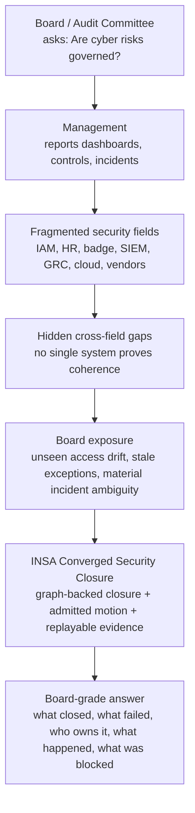

---

# 2. Current Enterprise Fragmentation

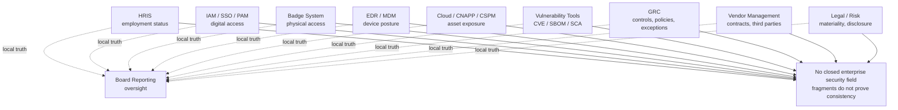

---

# 3. INSA Security Closure Layer

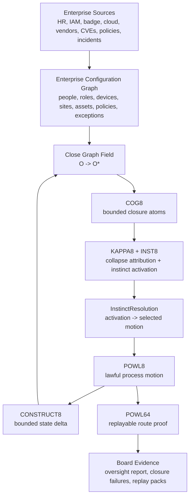

---

# 4. Enterprise Configuration Graph

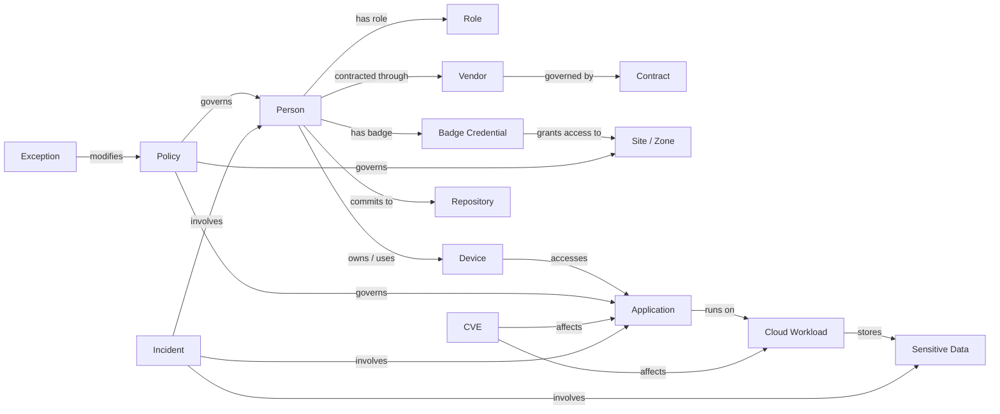

---

# 5. Cross-Field Risk Overlap

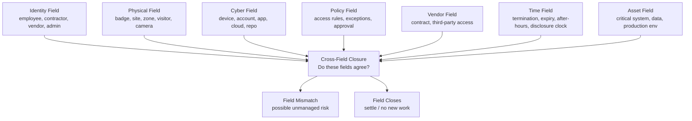

---

# 6. Access Drift Closure

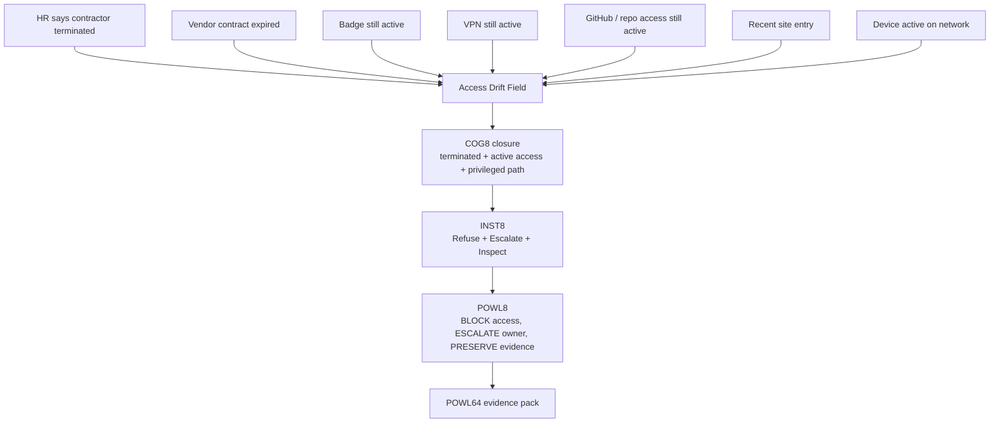

---

# 7. Badge Policy Contradiction

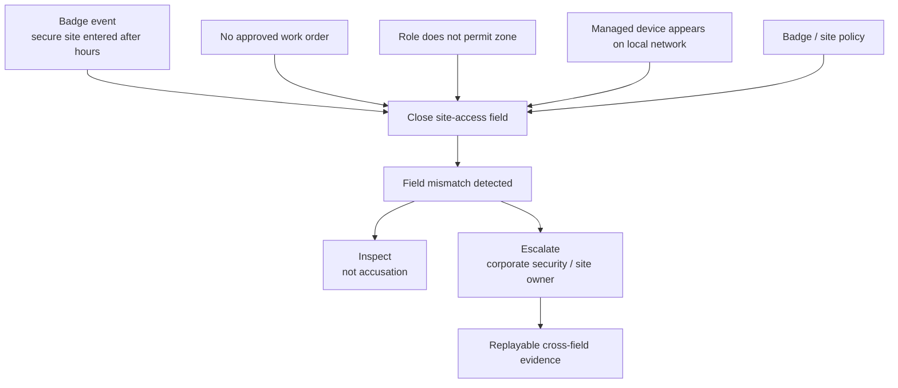

---

# 8. Critical CVE Release Gate

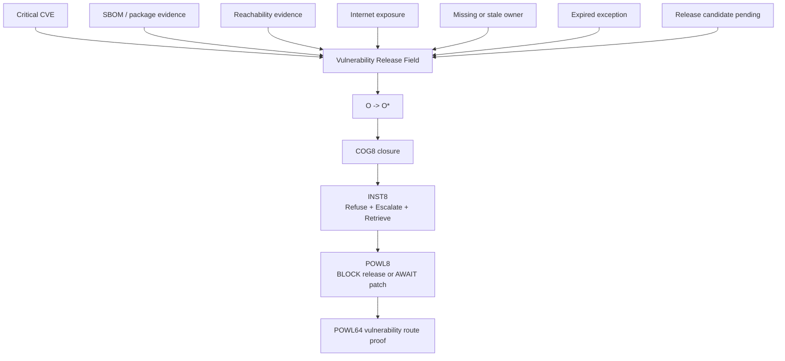

---

# 9. Material Incident Clock

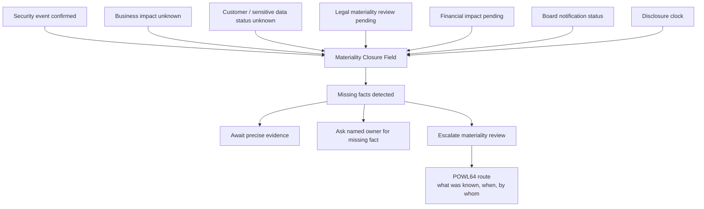

---

# 10. Board-Ready Security Closure Report

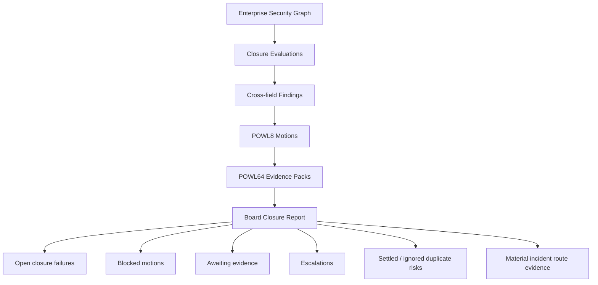

---

# 11. Security Product C4 Context

```mermaid
flowchart TD
    Board["Board / Audit Committee"]
    CISO["CISO / CSO"]
    GC["General Counsel"]
    Audit["Internal Audit"]
    HR["HR / People Ops"]
    Facilities["Physical Security / Facilities"]
    IT["IT / IAM / Platform"]
    INSA["INSA Converged Security Closure"]

    HRIS["HRIS"]
    IAM["IAM / SSO / PAM"]
    Badge["Badge / Visitor Systems"]
    SIEM["SIEM / EDR / Logs"]
    Cloud["Cloud / Asset Inventory"]
    GRC["GRC / Policy / Exceptions"]
    Vendor["Vendor Management"]
    Vuln["Vulnerability / SBOM Tools"]

    Board --> INSA
    CISO --> INSA
    GC --> INSA
    Audit --> INSA
    HR --> INSA
    Facilities --> INSA
    IT --> INSA

    HRIS --> INSA
    IAM --> INSA
    Badge --> INSA
    SIEM --> INSA
    Cloud --> INSA
    GRC --> INSA
    Vendor --> INSA
    Vuln --> INSA
```

---

# 12. Security Product Container Architecture

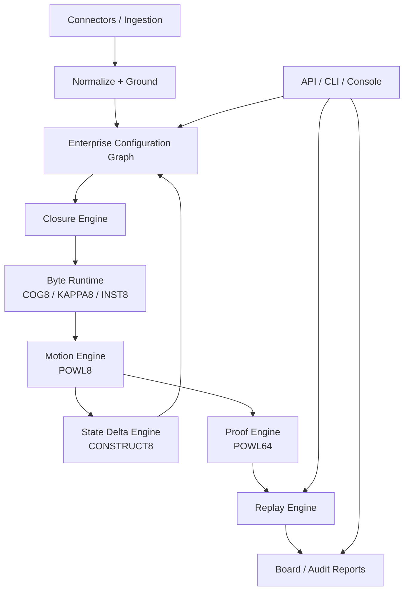

---

# 13. Runtime Component Diagram

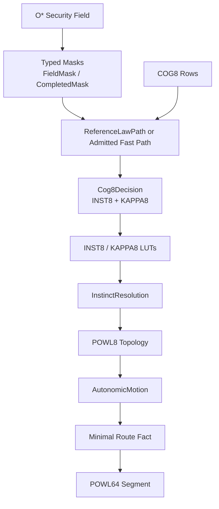

---

# 14. Byte-Level Hot Path

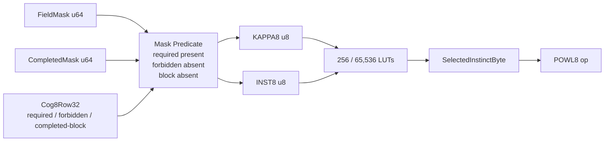

---

# 15. INST8 Security Instincts

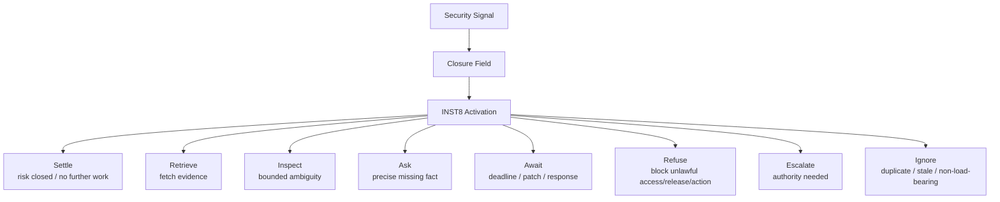

---

# 16. KAPPA8 Security Collapse

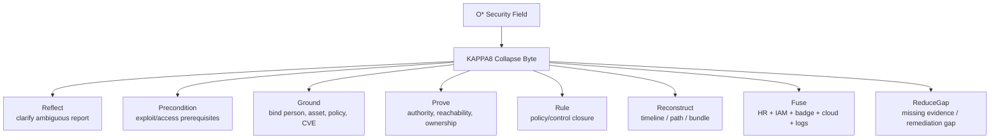

---

# 17. POWL8 Security Motion

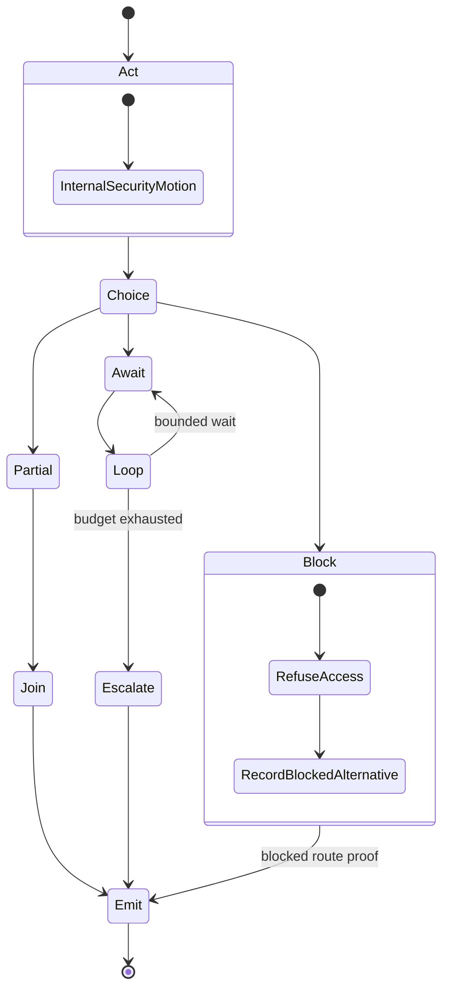

---

# 18. Need9 Decomposition in Security Closure

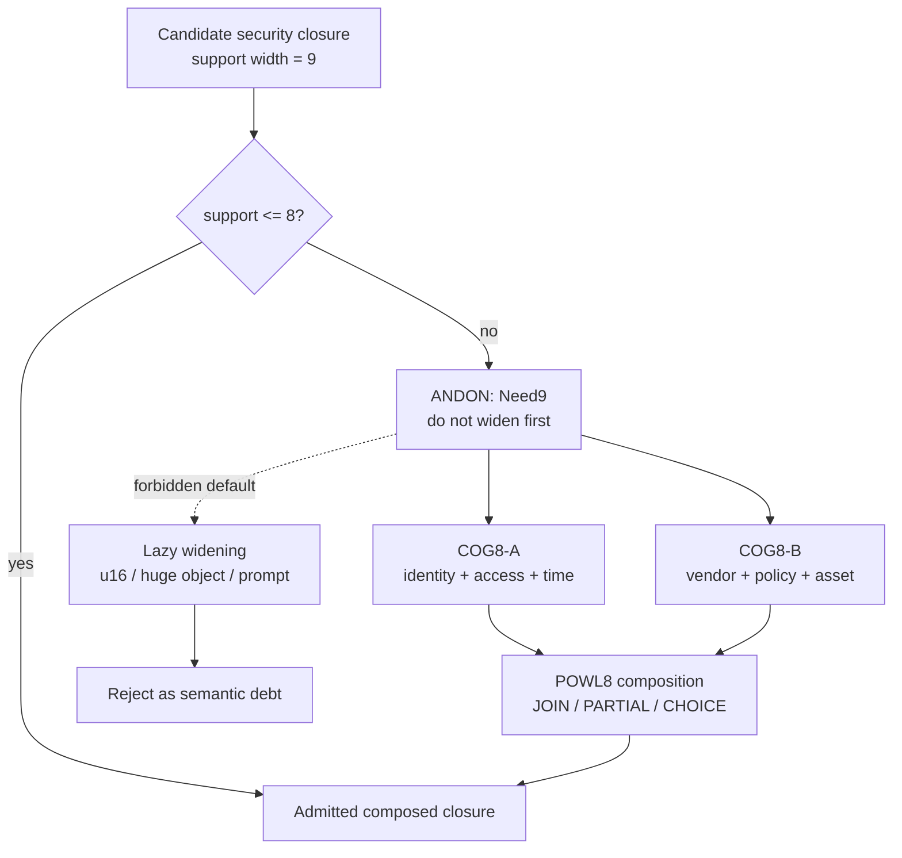

---

# 19. Hot / Warm / Cold Security Boundary

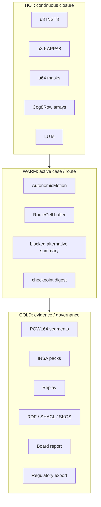

---

# 20. Reference Law vs Admitted Fast Paths

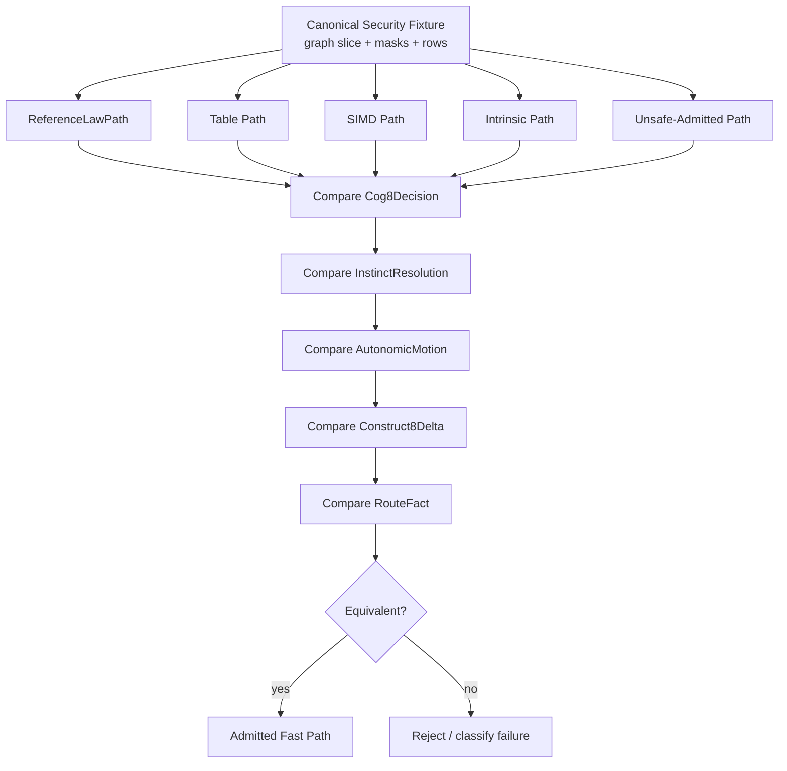

---

# 21. v0.4 Evidence Authority Separation

```mermaid
flowchart TD
    Law["ReferenceLawPath<br/>defines semantics"]
    Layout["AdmittedLayout<br/>defines machine shape"]
    Wire["WireV1<br/>defines canonical bytes"]
    Golden["Golden Fixtures<br/>define byte stability"]
    Target["Target Contract<br/>defines where path is valid"]
    Truthforge["Truthforge<br/>defines admission"]
    Deadmit["De-admission<br/>evidence can expire"]

    Law --> Truthforge
    Layout --> Truthforge
    Wire --> Truthforge
    Golden --> Truthforge
    Target --> Truthforge
    Truthforge --> Admit["Admitted Control Edge"]
    Admit --> Deadmit
    Deadmit --> Candidate["Candidate again"]
```

---

# 22. POWL64 Security Evidence Pack

```mermaid
flowchart TD
    Route["Security Route"]
    Cell["RouteCell<br/>ordinal, node, edge, op, INST8, KAPPA8"]
    Block["BlockedAlternative<br/>what did not happen and why"]
    Check["Checkpoint<br/>input/output field state"]
    Digest["Digest Chain<br/>config, policy, dictionary, segment"]
    Replay["Replay Verdict"]
    Pack["INSA Security Evidence Pack"]
    Board["Board / Audit / Legal Evidence"]

    Route --> Cell
    Route --> Block
    Route --> Check
    Cell --> Digest
    Block --> Digest
    Check --> Digest
    Digest --> Replay
    Replay --> Pack
    Pack --> Board
```

---

# 23. Canonical Wire Encoding Gate

```mermaid
flowchart TD
    InMemory["AdmittedLayout<br/>repr(C), aligned, target-shaped"]
    Encoder["Explicit Encoder<br/>little-endian WireV1"]
    Bytes["Canonical Bytes"]
    Decoder["Explicit Decoder<br/>reject invalid discriminants"]
    Golden["Golden Fixture"]
    Cross["Cross-platform Test<br/>x86_64, aarch64, wasm optional"]
    Admit["Wire Encoding Admitted"]

    InMemory --> Encoder
    Encoder --> Bytes
    Bytes --> Decoder
    Bytes --> Golden
    Golden --> Cross
    Decoder --> Cross
    Cross --> Admit

    Bad["Raw transmute"]
    InMemory -. forbidden .-> Bad
    Bad -. reject .-> Encoder
```

---

# 24. Little’s Law for Fortune 500 Security

```mermaid
flowchart LR
    Events["Enterprise event arrival rate<br/>lambda"]
    Time["Closure time<br/>W"]
    WIP["Unresolved risk / work-in-process<br/>L = lambda * W"]

    Slow["Slow analysis / LLM / manual review<br/>W high"]
    More["More generated alerts and tickets<br/>lambda high"]
    Explosion["Risk WIP explodes"]

    Fast["Byte-speed closure<br/>W collapses"]
    Suppress["No-at-scale<br/>wrong work birth suppressed"]
    Control["Managed security field"]

    Events --> WIP
    Time --> WIP

    Events --> Slow --> Explosion
    Events --> More --> Explosion

    Events --> Fast --> Control
    Fast --> Suppress --> Control
```

---

# 25. Ashby’s Law in Security Closure

```mermaid
flowchart TD
    Variety["Enterprise disturbance variety<br/>people, vendors, devices, sites, CVEs, policies, incidents"]
    Attenuate["Attenuate<br/>O -> O*"]
    COG8["COG8<br/>local closure <= 8 fields"]
    KAPPA8["KAPPA8<br/>collapse variety"]
    INST8["INST8<br/>response variety"]
    POWL8["POWL8<br/>composed motion"]
    Projection["Projection<br/>higher-variety regulator if local closure insufficient"]
    Proof["POWL64 + Replay<br/>feedback and improvement"]

    Variety --> Attenuate
    Attenuate --> COG8
    COG8 --> KAPPA8
    COG8 --> INST8
    KAPPA8 --> POWL8
    INST8 --> POWL8
    POWL8 --> Projection
    POWL8 --> Proof
    Proof --> COG8
```

---

# 26. Context Window vs Closed Security Field

```mermaid
flowchart TD
    World["Enterprise reality<br/>full security configuration"]
    Context["LLM Context Window<br/>selected token slice"]
    Latent["Latent Reasoning<br/>possible inference"]
    Output["Generated answer<br/>plausible analysis"]

    Graph["Enterprise Configuration Graph"]
    OStar["O* Closed Security Field"]
    INSA["INSA Closure Runtime"]
    Action["Admitted action + proof"]

    World --> Context --> Latent --> Output
    World --> Graph --> OStar --> INSA --> Action

    Output -. must be validated .-> OStar
```

---

# 27. OpenMythos / LLM vs INSA Security Closure

```mermaid
flowchart LR
    O["Observation O"]
    LLM["LLM / OpenMythos<br/>latent recurrent reasoning"]
    Text["Generated hypothesis / explanation"]

    Close["Close O -> O*"]
    INSA["INSA<br/>COG8 + KAPPA8 + INST8 + POWL8"]
    Proof["POWL64 Evidence"]

    O --> LLM --> Text
    Text --> Close
    O --> Close
    Close --> INSA --> Proof

    LLM -. proposes .-> Close
    INSA -. admits .-> Proof
```

---

# 28. Sales Motion: 90-Day Access Drift Closure Assessment

```mermaid
flowchart TD
    Prospect["Fortune 500 Board / CISO / GC"]
    Offer["90-Day Access Drift Closure Assessment"]
    Connect["Connect sources<br/>HRIS, IAM, badge, MDM, cloud, vendor, policy"]
    Graph["Build security graph"]
    Close["Run closure checks"]
    Findings["Top closure failures"]
    Evidence["Evidence pack prototype"]
    BoardReport["Board-ready closure report"]
    Expansion["Platform expansion<br/>sites, CVEs, incidents, vendors, materiality"]

    Prospect --> Offer
    Offer --> Connect
    Connect --> Graph
    Graph --> Close
    Close --> Findings
    Findings --> Evidence
    Evidence --> BoardReport
    BoardReport --> Expansion
```

---

# 29. Monetization Stack

```mermaid
flowchart TD
    Dam["Blue River Dam<br/>O* + closure + admitted motion"]
    Security["Security Closure Product"]
    Access["Access Drift Module"]
    CVE["CVE / Release Gate Module"]
    Incident["Material Incident Module"]
    Vendor["Vendor Risk Module"]
    Board["Board Evidence Module"]
    Pack["Evidence Packs<br/>POWL64 / INSA Pack"]
    Services["90-Day Assessments / Integrations"]
    Platform["Enterprise Platform License"]

    Dam --> Security
    Security --> Access
    Security --> CVE
    Security --> Incident
    Security --> Vendor
    Security --> Board
    Access --> Pack
    CVE --> Pack
    Incident --> Pack
    Vendor --> Pack
    Board --> Pack
    Pack --> Platform
    Services --> Platform
```

---

# 30. Board Director “Immediate Understanding” Diagram

```mermaid
flowchart TD
    Q["Board Question:<br/>Are we actually secure across the enterprise?"]
    A1["Current answer:<br/>We have many tools and reports"]
    Problem["Problem:<br/>tools do not prove cross-field consistency"]

    Example["Example:<br/>terminated contractor still has badge, VPN, repo, vendor access"]
    Meaning["Meaning:<br/>each system may be locally correct<br/>but enterprise field is globally unsafe"]

    INSA["INSA answer:<br/>close the graph field, select lawful motion, preserve evidence"]
    Pay["Why pay:<br/>reduced hidden risk + proof of oversight"]

    Q --> A1
    A1 --> Problem
    Problem --> Example
    Example --> Meaning
    Meaning --> INSA
    INSA --> Pay
```

---

# 31. “Security Tools See Events” Positioning

```mermaid
flowchart LR
    SIEM["SIEM<br/>events"]
    GRC["GRC<br/>controls"]
    IAM["IAM<br/>access"]
    Badge["Badge<br/>physical entry"]
    Vuln["Vulnerability Tools<br/>CVEs"]
    Graph["Graph DB<br/>relationships"]
    INSA["INSA<br/>closure + lawful motion + evidence"]

    SIEM --> Fragment["Fragments"]
    GRC --> Fragment
    IAM --> Fragment
    Badge --> Fragment
    Vuln --> Fragment
    Graph --> Relationships["Relationships"]

    Fragment --> INSA
    Relationships --> INSA
    INSA --> Closure["Proves whether enterprise security field closes"]
```

---

# 32. Final Architecture Spine

```mermaid
flowchart TD
    O["O<br/>raw enterprise observation"]
    Graph["Configuration Graph"]
    OStar["O*<br/>closed security field"]
    COG8["COG8<br/>bounded closure"]
    KAPPA8["KAPPA8<br/>why closure happened"]
    INST8["INST8<br/>what instinct is alive"]
    Resolve["InstinctResolution<br/>activation -> selected"]
    POWL8["POWL8<br/>lawful motion"]
    Construct["CONSTRUCT8<br/>bounded reentry"]
    POWL64["POWL64<br/>proof spine"]
    Replay["Replay<br/>route was not a lie"]
    Board["Board-grade evidence"]

    O --> Graph
    Graph --> OStar
    OStar --> COG8
    COG8 --> KAPPA8
    COG8 --> INST8
    KAPPA8 --> Resolve
    INST8 --> Resolve
    Resolve --> POWL8
    POWL8 --> Construct
    Construct --> Graph
    POWL8 --> POWL64
    POWL64 --> Replay
    Replay --> Board
```

---

# 33. One-Line Pitch Diagram

```mermaid
flowchart LR
    Tools["Security tools<br/>see fragments"]
    Graph["Graph<br/>sees relationships"]
    INSA["INSA<br/>proves closure"]
    Board["Board<br/>gets evidence of oversight"]

    Tools --> Graph --> INSA --> Board
```