Below is the **code-architecture Mermaid pack** using the **Access Drift Closure** case study as the end-to-end JTBD test.

Case study:

```text
Terminated contractor still has active badge, VPN, repo access, vendor relationship, and recent site/device activity.
```

Target JTBD:

```text
When cross-field access drift appears across HR, vendor, badge, IAM, repo, device, and site fields,
the system must close the field, select lawful motion, block/refuse/escalate as needed,
produce a POWL64 evidence route, and replay the decision deterministically.
```

This uses the current INSA doctrine: byte-shaped hot path, `COG8 → KAPPA8/INST8 → POWL8 → CONSTRUCT8 → POWL64`, ReferenceLawPath equivalence, WireV1 canonical encoding, golden fixtures, and Truthforge admission.   

---

# 1. Workspace / Repo Architecture

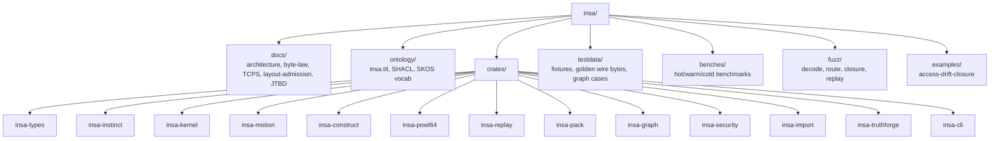

---

# 2. Crate Dependency DAG

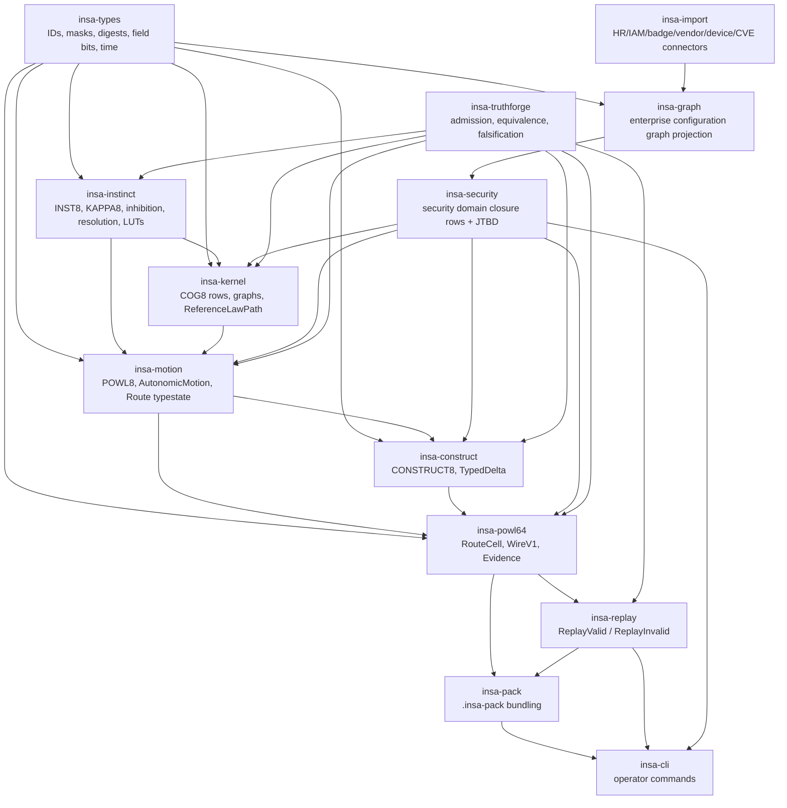

---

# 3. Security Case Study Package Layout

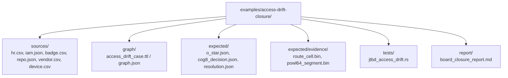

---

# 4. C4 Context: Code System Boundary

```mermaid
flowchart TD
    Board["Board / Audit Committee"]
    CISO["CISO / CSO"]
    SecurityOps["Security Operations"]
    HR["HR / People Ops"]
    Physical["Physical Security"]
    IAMTeam["IAM / Platform"]
    VendorRisk["Vendor Risk"]

    System["INSA Security Closure Runtime"]

    HRIS["HRIS"]
    IAM["IAM / SSO / PAM"]
    Badge["Badge System"]
    Repo["GitHub / GitLab"]
    MDM["MDM / EDR"]
    Vendor["Vendor Management"]
    GRC["GRC / Policy Exceptions"]

    Board --> System
    CISO --> System
    SecurityOps --> System
    HR --> System
    Physical --> System
    IAMTeam --> System
    VendorRisk --> System

    HRIS --> System
    IAM --> System
    Badge --> System
    Repo --> System
    MDM --> System
    Vendor --> System
    GRC --> System
```

---

# 5. C4 Container: Runtime Containers

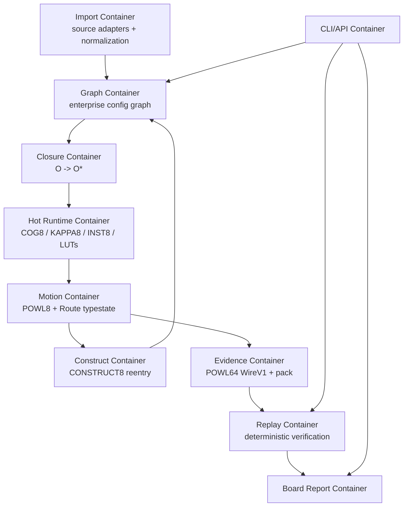

---

# 6. Component Diagram: `insa-security`

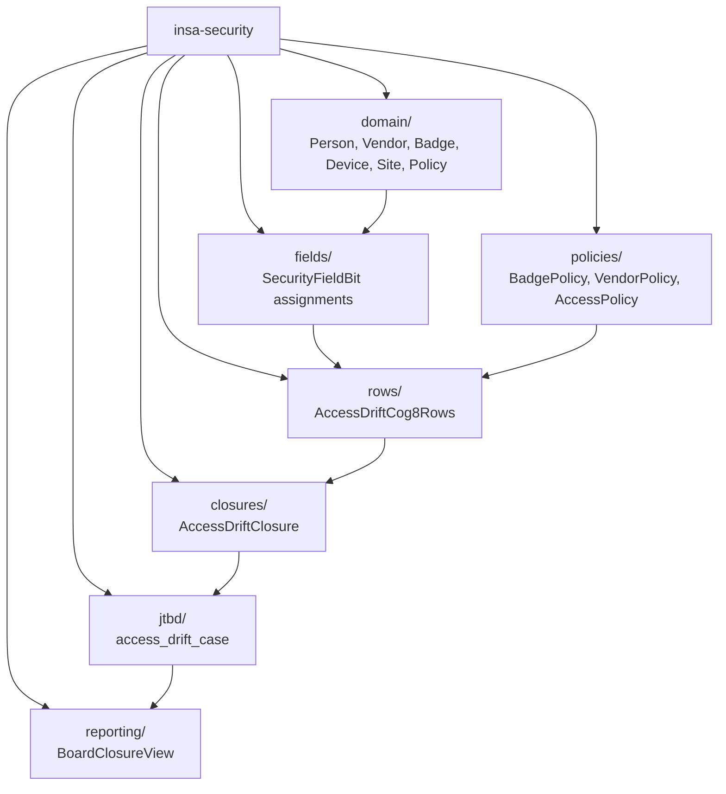

---

# 7. Access Drift Domain Graph to O*

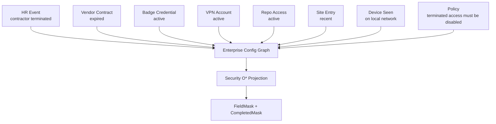

---

# 8. FieldBit Assignment for Access Drift

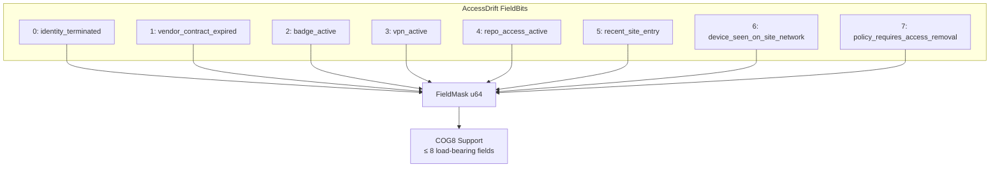

---

# 9. COG8 Row Set for Access Drift

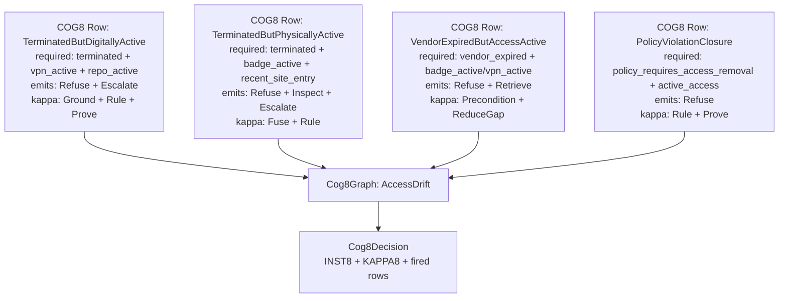

---

# 10. Hot Path Execution: Access Drift

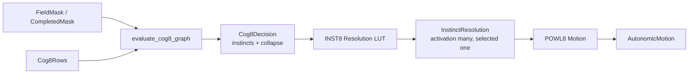

---

# 11. Access Drift INST8 Resolution

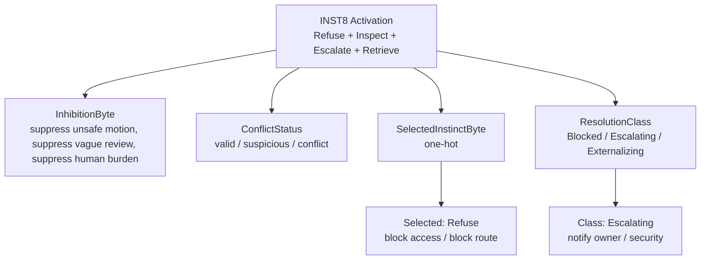

---

# 12. POWL8 Motion for Access Drift

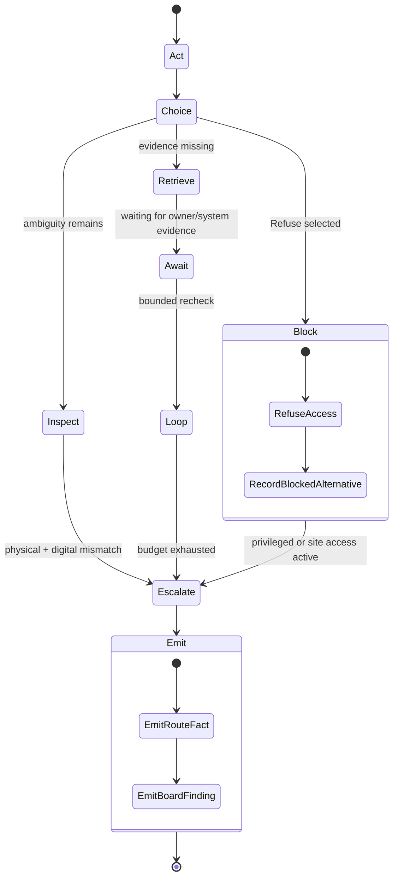

---

# 13. CONSTRUCT8 Reentry for Remediation

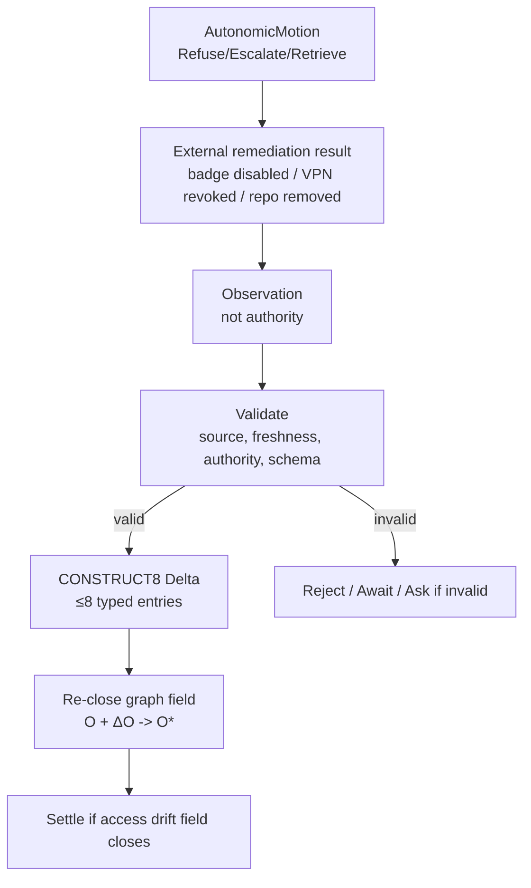

---

# 14. POWL64 Evidence Route

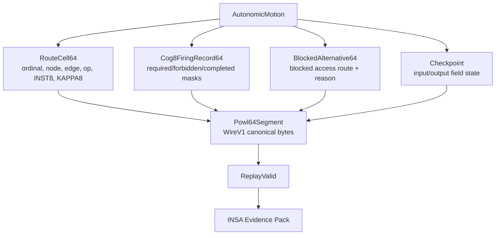

---

# 15. WireV1 Encoding Boundary

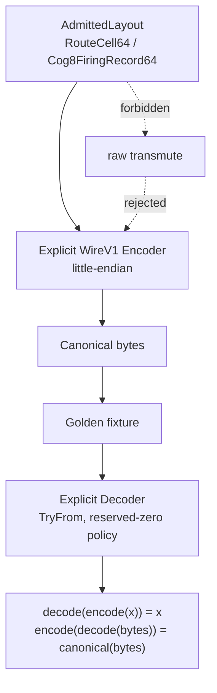

WireV1 must remain platform-independent, while admitted layouts may be target-specific; the v0.4 doctrine also requires golden byte fixtures and cross-platform encoding gates. 

---

# 16. JTBD Test Architecture

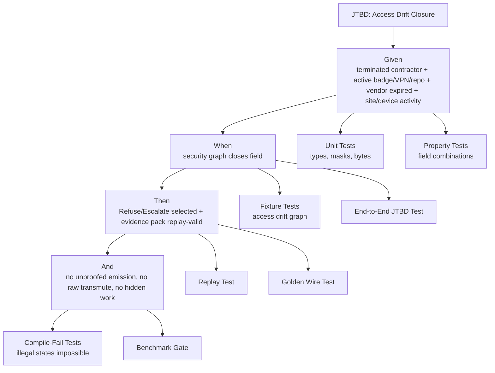

---

# 17. End-to-End JTBD Test Flow

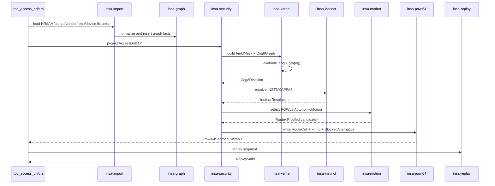

---

# 18. JTBD Acceptance Criteria

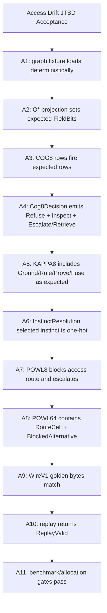

---

# 19. Truthforge Admission Gate for Case Study

```mermaid
flowchart LR
    Design["Design Intent<br/>Access drift must not become hidden risk"]
    Type["Type Law<br/>FieldBit, masks, SelectedInstinctByte"]
    Reference["ReferenceLawPath<br/>clear closure implementation"]
    Fast["Candidate Fast Path<br/>tables/SIMD/intrinsics if admitted"]
    Tests["Truthforge<br/>unit, prop, compile-fail, fuzz, replay"]
    Wire["WireV1 Golden Fixtures"]
    Bench["Benchmark Evidence<br/>allocs/op, ns/closure, route cells/sec"]
    Review["Adversarial Review<br/>false settle/refuse/escalate"]
    Admit["Admitted JTBD"]

    Design --> Type --> Reference --> Fast --> Tests --> Wire --> Bench --> Review --> Admit
```

---

# 20. False-Positive / False-Negative Security Tests

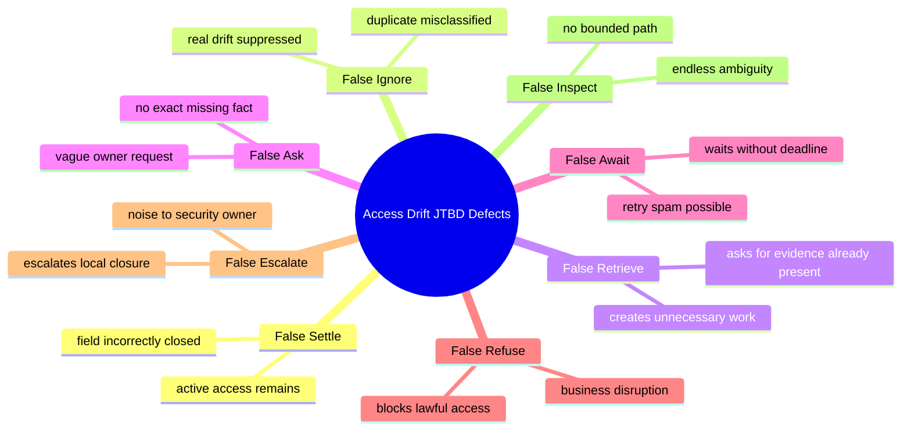

No-at-scale tests are required early because INSA is a scaled inhibition system, not only a mask executor. 

---

# 21. ReferenceLawPath vs Candidate Fast Path

```mermaid
flowchart TD
    Fixture["Canonical Access Drift Fixture"]
    Ref["ReferenceLawPath"]
    Table["Table Path<br/>256 / 65,536 LUTs"]
    Simd["SIMD Path"]
    Intrinsic["Intrinsic Path"]
    Unsafe["Unsafe-Admitted Path"]

    RefOut["Reference Outputs<br/>Cog8Decision, Resolution, Motion, RouteFact"]
    FastOut["Candidate Outputs"]

    Compare["Equivalence Compare"]
    Verdict{"Equivalent?"}
    Admit["Admit candidate path"]
    Reject["Reject / classify failure"]

    Fixture --> Ref --> RefOut
    Fixture --> Table --> FastOut
    Fixture --> Simd --> FastOut
    Fixture --> Intrinsic --> FastOut
    Fixture --> Unsafe --> FastOut

    RefOut --> Compare
    FastOut --> Compare
    Compare --> Verdict
    Verdict -- yes --> Admit
    Verdict -- no --> Reject
```

The byte-law documentation makes LUTs central because `INST8` is a `u8` activation surface with 256 possible states, and `(KAPPA8, INST8)` gives 65,536 bounded signatures. 

---

# 22. Fixture-to-Golden Traceability

```mermaid
flowchart TD
    Fixture["testdata/cases/access_drift/input/*"]
    ExpectedGraph["expected/graph_snapshot.json"]
    ExpectedOStar["expected/o_star_access_drift.json"]
    ExpectedDecision["expected/cog8_decision.json"]
    ExpectedResolution["expected/instinct_resolution.json"]
    ExpectedMotion["expected/autonomic_motion.json"]
    ExpectedWire["golden/wire/route_cell_v1_le.bin"]
    ExpectedReplay["expected/replay_valid.json"]

    Fixture --> ExpectedGraph
    ExpectedGraph --> ExpectedOStar
    ExpectedOStar --> ExpectedDecision
    ExpectedDecision --> ExpectedResolution
    ExpectedResolution --> ExpectedMotion
    ExpectedMotion --> ExpectedWire
    ExpectedWire --> ExpectedReplay
```

---

# 23. Testdata Directory Architecture

```mermaid
flowchart TD
    Testdata["testdata/"]

    Cases["cases/"]
    Golden["golden/"]
    Mutants["mutants/"]
    FuzzSeeds["fuzz-seeds/"]
    BenchInputs["bench-inputs/"]

    Access["cases/access_drift/"]
    Inputs["input/<br/>hr, iam, badge, repo, vendor, device"]
    Expected["expected/<br/>o_star, decision, resolution, motion, replay"]
    Negative["negative/<br/>false_settle, false_ignore, false_refuse"]

    Wire["golden/wire/<br/>route_cell_v1_le.bin, powl64_header_v1_le.bin"]
    Graphs["golden/graph/<br/>access_drift_closure.ttl"]

    Testdata --> Cases
    Testdata --> Golden
    Testdata --> Mutants
    Testdata --> FuzzSeeds
    Testdata --> BenchInputs

    Cases --> Access
    Access --> Inputs
    Access --> Expected
    Access --> Negative

    Golden --> Wire
    Golden --> Graphs
```

---

# 24. Compile-Fail Architecture

```mermaid
flowchart TD
    CompileFail["trybuild compile-fail tests"]

    CF1["selected_instinct_multiple_bits.rs<br/>must fail"]
    CF2["emit_unproofed_route.rs<br/>must fail"]
    CF3["construct8_nine_entries.rs<br/>must fail"]
    CF4["fieldbit_out_of_range.rs<br/>must fail"]
    CF5["raw_u64_required_mask.rs<br/>must fail"]
    CF6["wire_transmute.rs<br/>must fail"]

    CompileFail --> CF1
    CompileFail --> CF2
    CompileFail --> CF3
    CompileFail --> CF4
    CompileFail --> CF5
    CompileFail --> CF6
```

---

# 25. Route Typestate in Code

```mermaid
stateDiagram-v2
    [*] --> Unproofed
    Unproofed --> Proofed: prove_route()
    Proofed --> Emitted: emit()

    Unproofed --> Rejected: invalid topology / missing reason / replay gap
    Proofed --> Rejected: wire encoding failure / digest failure

    note right of Unproofed
      Route<Unproofed>
      cannot emit
    end note

    note right of Proofed
      Route<Proofed>
      can emit route fact
    end note
```

---

# 26. Hot / Warm / Cold Code Paths

```mermaid
flowchart TD
    subgraph Hot["HOT crates / modules"]
        T["insa-types"]
        I["insa-instinct"]
        K["insa-kernel"]
        Tables["kernel/tables"]
    end

    subgraph Warm["WARM crates / modules"]
        M["insa-motion"]
        C["insa-construct"]
        P["insa-powl64 segment builder"]
    end

    subgraph Cold["COLD crates / modules"]
        R["insa-replay"]
        Pack["insa-pack"]
        RDF["ontology export / SHACL"]
        Reports["board reports"]
    end

    Hot --> Warm
    Warm --> Cold
```

Proof and explanation witness the hot path; they do not govern it. 

---

# 27. Benchmark Architecture for JTBD

```mermaid
flowchart TD
    Bench["benches/access_drift.rs"]

    B1["ns/cog8_row"]
    B2["ns/cog8_decision"]
    B3["ns/instinct_resolution"]
    B4["ns/powl8_motion"]
    B5["ns/route_cell_write"]
    B6["ms/powl64_replay"]
    B7["allocs/op = 0 for hot path"]
    B8["cross-profile equivalence"]

    Bench --> B1
    Bench --> B2
    Bench --> B3
    Bench --> B4
    Bench --> B5
    Bench --> B6
    Bench --> B7
    Bench --> B8
```

---

# 28. CI Admission Pipeline

```mermaid
flowchart LR
    Fmt["fmt"]
    Lint["clippy / deny"]
    Unit["unit tests"]
    Trybuild["compile-fail"]
    Prop["proptest"]
    Fuzz["fuzz smoke"]
    Golden["golden wire tests"]
    Replay["replay tests"]
    Bench["benchmark evidence"]
    Audit["layout/offset gates"]
    Admit["admitted release artifact"]

    Fmt --> Lint --> Unit --> Trybuild --> Prop --> Fuzz --> Golden --> Replay --> Bench --> Audit --> Admit
```

---

# 29. Failure Classification Pipeline

```mermaid
flowchart TD
    Failure["Test / replay / benchmark failure"]

    Semantic["Semantic failure<br/>wrong decision, wrong instinct"]
    Layout["Layout failure<br/>size/align/offset mismatch"]
    Encoding["Encoding failure<br/>golden bytes mismatch"]
    Replay["Replay failure<br/>route not valid"]
    Target["Target contract failure<br/>unsupported CPU / flags"]
    Benchmark["Benchmark failure<br/>allocs/op, regression"]
    Ontology["Ontology failure<br/>missing mapping / SHACL violation"]

    Failure --> Semantic
    Failure --> Layout
    Failure --> Encoding
    Failure --> Replay
    Failure --> Target
    Failure --> Benchmark
    Failure --> Ontology

    Semantic --> Andon["ANDON: stop line"]
    Layout --> Andon
    Encoding --> Andon
    Replay --> Andon
    Target --> Andon
    Benchmark --> Andon
    Ontology --> Andon
```

TCPS frames “done” as implemented, proven, replayable, and explainable, with evidence beating status and defects stopping the line. 

---

# 30. End-to-End Code Spine

```mermaid
flowchart TD
    Import["insa-import<br/>load source observations"]
    Graph["insa-graph<br/>build enterprise graph"]
    Security["insa-security<br/>project access-drift O*"]
    Kernel["insa-kernel<br/>COG8 closure"]
    Instinct["insa-instinct<br/>KAPPA8/INST8 resolution"]
    Motion["insa-motion<br/>POWL8 route"]
    Construct["insa-construct<br/>bounded reentry"]
    Powl64["insa-powl64<br/>route evidence"]
    Replay["insa-replay<br/>verify route"]
    Pack["insa-pack<br/>bundle evidence"]
    Cli["insa-cli<br/>board/security report"]

    Import --> Graph --> Security --> Kernel --> Instinct --> Motion
    Motion --> Construct --> Graph
    Motion --> Powl64 --> Replay --> Pack --> Cli
```

---

# 31. The Exact JTBD “Done” Definition

```mermaid
flowchart TD
    Done["JTBD Done"]

    D1["Field closed or explicitly not closed"]
    D2["COG8 decision deterministic"]
    D3["INST8 activation many allowed"]
    D4["Selected instinct one-hot"]
    D5["POWL8 route lawful"]
    D6["CONSTRUCT8 delta bounded"]
    D7["POWL64 evidence written"]
    D8["WireV1 canonical bytes stable"]
    D9["ReplayValid"]
    D10["Board report generated from evidence, not prose"]

    Done --> D1
    Done --> D2
    Done --> D3
    Done --> D4
    Done --> D5
    Done --> D6
    Done --> D7
    Done --> D8
    Done --> D9
    Done --> D10
```

---

# 32. Minimal First Implementation Cut

```mermaid
flowchart TD
    M0["Milestone 0: Access Drift JTBD"]

    Types["insa-types<br/>FieldBit, FieldMask, IDs"]
    Instinct["insa-instinct<br/>INST8/KAPPA8/SelectedInstinctByte/LUT"]
    Kernel["insa-kernel<br/>Cog8Row32, Cog8Graph, ReferenceLawPath"]
    Security["insa-security<br/>access drift rows and fixtures"]
    Powl64["insa-powl64<br/>RouteCell WireV1 + golden"]
    Replay["insa-replay<br/>ReplayValid for one segment"]
    Truth["insa-truthforge<br/>E2E JTBD gate"]

    M0 --> Types
    Types --> Instinct
    Instinct --> Kernel
    Kernel --> Security
    Security --> Powl64
    Powl64 --> Replay
    Replay --> Truth
```

---

# 33. Final Case Study Architecture Spine

```mermaid
flowchart TD
    O["Raw observations<br/>HR, IAM, badge, repo, vendor, device"]
    G["Enterprise graph"]
    OStar["AccessDrift O*"]
    COG8["COG8 rows fire"]
    KAPPA8["KAPPA8<br/>Ground + Rule + Prove + Fuse"]
    INST8["INST8<br/>Refuse + Inspect + Escalate + Retrieve"]
    RES["InstinctResolution<br/>selected Refuse/Escalate path"]
    POWL8["POWL8<br/>Block + Escalate + Retrieve/Await"]
    DELTA["CONSTRUCT8<br/>badge/VPN/repo revoked after validation"]
    PROOF["POWL64<br/>RouteCell + BlockedAlternative + Checkpoint"]
    REPLAY["ReplayValid"]
    REPORT["Board-ready evidence report"]

    O --> G --> OStar --> COG8
    COG8 --> KAPPA8
    COG8 --> INST8
    KAPPA8 --> RES
    INST8 --> RES
    RES --> POWL8
    POWL8 --> DELTA
    DELTA --> G
    POWL8 --> PROOF
    PROOF --> REPLAY
    REPLAY --> REPORT
```