Yes. Here is the **Rust architecture diagram pack for the old-AI systems inside KAPPA8**, designed around the corrected rule:

[
\boxed{
\text{nightly is not “best” by default; admitted control is best.}
}
]

Rust nightly features are valid when they create a control edge and survive Truthforge. The Rust Unstable Book says unstable features are organized by feature flags, and explicitly notes the documentation is best-effort and tied to tracking issues, so nightly usage must be gated by admission evidence, not enthusiasm. ([Rust Documentation][1]) `generic_const_exprs` is relevant because it allows non-trivial generic constants, while `portable_simd` is relevant as a SIMD control surface; both remain unstable/tracked features. ([Rust Documentation][2]) ([Rust Documentation][3])

KAPPA8 is the collapse-attribution byte: Reflect/ELIZA, Precondition/STRIPS, Ground/SHRDLU, Prove/Prolog, Rule/MYCIN, Reconstruct/DENDRAL, Fuse/HEARSAY-II, and ReduceGap/GPS. It names why COG8 closure became actionable without turning the hot path into prose. 

---

# 1. KAPPA8 Old-AI Rust Spine

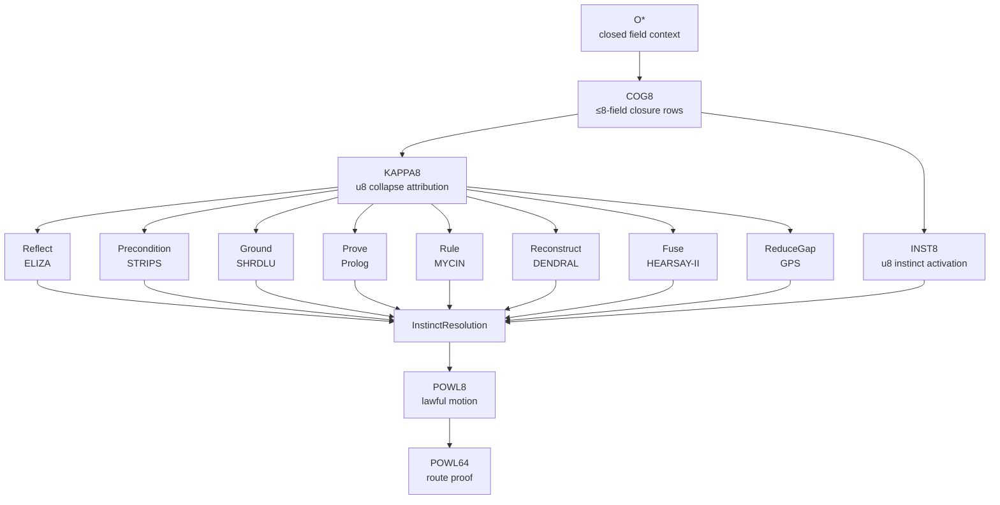
```mermaid
flowchart TD
    OStar["O*<br/>closed field context"]
    COG8["COG8<br/>≤8-field closure rows"]
    KAPPA8["KAPPA8<br/>u8 collapse attribution"]
    INST8["INST8<br/>u8 instinct activation"]
    Resolution["InstinctResolution"]
    POWL8["POWL8<br/>lawful motion"]
    Proof["POWL64<br/>route proof"]

    Reflect["Reflect<br/>ELIZA"]
    Precondition["Precondition<br/>STRIPS"]
    Ground["Ground<br/>SHRDLU"]
    Prove["Prove<br/>Prolog"]
    Rule["Rule<br/>MYCIN"]
    Reconstruct["Reconstruct<br/>DENDRAL"]
    Fuse["Fuse<br/>HEARSAY-II"]
    ReduceGap["ReduceGap<br/>GPS"]

    OStar --> COG8
    COG8 --> KAPPA8
    COG8 --> INST8

    KAPPA8 --> Reflect
    KAPPA8 --> Precondition
    KAPPA8 --> Ground
    KAPPA8 --> Prove
    KAPPA8 --> Rule
    KAPPA8 --> Reconstruct
    KAPPA8 --> Fuse
    KAPPA8 --> ReduceGap

    Reflect --> Resolution
    Precondition --> Resolution
    Ground --> Resolution
    Prove --> Resolution
    Rule --> Resolution
    Reconstruct --> Resolution
    Fuse --> Resolution
    ReduceGap --> Resolution

    INST8 --> Resolution
    Resolution --> POWL8
    POWL8 --> Proof
```

---

# 2. Old-AI Crate / Module Layout

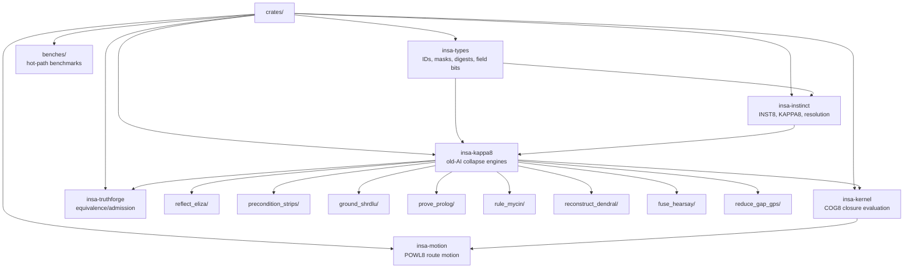
```mermaid
flowchart TD
    Root["crates/"]

    Types["insa-types<br/>IDs, masks, digests, field bits"]
    Instinct["insa-instinct<br/>INST8, KAPPA8, resolution"]
    Kappa["insa-kappa8<br/>old-AI collapse engines"]
    Kernel["insa-kernel<br/>COG8 closure evaluation"]
    Motion["insa-motion<br/>POWL8 route motion"]
    Truth["insa-truthforge<br/>equivalence/admission"]
    Bench["benches/<br/>hot-path benchmarks"]

    Root --> Types
    Root --> Instinct
    Root --> Kappa
    Root --> Kernel
    Root --> Motion
    Root --> Truth
    Root --> Bench

    Kappa --> Reflect["reflect_eliza/"]
    Kappa --> Strips["precondition_strips/"]
    Kappa --> Shrdlu["ground_shrdlu/"]
    Kappa --> Prolog["prove_prolog/"]
    Kappa --> Mycin["rule_mycin/"]
    Kappa --> Dendral["reconstruct_dendral/"]
    Kappa --> Hearsay["fuse_hearsay/"]
    Kappa --> Gps["reduce_gap_gps/"]

    Types --> Instinct
    Types --> Kappa
    Instinct --> Kappa
    Kappa --> Kernel
    Kernel --> Motion
    Kappa --> Truth
```

---

# 3. KAPPA8 Byte Lane

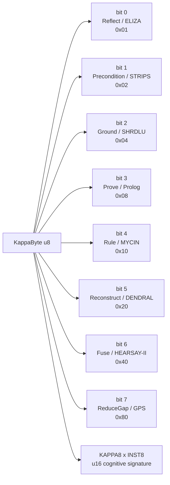
```mermaid
flowchart LR
    Byte["KappaByte u8"]

    B0["bit 0<br/>Reflect / ELIZA<br/>0x01"]
    B1["bit 1<br/>Precondition / STRIPS<br/>0x02"]
    B2["bit 2<br/>Ground / SHRDLU<br/>0x04"]
    B3["bit 3<br/>Prove / Prolog<br/>0x08"]
    B4["bit 4<br/>Rule / MYCIN<br/>0x10"]
    B5["bit 5<br/>Reconstruct / DENDRAL<br/>0x20"]
    B6["bit 6<br/>Fuse / HEARSAY-II<br/>0x40"]
    B7["bit 7<br/>ReduceGap / GPS<br/>0x80"]

    Byte --> B0
    Byte --> B1
    Byte --> B2
    Byte --> B3
    Byte --> B4
    Byte --> B5
    Byte --> B6
    Byte --> B7

    Byte --> Signature["KAPPA8 x INST8<br/>u16 cognitive signature"]
```

---

# 4. Nightly Control-Edge Admission

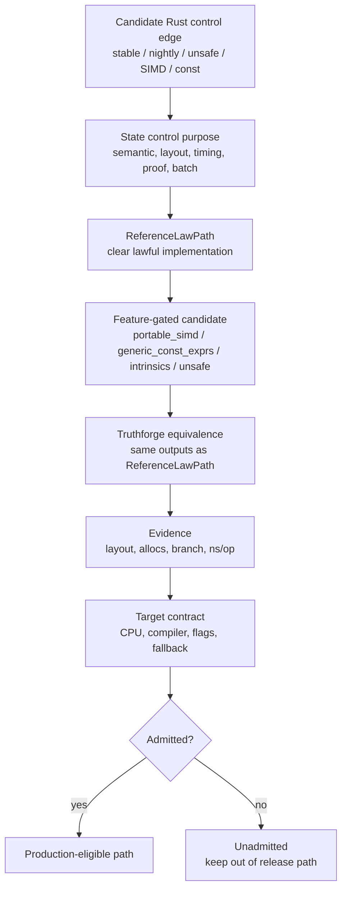
```mermaid
flowchart TD
    Candidate["Candidate Rust control edge<br/>stable / nightly / unsafe / SIMD / const"]
    Purpose["State control purpose<br/>semantic, layout, timing, proof, batch"]
    Ref["ReferenceLawPath<br/>clear lawful implementation"]
    Feature["Feature-gated candidate<br/>portable_simd / generic_const_exprs / intrinsics / unsafe"]
    Equiv["Truthforge equivalence<br/>same outputs as ReferenceLawPath"]
    Bench["Evidence<br/>layout, allocs, branch, ns/op"]
    Target["Target contract<br/>CPU, compiler, flags, fallback"]
    Admit{"Admitted?"}
    Prod["Production-eligible path"]
    Reject["Unadmitted<br/>keep out of release path"]

    Candidate --> Purpose
    Purpose --> Ref
    Ref --> Feature
    Feature --> Equiv
    Equiv --> Bench
    Bench --> Target
    Target --> Admit
    Admit -- yes --> Prod
    Admit -- no --> Reject
```

---

# 5. Shared Trait Surface for Old-AI Engines

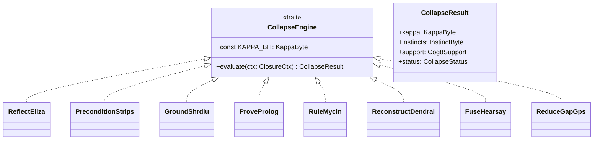
```mermaid
classDiagram
    class CollapseEngine {
      <<trait>>
      +const KAPPA_BIT: KappaByte
      +evaluate(ctx: ClosureCtx) CollapseResult
    }

    class ReflectEliza
    class PreconditionStrips
    class GroundShrdlu
    class ProveProlog
    class RuleMycin
    class ReconstructDendral
    class FuseHearsay
    class ReduceGapGps

    CollapseEngine <|.. ReflectEliza
    CollapseEngine <|.. PreconditionStrips
    CollapseEngine <|.. GroundShrdlu
    CollapseEngine <|.. ProveProlog
    CollapseEngine <|.. RuleMycin
    CollapseEngine <|.. ReconstructDendral
    CollapseEngine <|.. FuseHearsay
    CollapseEngine <|.. ReduceGapGps

    class CollapseResult {
      +kappa: KappaByte
      +instincts: InstinctByte
      +support: Cog8Support
      +status: CollapseStatus
    }
```

---

# 6. Shared Hot Types

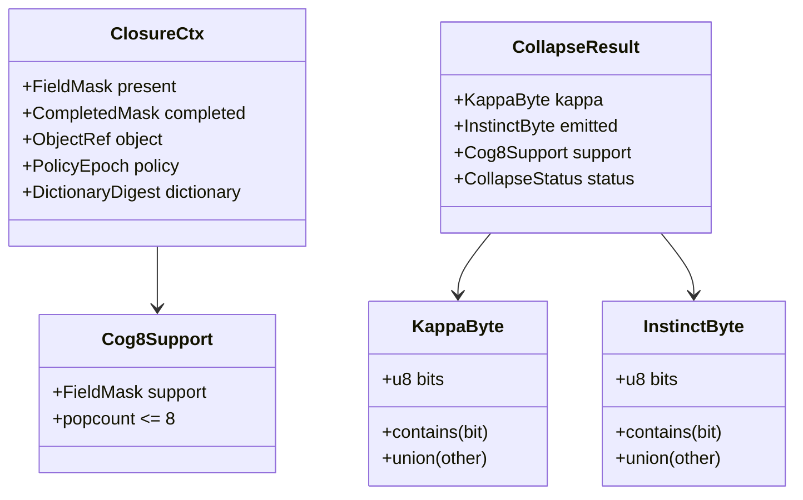
```mermaid
classDiagram
    class KappaByte {
      +u8 bits
      +contains(bit)
      +union(other)
    }

    class InstinctByte {
      +u8 bits
      +contains(bit)
      +union(other)
    }

    class Cog8Support {
      +FieldMask support
      +popcount <= 8
    }

    class ClosureCtx {
      +FieldMask present
      +CompletedMask completed
      +ObjectRef object
      +PolicyEpoch policy
      +DictionaryDigest dictionary
    }

    class CollapseResult {
      +KappaByte kappa
      +InstinctByte emitted
      +Cog8Support support
      +CollapseStatus status
    }

    ClosureCtx --> Cog8Support
    CollapseResult --> KappaByte
    CollapseResult --> InstinctByte
```

---

# 7. ELIZA / Reflect Rust Architecture

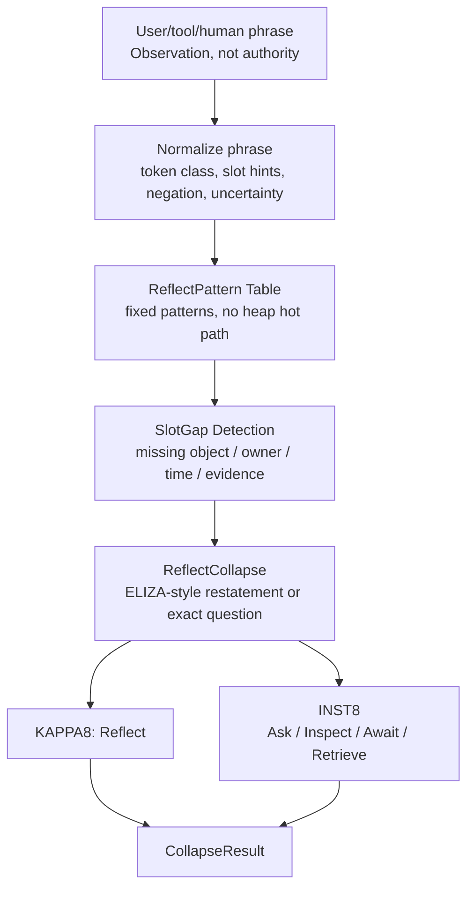
```mermaid
flowchart TD
    Input["User/tool/human phrase<br/>Observation, not authority"]
    Normalize["Normalize phrase<br/>token class, slot hints, negation, uncertainty"]
    Pattern["ReflectPattern Table<br/>fixed patterns, no heap hot path"]
    Slot["SlotGap Detection<br/>missing object / owner / time / evidence"]
    Reflect["ReflectCollapse<br/>ELIZA-style restatement or exact question"]
    Kappa["KAPPA8: Reflect"]
    Instinct["INST8<br/>Ask / Inspect / Await / Retrieve"]
    Result["CollapseResult"]

    Input --> Normalize
    Normalize --> Pattern
    Pattern --> Slot
    Slot --> Reflect
    Reflect --> Kappa
    Reflect --> Instinct
    Kappa --> Result
    Instinct --> Result
```

---

# 8. ELIZA / Reflect Type Diagram

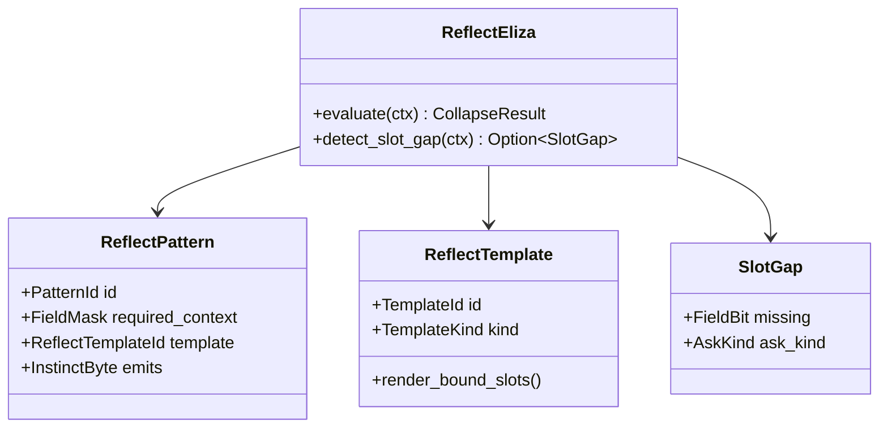
```mermaid
classDiagram
    class ReflectPattern {
      +PatternId id
      +FieldMask required_context
      +ReflectTemplateId template
      +InstinctByte emits
    }

    class ReflectTemplate {
      +TemplateId id
      +TemplateKind kind
      +render_bound_slots()
    }

    class SlotGap {
      +FieldBit missing
      +AskKind ask_kind
    }

    class ReflectEliza {
      +evaluate(ctx) CollapseResult
      +detect_slot_gap(ctx) Option~SlotGap~
    }

    ReflectEliza --> ReflectPattern
    ReflectEliza --> ReflectTemplate
    ReflectEliza --> SlotGap
```

---

# 9. STRIPS / Precondition Rust Architecture

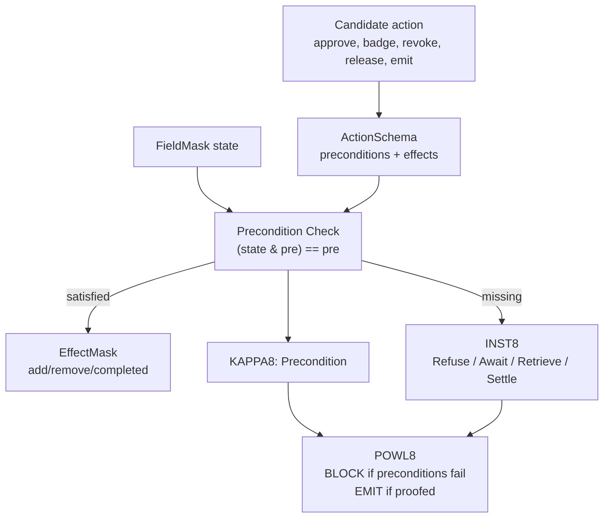
```mermaid
flowchart TD
    Action["Candidate action<br/>approve, badge, revoke, release, emit"]
    State["FieldMask state"]
    Schema["ActionSchema<br/>preconditions + effects"]
    Check["Precondition Check<br/>(state & pre) == pre"]
    Effects["EffectMask<br/>add/remove/completed"]
    Kappa["KAPPA8: Precondition"]
    Instinct["INST8<br/>Refuse / Await / Retrieve / Settle"]
    Motion["POWL8<br/>BLOCK if preconditions fail<br/>EMIT if proofed"]

    Action --> Schema
    State --> Check
    Schema --> Check
    Check -- satisfied --> Effects
    Check -- missing --> Instinct
    Check --> Kappa
    Kappa --> Motion
    Instinct --> Motion
```

---

# 10. STRIPS Type Diagram

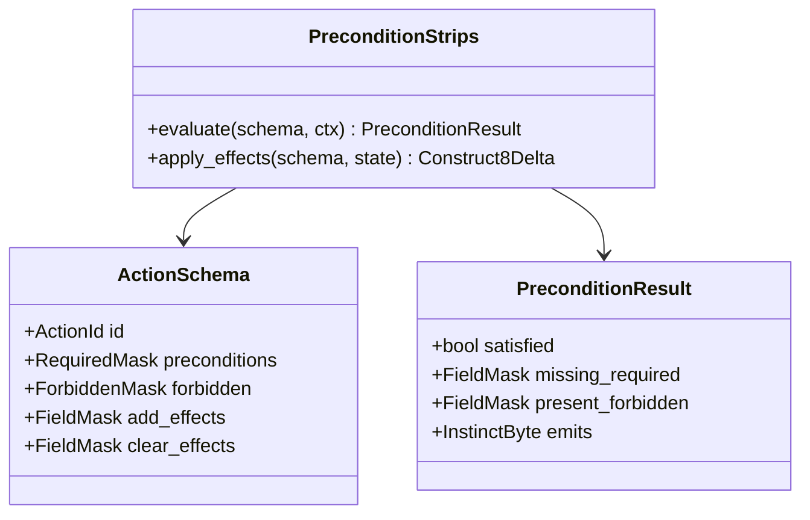
```mermaid
classDiagram
    class ActionSchema {
      +ActionId id
      +RequiredMask preconditions
      +ForbiddenMask forbidden
      +FieldMask add_effects
      +FieldMask clear_effects
    }

    class PreconditionResult {
      +bool satisfied
      +FieldMask missing_required
      +FieldMask present_forbidden
      +InstinctByte emits
    }

    class PreconditionStrips {
      +evaluate(schema, ctx) PreconditionResult
      +apply_effects(schema, state) Construct8Delta
    }

    PreconditionStrips --> ActionSchema
    PreconditionStrips --> PreconditionResult
```

---

# 11. SHRDLU / Ground Rust Architecture

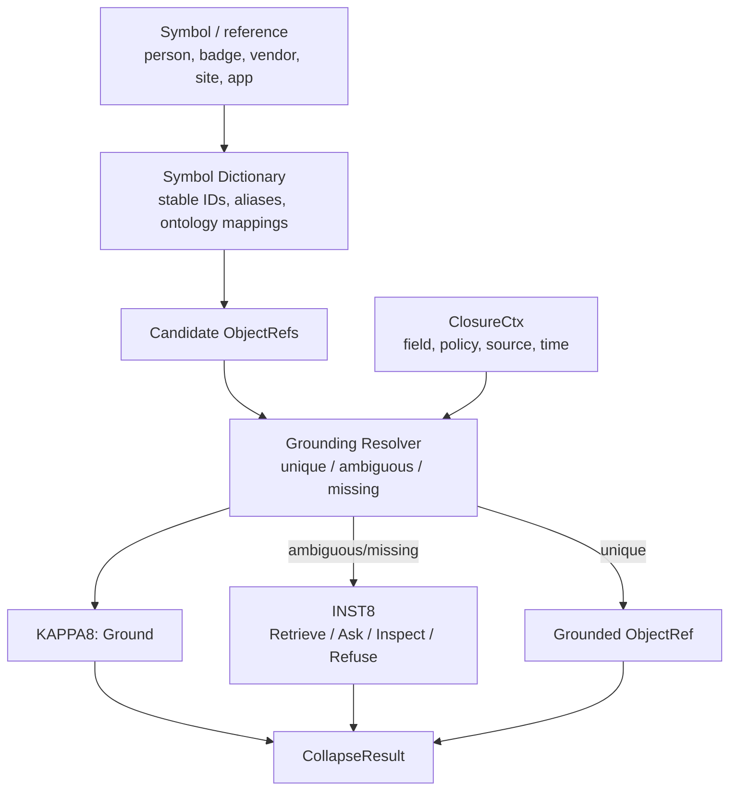
```mermaid
flowchart TD
    Symbol["Symbol / reference<br/>person, badge, vendor, site, app"]
    Lexicon["Symbol Dictionary<br/>stable IDs, aliases, ontology mappings"]
    Candidate["Candidate ObjectRefs"]
    Context["ClosureCtx<br/>field, policy, source, time"]
    Resolve["Grounding Resolver<br/>unique / ambiguous / missing"]
    Kappa["KAPPA8: Ground"]
    Instinct["INST8<br/>Retrieve / Ask / Inspect / Refuse"]
    Object["Grounded ObjectRef"]
    Result["CollapseResult"]

    Symbol --> Lexicon
    Lexicon --> Candidate
    Candidate --> Resolve
    Context --> Resolve
    Resolve -- unique --> Object
    Resolve -- ambiguous/missing --> Instinct
    Resolve --> Kappa
    Kappa --> Result
    Instinct --> Result
    Object --> Result
```

---

# 12. SHRDLU Type Diagram

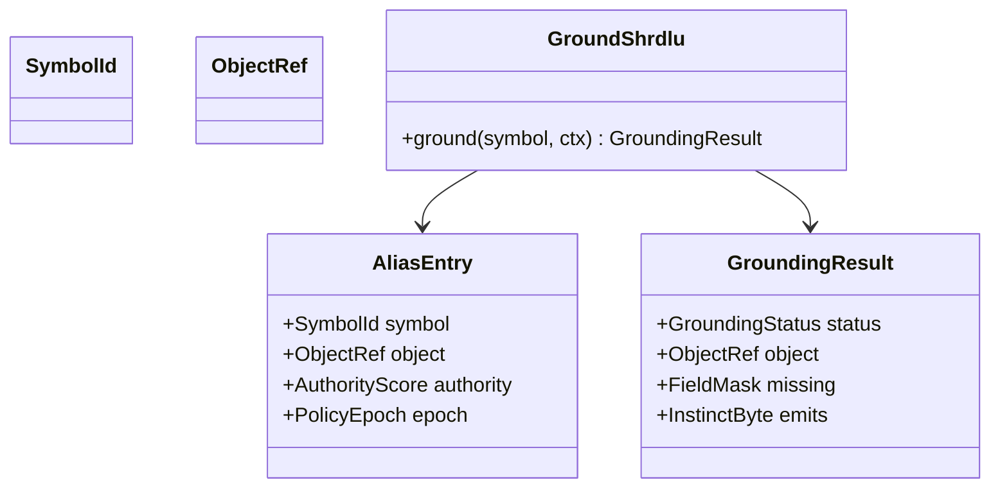
```mermaid
classDiagram
    class SymbolId
    class ObjectRef
    class AliasEntry {
      +SymbolId symbol
      +ObjectRef object
      +AuthorityScore authority
      +PolicyEpoch epoch
    }

    class GroundingResult {
      +GroundingStatus status
      +ObjectRef object
      +FieldMask missing
      +InstinctByte emits
    }

    class GroundShrdlu {
      +ground(symbol, ctx) GroundingResult
    }

    GroundShrdlu --> AliasEntry
    GroundShrdlu --> GroundingResult
```

---

# 13. Prolog / Prove Rust Architecture

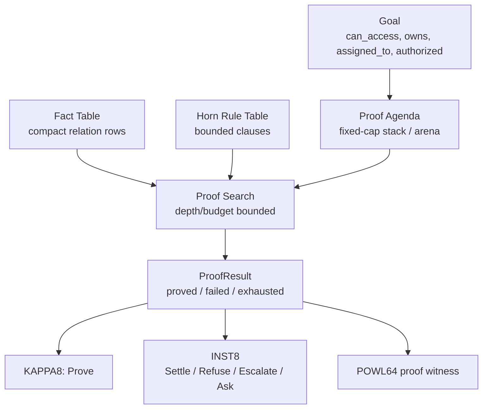
```mermaid
flowchart TD
    Goal["Goal<br/>can_access, owns, assigned_to, authorized"]
    Facts["Fact Table<br/>compact relation rows"]
    Rules["Horn Rule Table<br/>bounded clauses"]
    Agenda["Proof Agenda<br/>fixed-cap stack / arena"]
    Search["Proof Search<br/>depth/budget bounded"]
    Proof["ProofResult<br/>proved / failed / exhausted"]
    Kappa["KAPPA8: Prove"]
    Instinct["INST8<br/>Settle / Refuse / Escalate / Ask"]
    Route["POWL64 proof witness"]

    Goal --> Agenda
    Facts --> Search
    Rules --> Search
    Agenda --> Search
    Search --> Proof
    Proof --> Kappa
    Proof --> Instinct
    Proof --> Route
```

---

# 14. Prolog Type Diagram

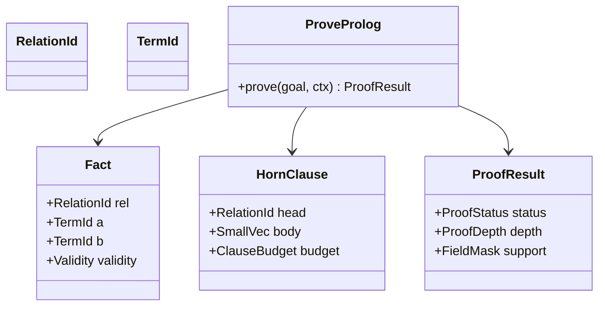
```mermaid
classDiagram
    class RelationId
    class TermId
    class Fact {
      +RelationId rel
      +TermId a
      +TermId b
      +Validity validity
    }

    class HornClause {
      +RelationId head
      +SmallVec body
      +ClauseBudget budget
    }

    class ProofResult {
      +ProofStatus status
      +ProofDepth depth
      +FieldMask support
    }

    class ProveProlog {
      +prove(goal, ctx) ProofResult
    }

    ProveProlog --> Fact
    ProveProlog --> HornClause
    ProveProlog --> ProofResult
```

---

# 15. MYCIN / Rule Rust Architecture

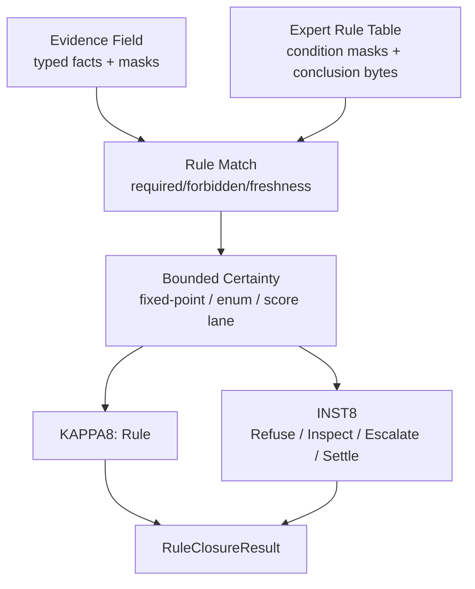
```mermaid
flowchart TD
    Evidence["Evidence Field<br/>typed facts + masks"]
    RuleTable["Expert Rule Table<br/>condition masks + conclusion bytes"]
    Match["Rule Match<br/>required/forbidden/freshness"]
    Confidence["Bounded Certainty<br/>fixed-point / enum / score lane"]
    Kappa["KAPPA8: Rule"]
    Instinct["INST8<br/>Refuse / Inspect / Escalate / Settle"]
    Result["RuleClosureResult"]

    Evidence --> Match
    RuleTable --> Match
    Match --> Confidence
    Confidence --> Kappa
    Confidence --> Instinct
    Kappa --> Result
    Instinct --> Result
```

---

# 16. MYCIN Type Diagram

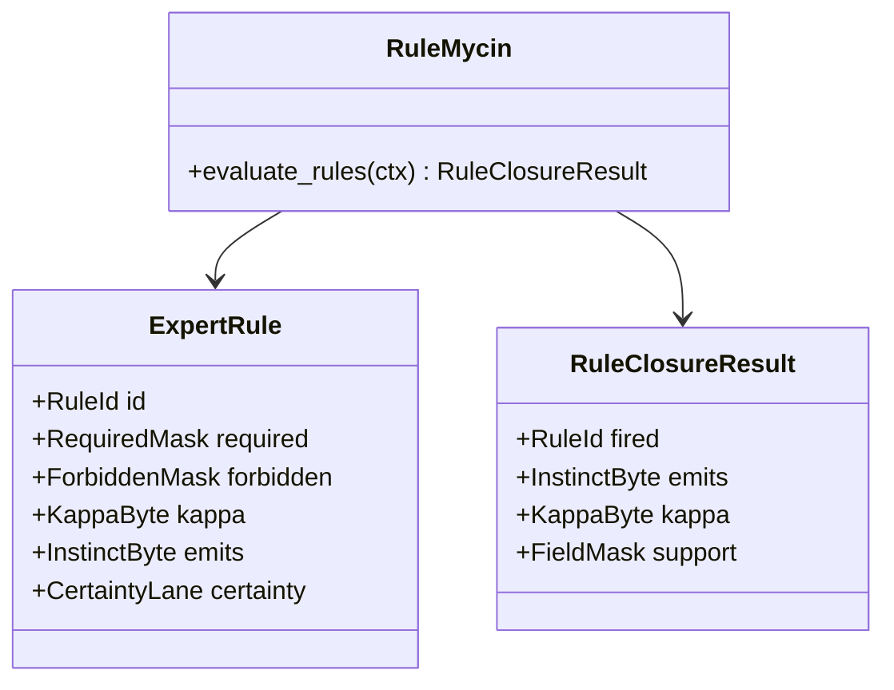
```mermaid
classDiagram
    class ExpertRule {
      +RuleId id
      +RequiredMask required
      +ForbiddenMask forbidden
      +KappaByte kappa
      +InstinctByte emits
      +CertaintyLane certainty
    }

    class RuleClosureResult {
      +RuleId fired
      +InstinctByte emits
      +KappaByte kappa
      +FieldMask support
    }

    class RuleMycin {
      +evaluate_rules(ctx) RuleClosureResult
    }

    RuleMycin --> ExpertRule
    RuleMycin --> RuleClosureResult
```

---

# 17. DENDRAL / Reconstruct Rust Architecture

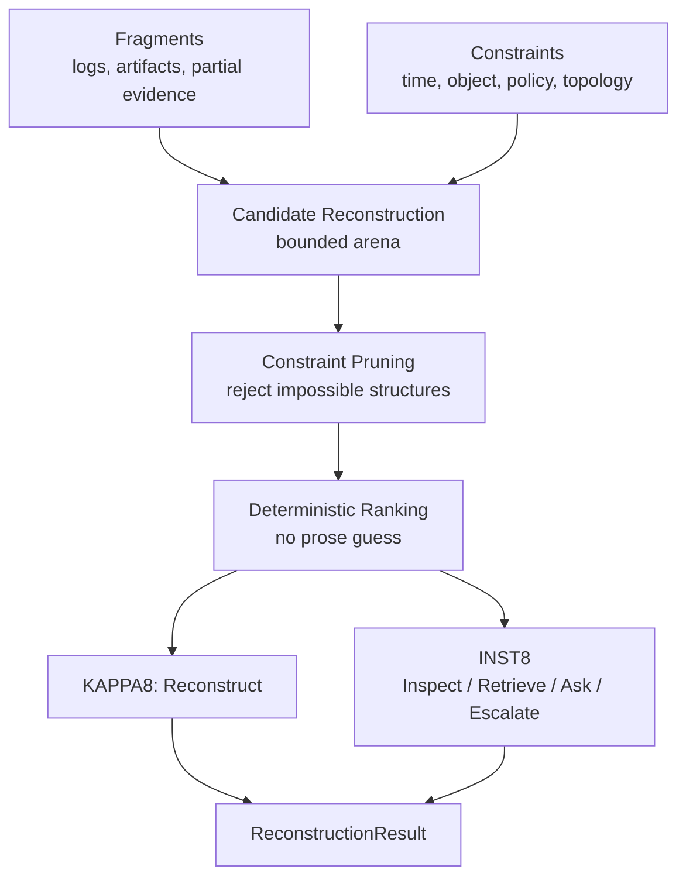
```mermaid
flowchart TD
    Fragments["Fragments<br/>logs, artifacts, partial evidence"]
    Constraints["Constraints<br/>time, object, policy, topology"]
    CandidateGen["Candidate Reconstruction<br/>bounded arena"]
    Prune["Constraint Pruning<br/>reject impossible structures"]
    Rank["Deterministic Ranking<br/>no prose guess"]
    Kappa["KAPPA8: Reconstruct"]
    Instinct["INST8<br/>Inspect / Retrieve / Ask / Escalate"]
    Result["ReconstructionResult"]

    Fragments --> CandidateGen
    Constraints --> CandidateGen
    CandidateGen --> Prune
    Prune --> Rank
    Rank --> Kappa
    Rank --> Instinct
    Kappa --> Result
    Instinct --> Result
```

---

# 18. DENDRAL Type Diagram

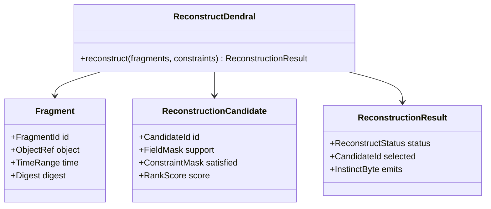
```mermaid
classDiagram
    class Fragment {
      +FragmentId id
      +ObjectRef object
      +TimeRange time
      +Digest digest
    }

    class ReconstructionCandidate {
      +CandidateId id
      +FieldMask support
      +ConstraintMask satisfied
      +RankScore score
    }

    class ReconstructionResult {
      +ReconstructStatus status
      +CandidateId selected
      +InstinctByte emits
    }

    class ReconstructDendral {
      +reconstruct(fragments, constraints) ReconstructionResult
    }

    ReconstructDendral --> Fragment
    ReconstructDendral --> ReconstructionCandidate
    ReconstructDendral --> ReconstructionResult
```

---

# 19. HEARSAY-II / Fuse Rust Architecture

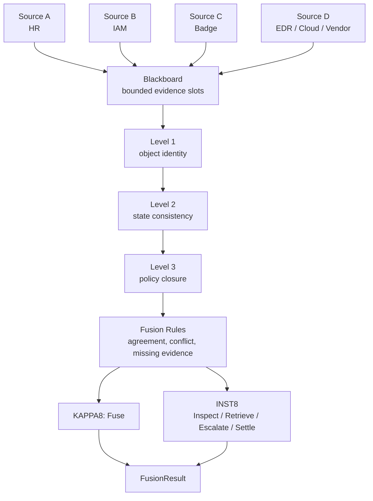
```mermaid
flowchart TD
    SourceA["Source A<br/>HR"]
    SourceB["Source B<br/>IAM"]
    SourceC["Source C<br/>Badge"]
    SourceD["Source D<br/>EDR / Cloud / Vendor"]

    Blackboard["Blackboard<br/>bounded evidence slots"]
    Level1["Level 1<br/>object identity"]
    Level2["Level 2<br/>state consistency"]
    Level3["Level 3<br/>policy closure"]
    Fuse["Fusion Rules<br/>agreement, conflict, missing evidence"]
    Kappa["KAPPA8: Fuse"]
    Instinct["INST8<br/>Inspect / Retrieve / Escalate / Settle"]
    Result["FusionResult"]

    SourceA --> Blackboard
    SourceB --> Blackboard
    SourceC --> Blackboard
    SourceD --> Blackboard

    Blackboard --> Level1
    Level1 --> Level2
    Level2 --> Level3
    Level3 --> Fuse
    Fuse --> Kappa
    Fuse --> Instinct
    Kappa --> Result
    Instinct --> Result
```

---

# 20. HEARSAY-II Type Diagram

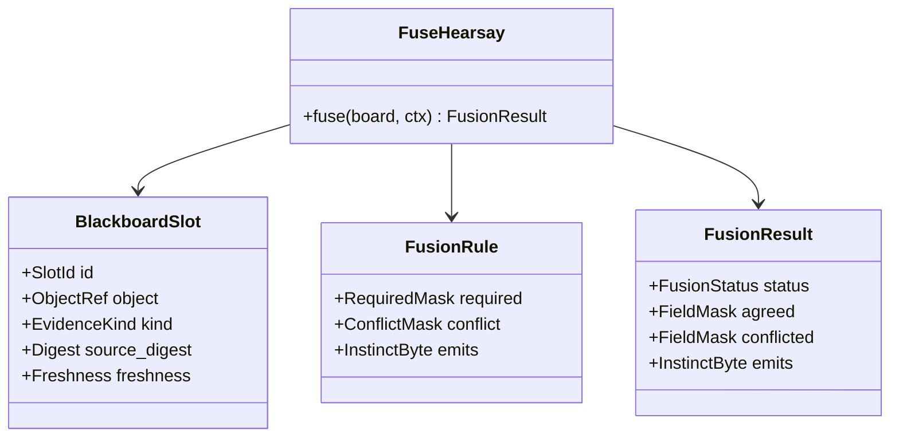
```mermaid
classDiagram
    class BlackboardSlot {
      +SlotId id
      +ObjectRef object
      +EvidenceKind kind
      +Digest source_digest
      +Freshness freshness
    }

    class FusionRule {
      +RequiredMask required
      +ConflictMask conflict
      +InstinctByte emits
    }

    class FusionResult {
      +FusionStatus status
      +FieldMask agreed
      +FieldMask conflicted
      +InstinctByte emits
    }

    class FuseHearsay {
      +fuse(board, ctx) FusionResult
    }

    FuseHearsay --> BlackboardSlot
    FuseHearsay --> FusionRule
    FuseHearsay --> FusionResult
```

---

# 21. GPS / ReduceGap Rust Architecture

```mermaid
flowchart TD
    Current["Current State<br/>FieldMask"]
    Goal["Goal State<br/>RequiredMask"]
    Diff["Gap Calculation<br/>missing = goal & !current"]
    Operators["Operators<br/>Retrieve, Ask, Await, Refuse, Escalate, Settle"]
    Select["Gap Reduction Selection<br/>smallest lawful next move"]
    Kappa["KAPPA8: ReduceGap"]
    Instinct["INST8<br/>Retrieve / Ask / Await / Settle"]
    Motion["POWL8 motion"]

    Current --> Diff
    Goal --> Diff
    Diff --> Operators
    Operators --> Select
    Select --> Kappa
    Select --> Instinct
    Instinct --> Motion
```

---

# 22. GPS Type Diagram

```mermaid
classDiagram
    class GoalState {
      +RequiredMask required
      +ForbiddenMask forbidden
      +CompletedMask completed
    }

    class Gap {
      +FieldMask missing_required
      +FieldMask present_forbidden
      +u8 width
    }

    class GapOperator {
      +OperatorId id
      +FieldMask resolves
      +InstinctByte emits
      +Powl8Op motion
    }

    class ReduceGapGps {
      +reduce(current, goal) GapReductionResult
    }

    GoalState --> Gap
    Gap --> GapOperator
    ReduceGapGps --> GoalState
    ReduceGapGps --> Gap
    ReduceGapGps --> GapOperator
```

---

# 23. Combined Old-AI Execution Pipeline

```mermaid
sequenceDiagram
    participant Graph as Enterprise Graph
    participant Sec as Security O*
    participant Cog as COG8
    participant Kap as KAPPA8 Engines
    participant Inst as INST8
    participant Mot as POWL8
    participant Proof as POWL64

    Graph->>Sec: project closed security field
    Sec->>Cog: FieldMask + CompletedMask + Cog8Rows
    Cog->>Kap: evaluate collapse families
    Kap->>Kap: Reflect / Ground / Rule / Prove / Fuse / ReduceGap...
    Kap-->>Cog: KappaByte
    Cog-->>Inst: InstinctByte
    Inst->>Mot: InstinctResolution
    Mot->>Proof: RouteCell + blocked alternatives
    Proof-->>Graph: replayable route evidence
```

---

# 24. Old-AI Engines Over Access Drift JTBD

```mermaid
flowchart TD
    Case["Access Drift JTBD<br/>terminated contractor + active access"]
    Reflect["Reflect / ELIZA<br/>clarify missing owner or evidence"]
    Precondition["Precondition / STRIPS<br/>access removal required after termination"]
    Ground["Ground / SHRDLU<br/>bind person, badge, VPN, repo, vendor"]
    Prove["Prove / Prolog<br/>prove contractor relation + active access"]
    Rule["Rule / MYCIN<br/>apply badge/vendor/access policy"]
    Reconstruct["Reconstruct / DENDRAL<br/>reconstruct timeline"]
    Fuse["Fuse / HEARSAY-II<br/>combine HR + IAM + badge + device"]
    Gap["ReduceGap / GPS<br/>what remains to close field"]

    Kappa["KAPPA8<br/>combined collapse byte"]
    Instinct["INST8<br/>Refuse + Inspect + Escalate + Retrieve"]

    Case --> Reflect
    Case --> Precondition
    Case --> Ground
    Case --> Prove
    Case --> Rule
    Case --> Reconstruct
    Case --> Fuse
    Case --> Gap

    Reflect --> Kappa
    Precondition --> Kappa
    Ground --> Kappa
    Prove --> Kappa
    Rule --> Kappa
    Reconstruct --> Kappa
    Fuse --> Kappa
    Gap --> Kappa

    Kappa --> Instinct
```

---

# 25. Rust Feature Strategy by Old-AI Engine

```mermaid
flowchart TD
    subgraph Stable["Stable-first law surfaces"]
        Newtypes["repr(transparent) newtypes"]
        U8["repr(u8) enums"]
        Arrays["fixed arrays"]
        ConstFn["const fn constructors"]
        Typestate["PhantomData typestate"]
        Offset["size/align/offset gates"]
    end

    subgraph Nightly["Nightly/admitted candidates"]
        Simd["portable_simd<br/>batch masks / fusion"]
        GCE["generic_const_exprs<br/>Support<N<=8> / bounded arrays"]
        Intrinsics["target intrinsics<br/>popcnt/tzcnt/lzcnt/avx/neon"]
        Unsafe["unsafe_admitted<br/>bounds/alignment elision"]
    end

    Engines["KAPPA8 Engines"]

    Stable --> Engines
    Nightly --> Admit["Truthforge admission"]
    Admit --> Engines
```

---

# 26. Engine-to-Nightly Control Edge Map

```mermaid
mindmap
  root((KAPPA8 Nightly Control Candidates))
    Reflect_ELIZA
      const templates
      compact pattern tables
      no heap render path
    STRIPS
      generic_const_exprs for ActionSchema<N>
      const precondition/effect tables
      bitset intrinsics
    SHRDLU
      perfect hash candidates
      compact dictionary layouts
      SIMD alias comparison
    Prolog
      bounded proof stack
      const clause arity
      unsafe_admitted arena if proven
    MYCIN
      SIMD rule matching
      const rule-table generation
      fixed-point certainty lanes
    DENDRAL
      bounded candidate arena
      SIMD constraint pruning
      target-specific ranking kernels
    HEARSAY_II
      SIMD blackboard fusion
      SoA evidence slots
      batch source agreement
    GPS
      popcnt/tzcnt gap selection
      const operator tables
      branch-minimized gap resolution
```

---

# 27. Reference vs Fast Path for Old-AI Engines

```mermaid
flowchart TD
    Fixture["Canonical fixture<br/>Access Drift / CVE / Badge Policy"]
    Ref["ReferenceLawPath<br/>clear old-AI implementation"]
    Table["Table Path<br/>precomputed LUTs"]
    Simd["SIMD Path<br/>batch row/rule/fusion"]
    Intrinsic["Intrinsic Path<br/>target CPU"]
    Unsafe["Unsafe-Admitted Path<br/>proved bounds/layout"]

    Compare["Compare CollapseResult<br/>KAPPA8, INST8, support, status"]
    Replay["Replay route under POWL64"]
    Admit{"Equivalent and evidenced?"}

    Fixture --> Ref
    Fixture --> Table
    Fixture --> Simd
    Fixture --> Intrinsic
    Fixture --> Unsafe

    Ref --> Compare
    Table --> Compare
    Simd --> Compare
    Intrinsic --> Compare
    Unsafe --> Compare

    Compare --> Replay
    Replay --> Admit
    Admit -- yes --> Prod["Production-eligible engine"]
    Admit -- no --> Scrap["Reject / classify failure"]
```

---

# 28. Hot / Warm / Cold Placement by Old-AI Engine

```mermaid
flowchart TD
    subgraph Hot["HOT: L1/L2"]
        KByte["KappaByte u8"]
        IByte["InstinctByte u8"]
        Masks["u64 masks"]
        LUTs["256 / 65,536 LUTs"]
        RuleRows["compact rule/precondition rows"]
    end

    subgraph Warm["WARM: active case"]
        ProofAgenda["bounded proof agenda"]
        Blackboard["blackboard slots"]
        CandidateArena["reconstruction candidates"]
        GoalStack["gap-reduction operators"]
    end

    subgraph Cold["COLD: explanation/audit"]
        RDF["RDF/SKOS mappings"]
        POWL64["POWL64 route evidence"]
        Replay["Replay traces"]
        Reports["Board/security reports"]
    end

    Hot --> Warm
    Warm --> Cold
```

---

# 29. Compile-Fail Tests for Old-AI Engines

```mermaid
flowchart TD
    Trybuild["trybuild compile-fail"]

    A["kappa_bit_out_of_range.rs"]
    B["selected_instinct_multi_bit.rs"]
    C["cog8_support_need9.rs"]
    D["strips_action_without_preconditions.rs"]
    E["prolog_unbounded_depth.rs"]
    F["mycin_rule_raw_u64_mask.rs"]
    G["dendral_unbounded_candidates.rs"]
    H["hearsay_dynamic_map_hot_path.rs"]
    I["gps_goal_width_gt_8.rs"]
    J["emit_without_route_proof.rs"]

    Trybuild --> A
    Trybuild --> B
    Trybuild --> C
    Trybuild --> D
    Trybuild --> E
    Trybuild --> F
    Trybuild --> G
    Trybuild --> H
    Trybuild --> I
    Trybuild --> J
```

---

# 30. Truthforge Test Matrix by Old-AI System

```mermaid
flowchart TD
    Matrix["Truthforge KAPPA8 Test Matrix"]

    Reflect["Reflect<br/>false ask, false await, vague reflection"]
    Precondition["Precondition<br/>missing precondition, forbidden present"]
    Ground["Ground<br/>ambiguous object, stale alias, wrong binding"]
    Prove["Prove<br/>false proof, unbounded recursion, missing fact"]
    Rule["Rule<br/>false rule fire, rule conflict, stale policy"]
    Reconstruct["Reconstruct<br/>wrong timeline, overfit candidate, missing fragment"]
    Fuse["Fuse<br/>source conflict, stale source, duplicate evidence"]
    Gap["ReduceGap<br/>wrong missing field, unbounded gap, false settle"]

    Matrix --> Reflect
    Matrix --> Precondition
    Matrix --> Ground
    Matrix --> Prove
    Matrix --> Rule
    Matrix --> Reconstruct
    Matrix --> Fuse
    Matrix --> Gap

    Reflect --> Admission["Admission bundle"]
    Precondition --> Admission
    Ground --> Admission
    Prove --> Admission
    Rule --> Admission
    Reconstruct --> Admission
    Fuse --> Admission
    Gap --> Admission
```

---

# 31. Old-AI Engines as `KappaByte` Contributors

```mermaid
flowchart LR
    Reflect["Reflect"]
    Precondition["Precondition"]
    Ground["Ground"]
    Prove["Prove"]
    Rule["Rule"]
    Reconstruct["Reconstruct"]
    Fuse["Fuse"]
    ReduceGap["ReduceGap"]

    Union["KappaByte Union<br/>kappa = kappa | engine_bit"]
    Decision["Cog8Decision<br/>kappa + instincts + fired_count"]

    Reflect --> Union
    Precondition --> Union
    Ground --> Union
    Prove --> Union
    Rule --> Union
    Reconstruct --> Union
    Fuse --> Union
    ReduceGap --> Union

    Union --> Decision
```

---

# 32. Final Old-AI Rust Architecture Spine

```mermaid
flowchart TD
    O["O<br/>raw observation"]
    Close["Close(O) -> O*"]
    Graph["Enterprise graph / field context"]
    COG8["COG8<br/>mask closure"]
    KAPPA["KAPPA8 Engine Set<br/>old-AI collapse"]
    INST["INST8<br/>inhibition activation"]
    RES["InstinctResolution"]
    MOT["POWL8<br/>route motion"]
    DELTA["CONSTRUCT8<br/>bounded reentry"]
    PROOF["POWL64<br/>evidence"]
    REPLAY["ReplayValid"]

    O --> Close
    Close --> Graph
    Graph --> COG8
    COG8 --> KAPPA
    COG8 --> INST
    KAPPA --> RES
    INST --> RES
    RES --> MOT
    MOT --> DELTA
    DELTA --> Graph
    MOT --> PROOF
    PROOF --> REPLAY
```

---

## The implementation rule

Use this line in the docs:

[
\boxed{
Old AI becomes production-grade only when each lineage compiles into a bounded Rust collapse engine that emits KAPPA8/INST8 bytes, proves equivalence to ReferenceLawPath, and survives Truthforge admission.
}
]

And the Rust-nightly rule:

[
\boxed{
Nightly is admitted only when it gives semantic, layout, timing, batch, compile-time, or proof control that stable Rust cannot provide with equal evidence.
}
]

That keeps the old-AI systems fast, bounded, testable, byte-shaped, and aligned with the “admitted vs unadmitted” boundary rather than the weaker stable/nightly boundary.

[1]: https://doc.rust-lang.org/beta/unstable-book/ "The Unstable Book - The Rust Unstable Book"
[2]: https://doc.rust-lang.org/beta/unstable-book/language-features/generic-const-exprs.html "generic_const_exprs - The Rust Unstable Book"
[3]: https://doc.rust-lang.org/beta/unstable-book/library-features/portable-simd.html "portable_simd - The Rust Unstable Book"