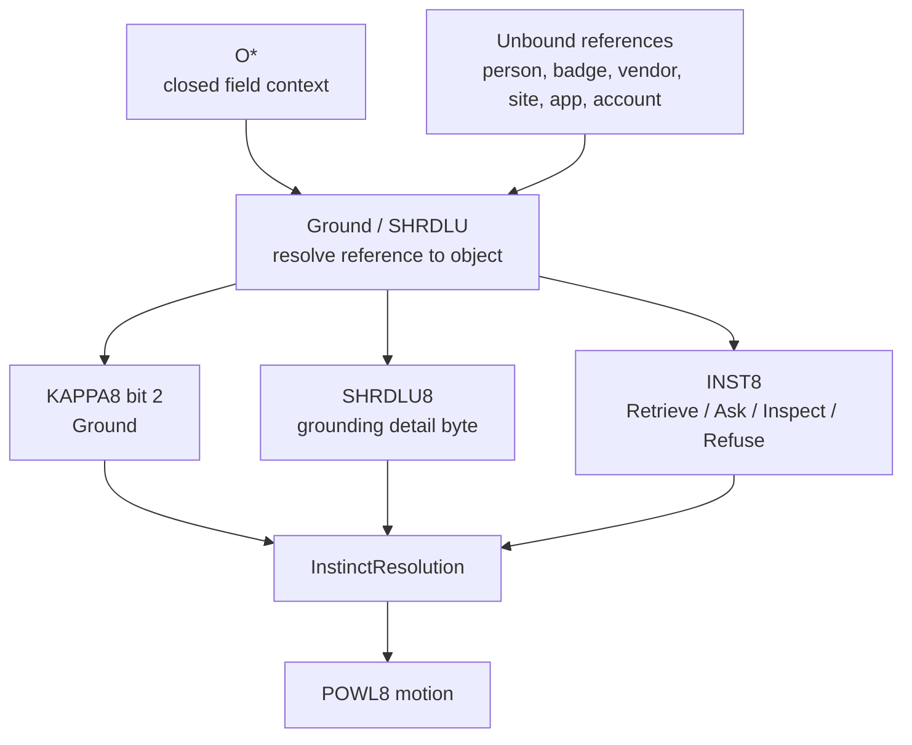
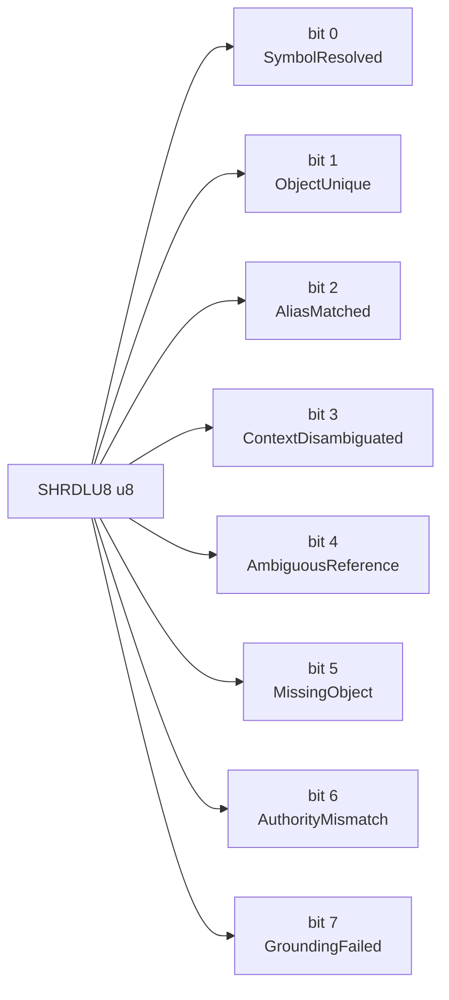
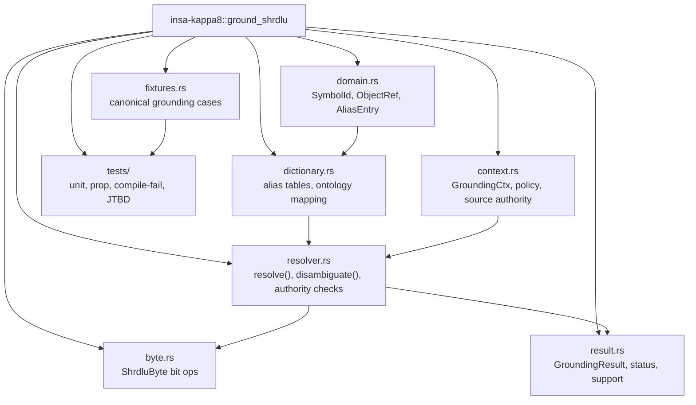
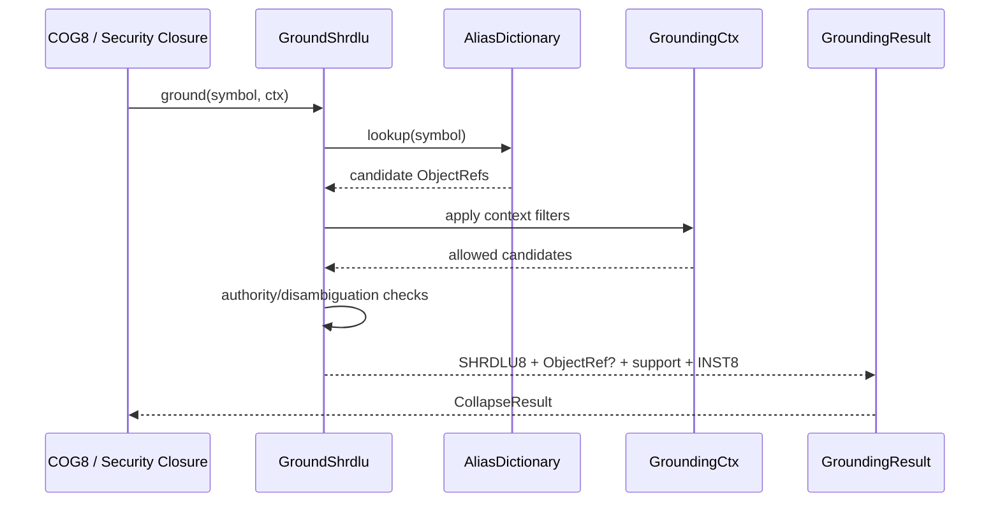
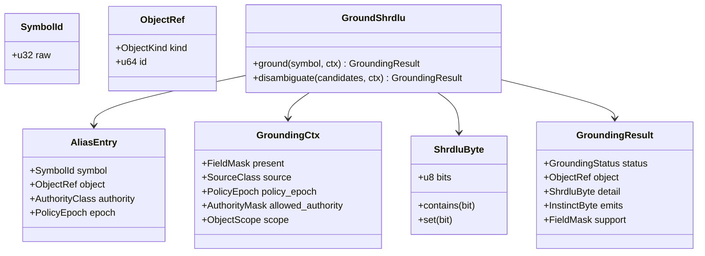
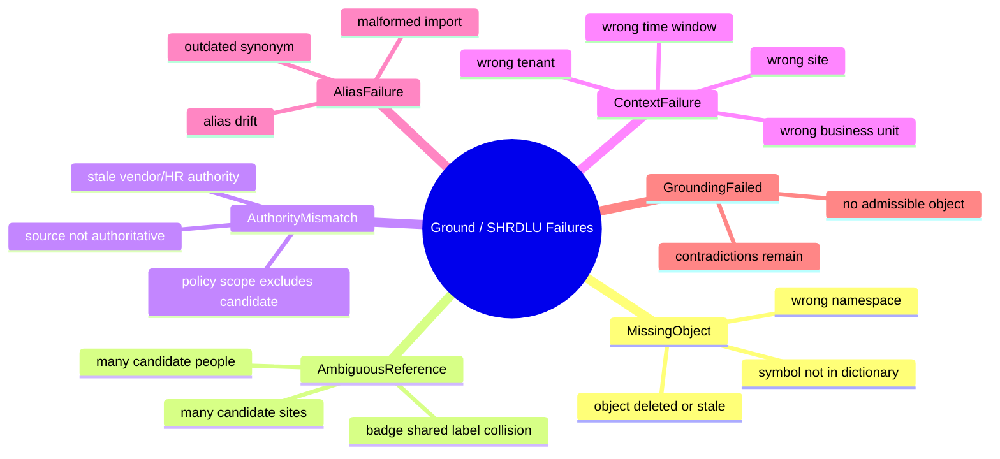
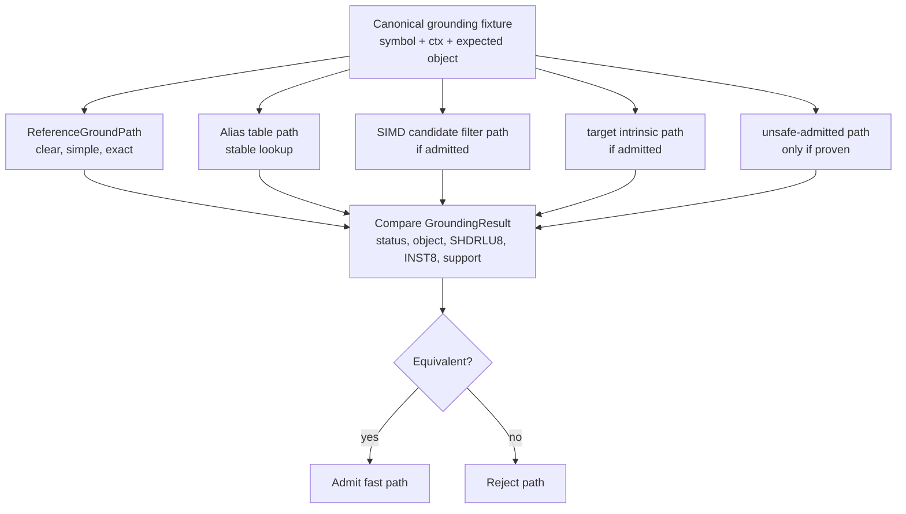
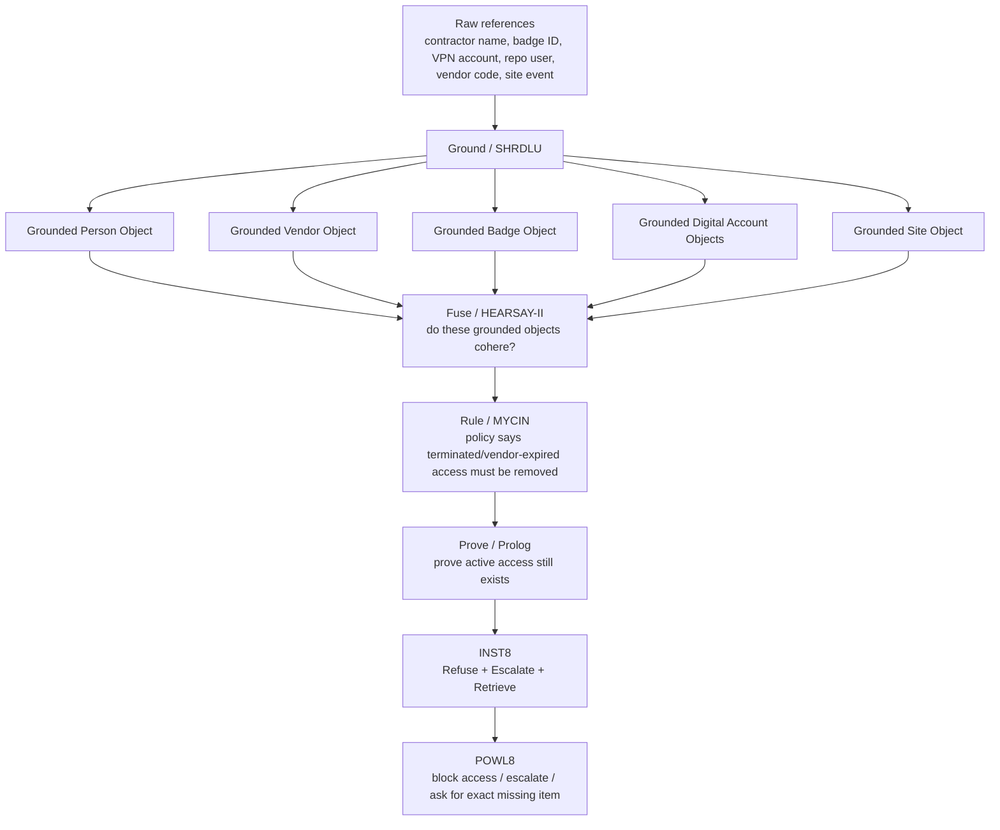

# KAPPA Template 01: Ground / SHRDLU

Core meaning:
Ground = bind symbols/references to the correct enterprise objects under context.
Without grounding, nothing else is lawful.

---

## 1. Role in the INSA pipeline

---

## 2. Internal 8-bit architecture: SHRDLU8

Semantic law:
* success-like bits: SymbolResolved, ObjectUnique, AliasMatched, ContextDisambiguated
* failure-like bits: AmbiguousReference, MissingObject, AuthorityMismatch, GroundingFailed

---

## 3. Rust module/component diagram

---

## 4. Execution flow / sequence

---

## 5. Type / data model

---

## 6. Failure taxonomy

---

## 7. Reference vs fast-path admission

**Rule:**
No fast grounding path without equivalence to the reference grounding law.

---

## 8. JTBD instantiation: Access Drift case

Case:
terminated contractor still has active badge, VPN, repo access, vendor relationship, and recent site/device activity

