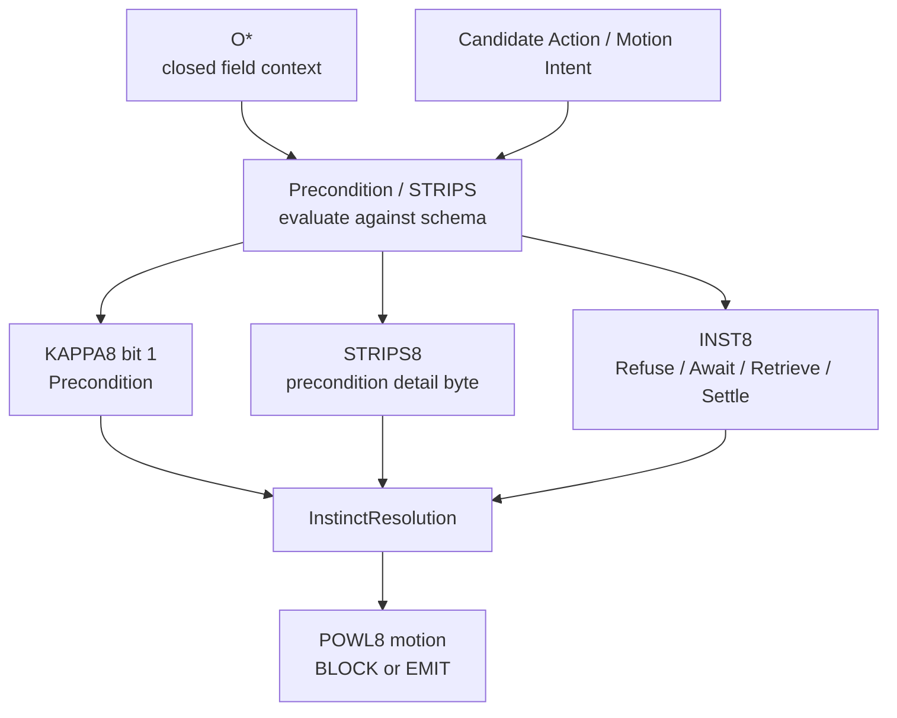
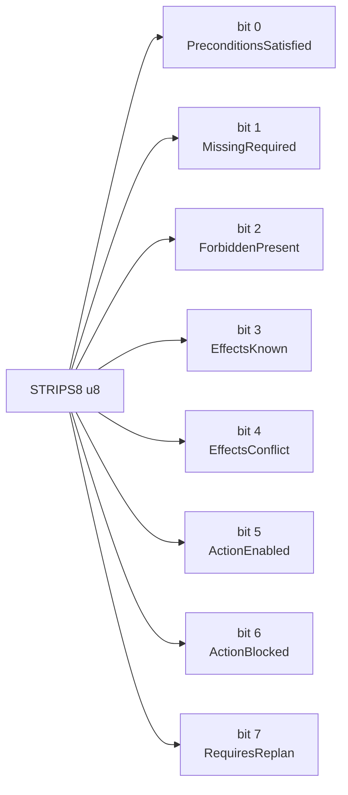
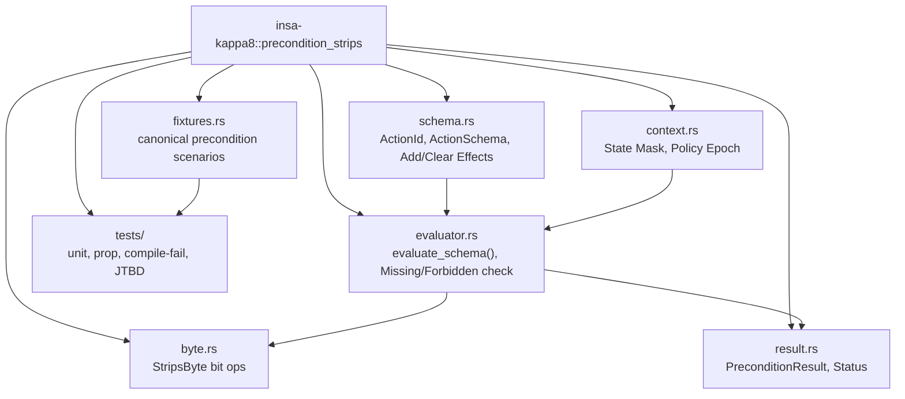
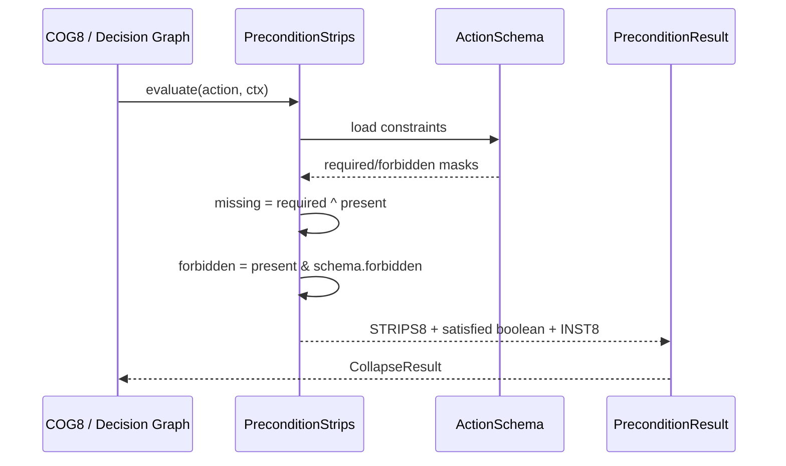
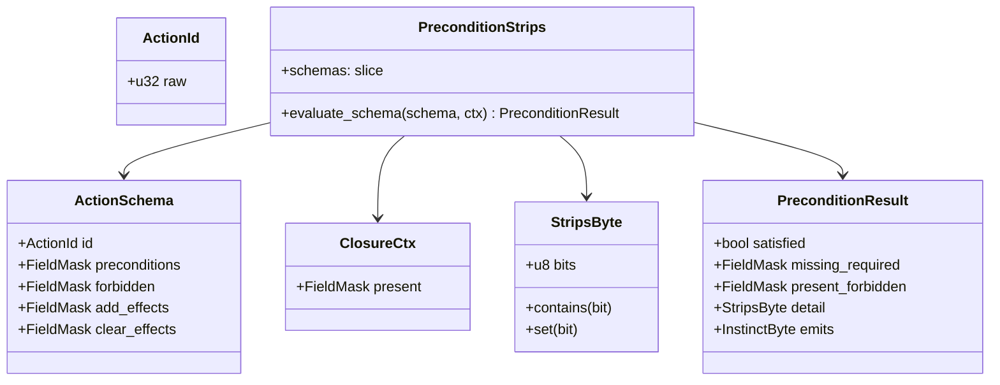
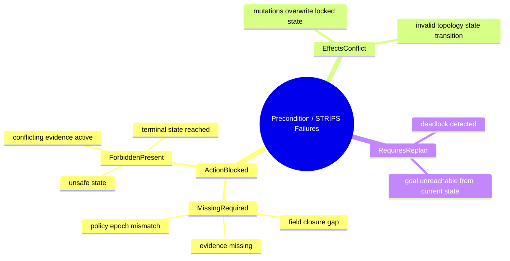
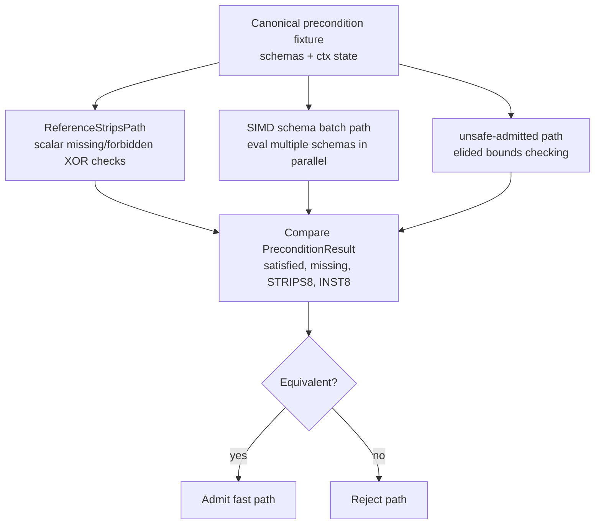
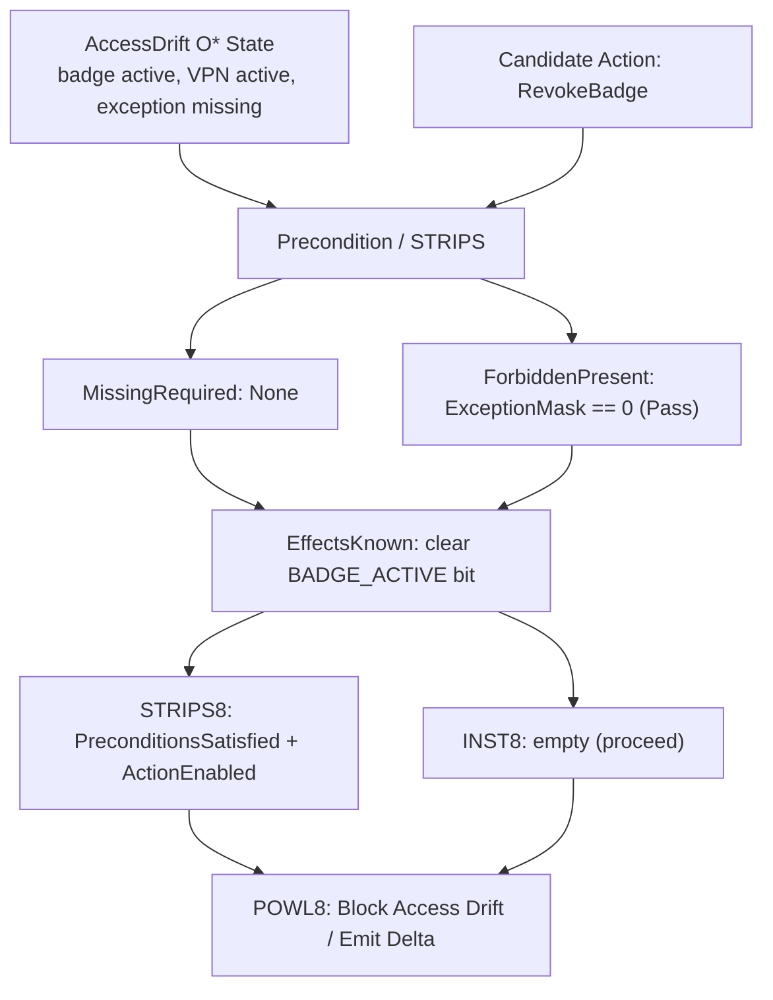

# KAPPA Template 02: Precondition / STRIPS

Core meaning:
**Precondition = Is the action enabled or blocked under the current field state?**
Once objects are grounded, the system must evaluate whether the desired autonomic motion (or projected action) violates field invariants or lacks required completion constraints.

---

## 1. Role in the INSA pipeline

---

## 2. Internal 8-bit architecture: STRIPS8

Semantic law:
* success-like bits: PreconditionsSatisfied, EffectsKnown, ActionEnabled
* failure-like bits: MissingRequired, ForbiddenPresent, EffectsConflict, ActionBlocked, RequiresReplan

---

## 3. Rust module/component diagram

---

## 4. Execution flow / sequence

---

## 5. Type / data model

---

## 6. Failure taxonomy

---

## 7. Reference vs fast-path admission

**Rule:**
No accelerated batch precondition evaluation without strict equivalence to the bitwise scalar reference law.

---

## 8. JTBD instantiation: Access Drift case

Case:
terminated contractor still has active badge, VPN, repo access, vendor relationship, and recent site/device activity

Precondition check is needed before remediation action:
* Is RevokeBadgeAccess legally enabled under the PolicyEpoch?
* Does RevokeBadgeAccess conflict with a locked EmergencyException field?
* What are the delta effects (clear_effects)?

