# KAPPA Template 03: Prove / Prolog

Core meaning:
**Prove = bounded relational proof over grounded facts, rules, authority, ownership, and policy relations.**

This comes after Ground / SHRDLU and Precondition / STRIPS because once objects are grounded and action schemas are known, the system must prove relations like:
* person owns account
* vendor contract governs identity
* badge belongs to contractor
* repo access is active
* policy applies to this site

---

## 1. Role in the INSA pipeline

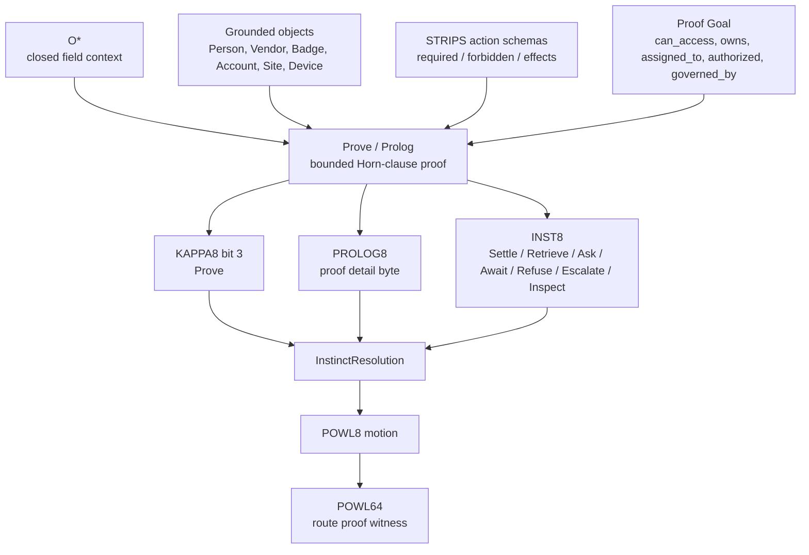

---

## 2. Internal 8-bit architecture: PROLOG8

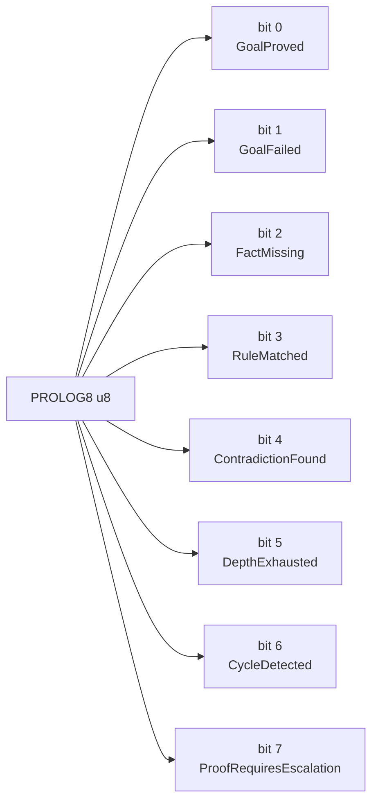

Semantic law:
* GoalProved means the proof closed under admitted facts/rules.
* GoalFailed means the goal was refuted or could not be satisfied under admitted closure.
* FactMissing means proof cannot proceed without exact missing evidence.
* ContradictionFound means admitted facts conflict.
* DepthExhausted means proof budget was exceeded.
* CycleDetected means recursive proof attempted unsafe repetition.
* ProofRequiresEscalation means local proof authority is insufficient.

---

## 3. Rust module/component diagram

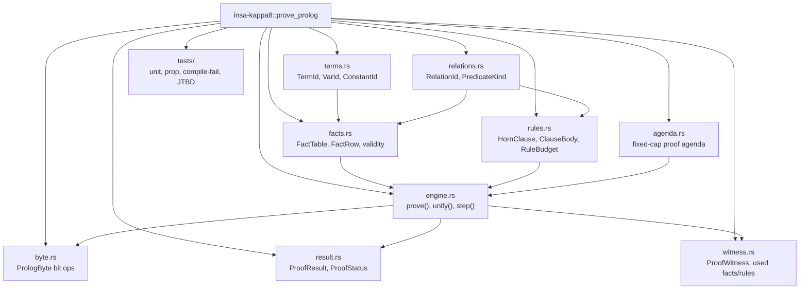

---

## 4. Execution flow / sequence

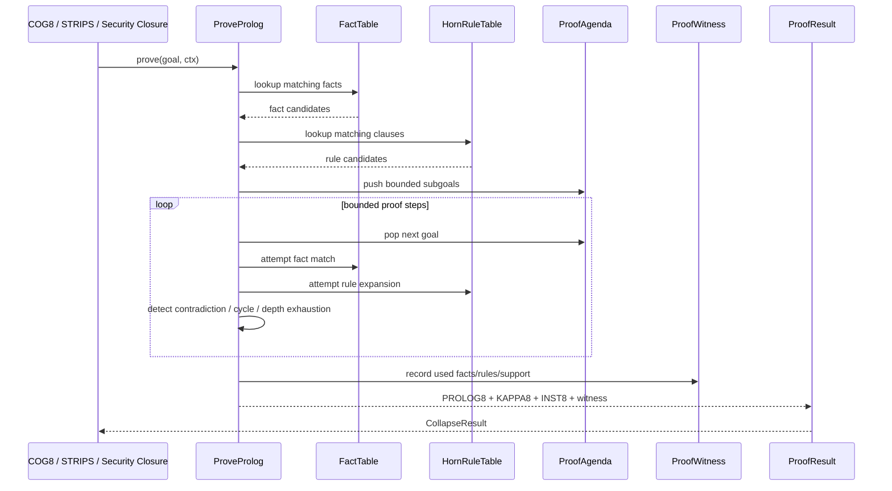

---

## 5. Type / data model

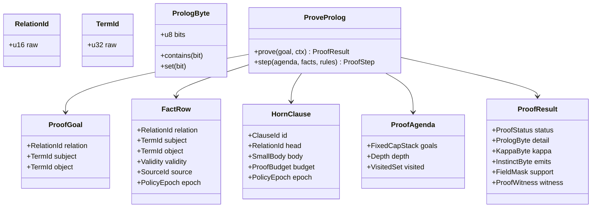

---

## 6. Failure taxonomy

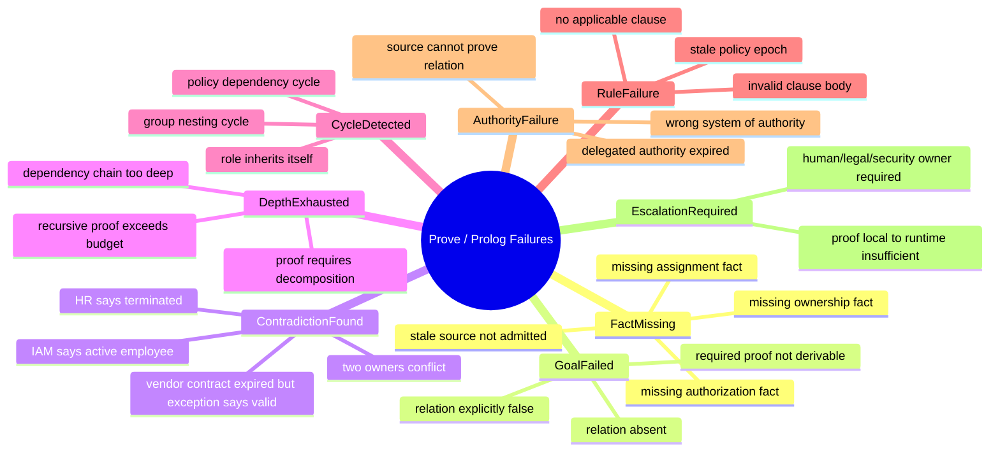

Core rule:
**Proof failure must produce an exact reason, not an empty “false.”**

---

## 7. Reference vs fast-path admission

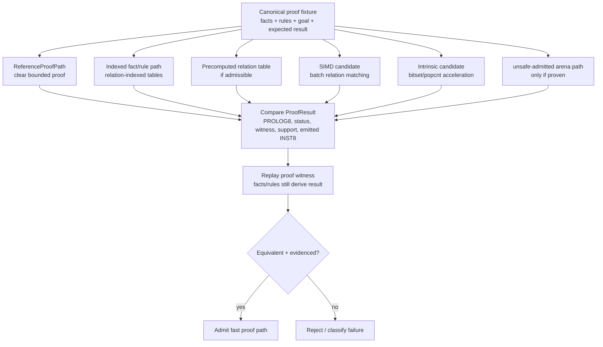

Admission law:
**A faster proof path is real only if it yields the same proof result and replay witness as ReferenceProofPath.**

---

## 8. JTBD instantiation: Access Drift case

Case:
terminated contractor still has active badge, VPN, repo access, vendor relationship, and recent site/device activity.

Ground / SHRDLU binds the objects.
STRIPS / Precondition determines which actions are enabled or blocked.
Prolog / Prove proves the relational facts:
* contractor belongs to vendor
* badge belongs to contractor
* vpn account belongs to contractor
* repo account belongs to contractor
* vendor contract is expired
* identity is terminated
* access is still active
* policy requires removal

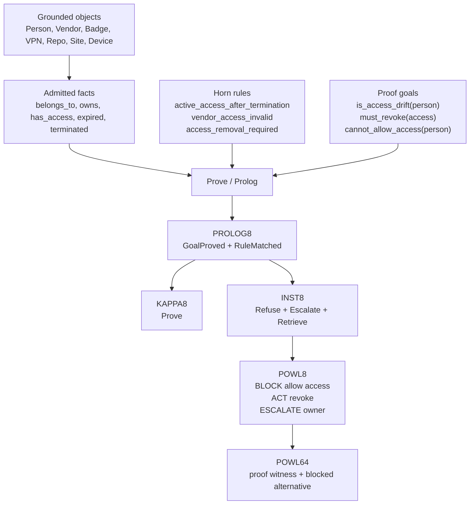

---

# 9. Access Drift proof rules

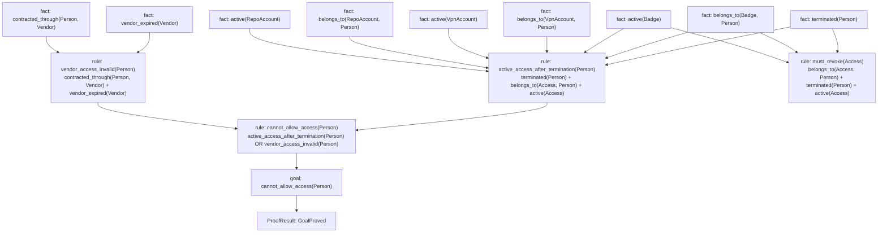

---

# 10. PROLOG8 → INST8 mapping

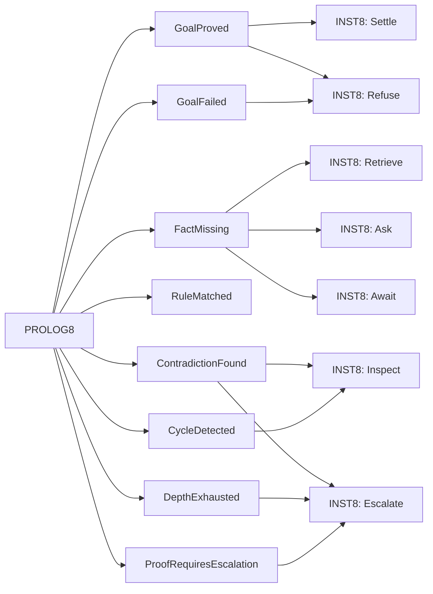

Mapping rule:
GoalProved -> Settle or Refuse depending on proven goal
FactMissing -> Retrieve / Ask / Await
ContradictionFound -> Inspect / Escalate
DepthExhausted -> Escalate / decompose
CycleDetected -> Inspect / reject rule graph
ProofRequiresEscalation -> Escalate

---

# 11. Prolog boundedness gates

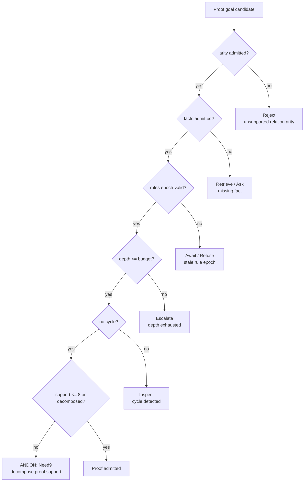

This prevents Prolog from becoming unbounded symbolic search.

---

# 12. Proof witness to POWL64

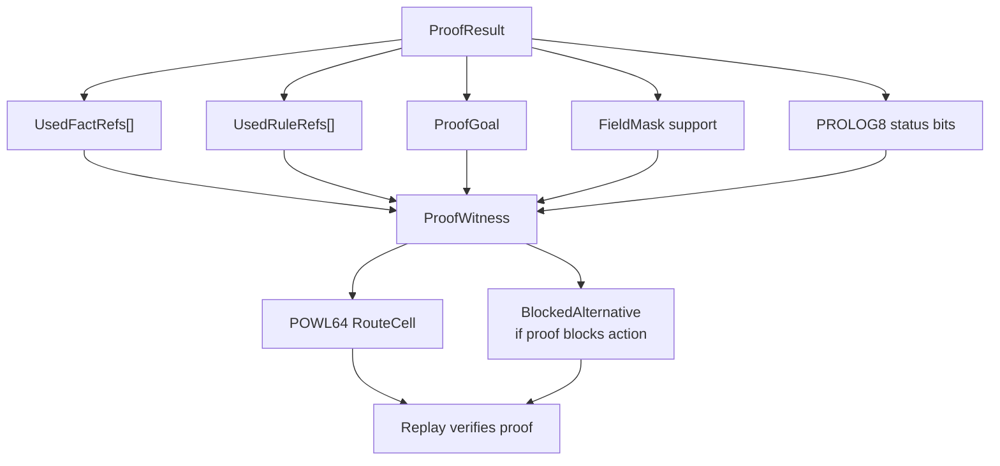
