Next KAPPA pack:

[
\boxed{\text{Reconstruct / DENDRAL}}
]

Core meaning:

[
\boxed{
\text{Reconstruct} = \text{derive the most lawful bounded structure from fragments without hallucinating missing links.}
}
]

This is the layer for:

```text id="e61xk2"
timeline reconstruction
incident path reconstruction
dependency chain reconstruction
access path reconstruction
document bundle reconstruction
evidence chain reconstruction
CVE reachability path reconstruction
```

`DENDRAL / Reconstruct` is not “creative inference.” It is **bounded structural reconstruction** under constraints.

---

# KAPPA Template 07: `Reconstruct / DENDRAL`

## 1. Role in the INSA pipeline

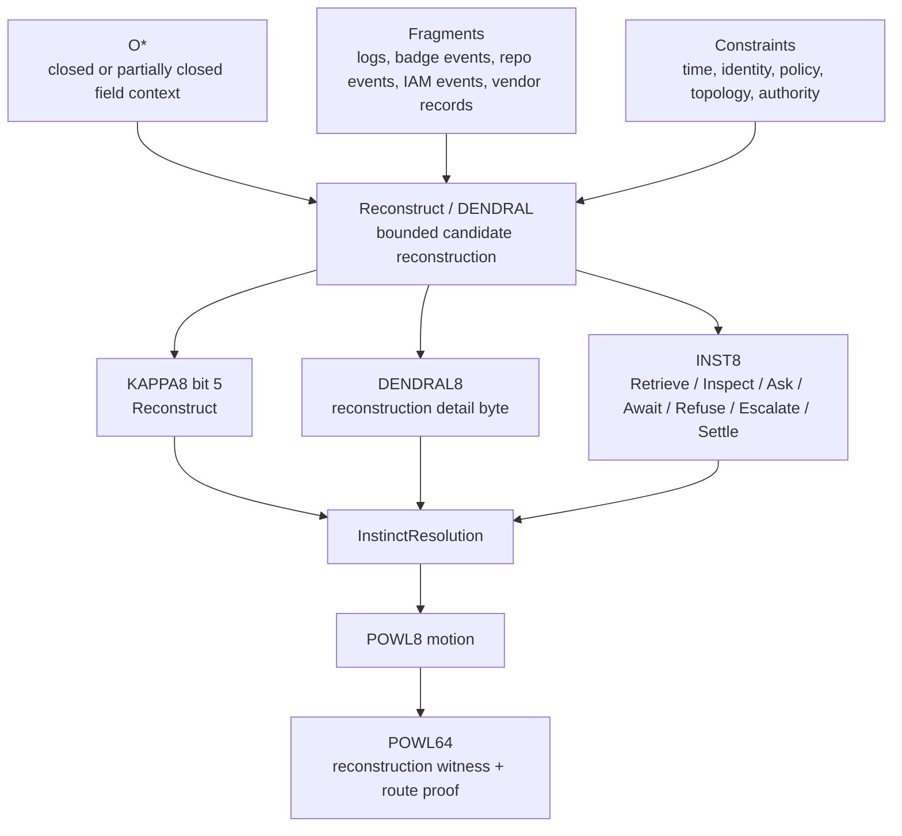

---

## 2. Internal 8-bit architecture: `DENDRAL8`

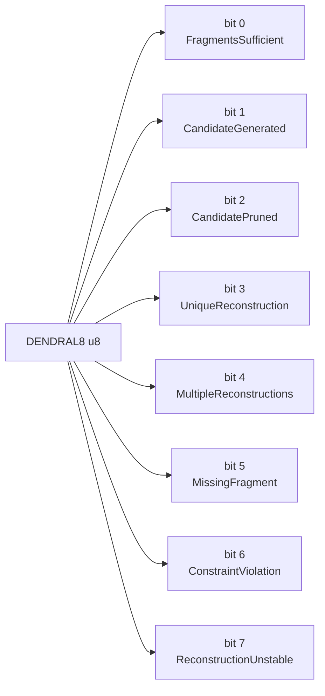

Semantic law:

[
UniqueReconstruction \Rightarrow FragmentsSufficient \land CandidateGenerated \land CandidatePruned \land \neg ConstraintViolation
]

[
ReconstructionUnstable \Rightarrow MultipleReconstructions \lor MissingFragment \lor ConstraintViolation
]

---

## 3. Rust module/component diagram

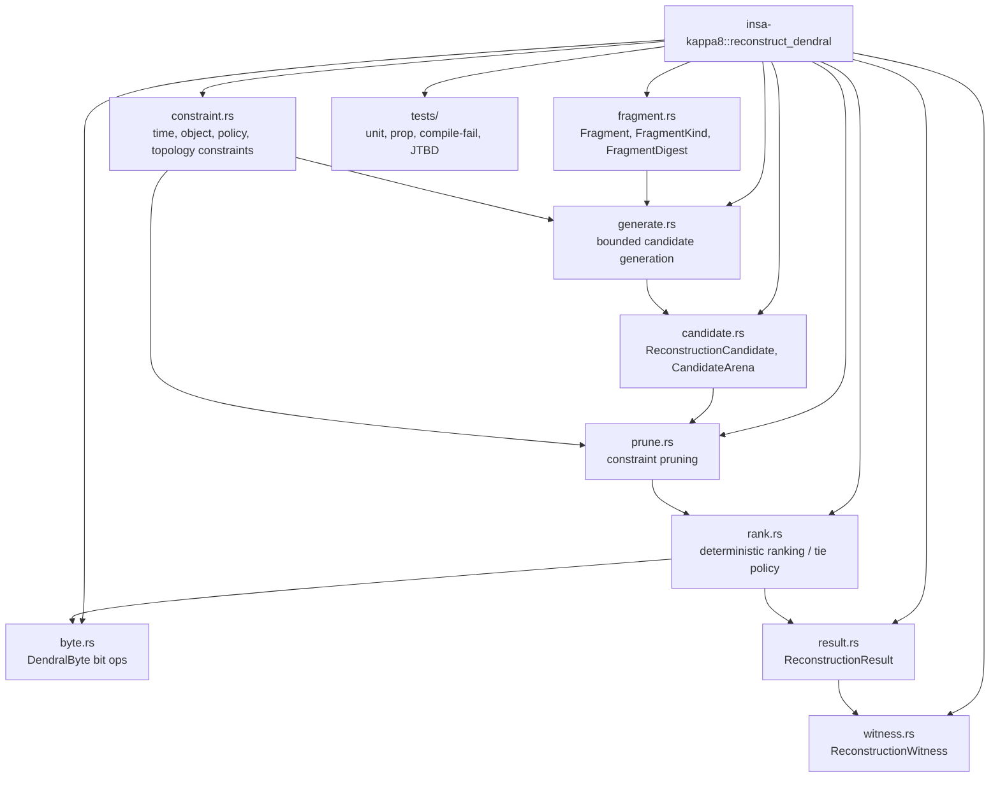

---

## 4. Execution flow / sequence

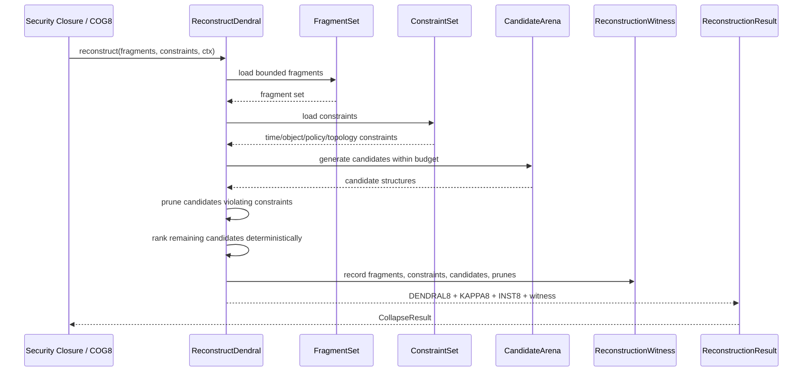

---

## 5. Type / data model

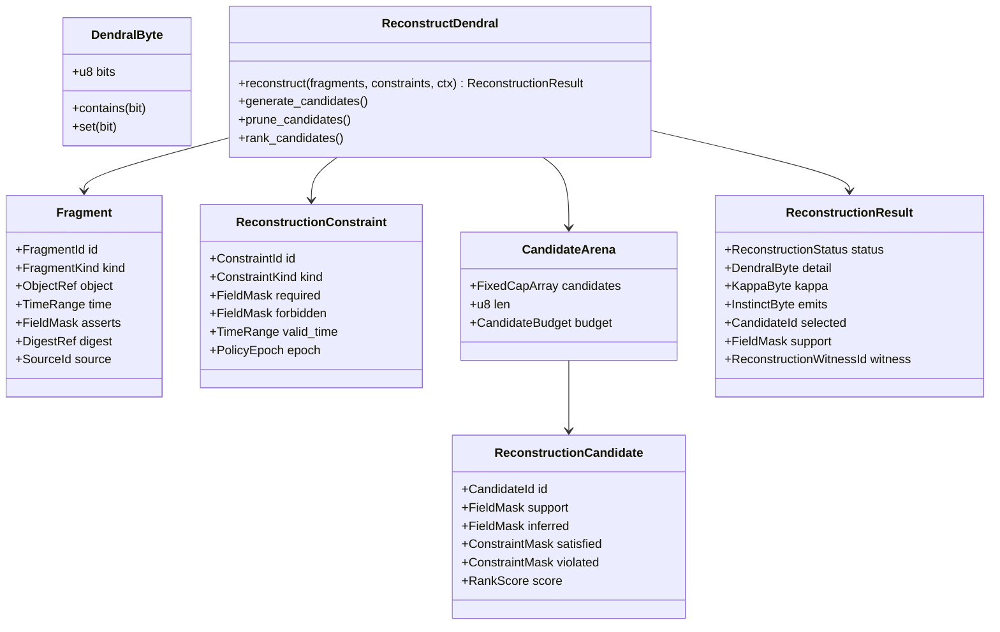

---

## 6. Failure taxonomy

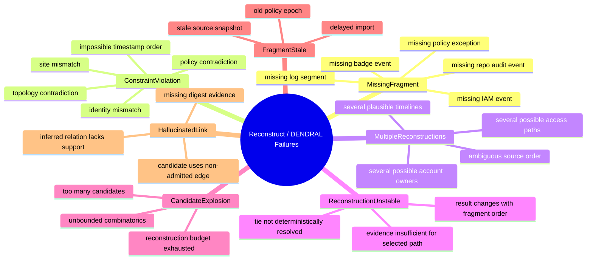

Hard law:

[
\boxed{
DENDRAL may reconstruct structure, but it may not invent authority.
}
]

Missing links become `Retrieve`, `Ask`, `Await`, or `Inspect`, not hallucinated closure.

---

## 7. Reference vs fast-path admission

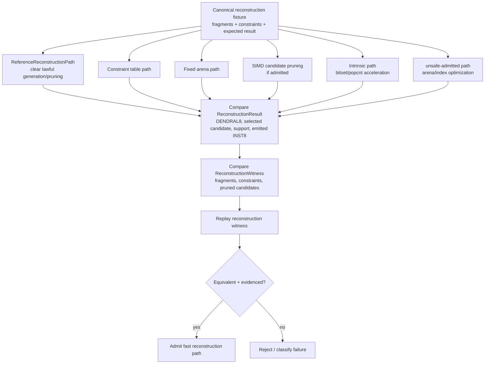

Admission law:

[
\boxed{
A faster reconstruction path is admitted only if it selects the same candidate, prunes the same invalid structures, and produces the same replay witness as ReferenceReconstructionPath.
}
]

---

## 8. JTBD instantiation: Access Drift case

Case:

```text id="f20znp"
Terminated contractor still has active badge, VPN, repo access, expired vendor relationship, and recent site/device activity.
```

`DENDRAL / Reconstruct` answers:

```text id="4f36dg"
What actually happened in sequence?
Which events form the access-drift path?
Which fragments are missing?
Is there one stable timeline or several possible reconstructions?
```

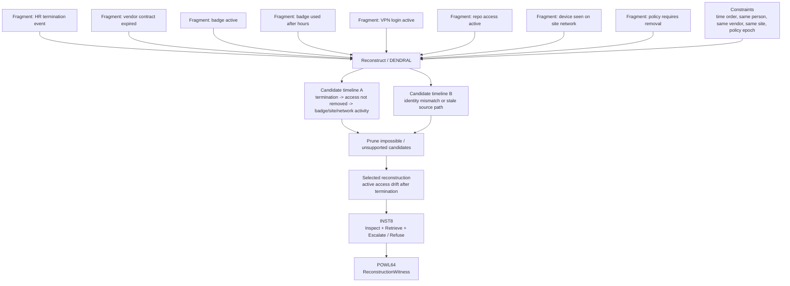

---

# 9. Reconstruction candidates for Access Drift

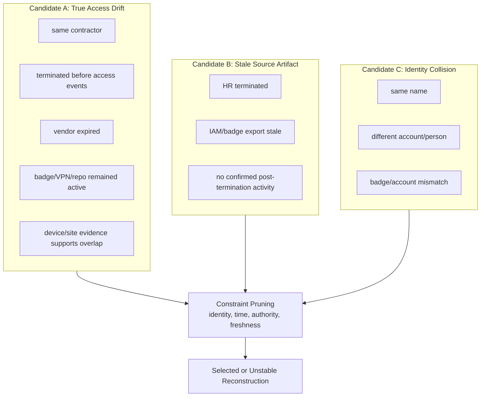

This is important because INSA should not accuse from fragments. It should either select a replayable reconstruction or mark the reconstruction unstable.

---

# 10. DENDRAL8 → INST8 mapping

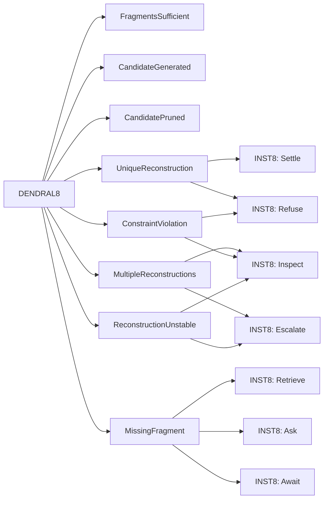

Mapping rule:

```text id="aznsbn"
UniqueReconstruction -> Settle or proceed to Refuse/Escalate depending on content
MultipleReconstructions -> Inspect/Escalate
MissingFragment -> Retrieve/Ask/Await
ConstraintViolation -> Inspect/Refuse
ReconstructionUnstable -> Inspect/Escalate
```

---

# 11. Reconstruction boundedness gates

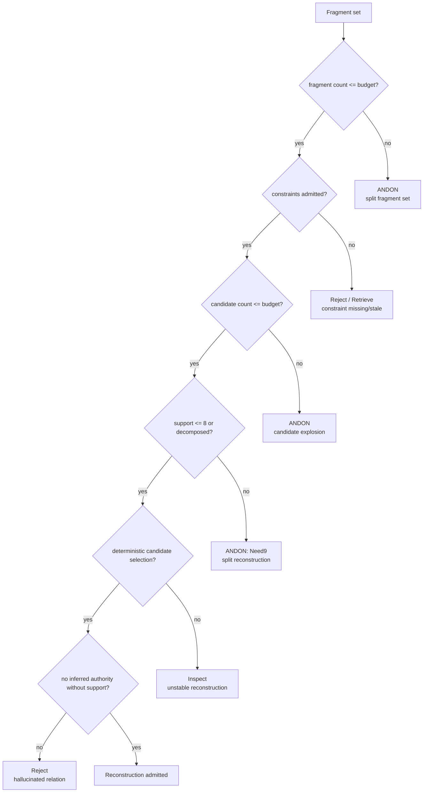

This is the DENDRAL equivalent of `Need9`: if reconstruction explodes, decompose rather than widen.

---

# 12. Reconstruction witness to POWL64

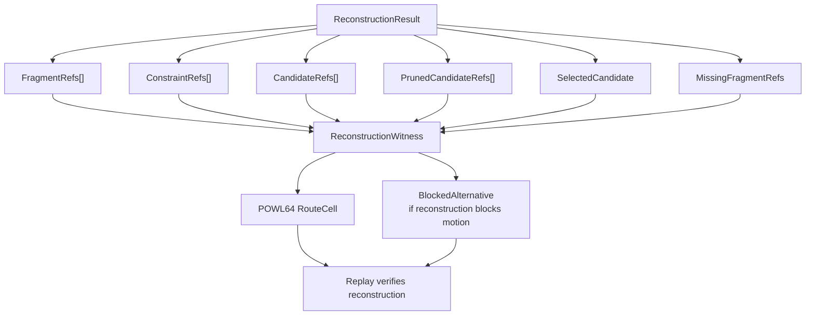

Replay question:

[
\boxed{
Given the same fragments and constraints, does the same reconstruction result emerge?
}
]

If not:

```text id="xlcdob"
ReplayInvalid
```

---

# 13. Immediate Rust surface

```rust id="kuk51f"
#[repr(transparent)]
#[derive(Copy, Clone, Eq, PartialEq, Default, Debug)]
pub struct DendralByte(u8);

impl DendralByte {
    pub const FRAGMENTS_SUFFICIENT:     Self = Self(1 << 0);
    pub const CANDIDATE_GENERATED:      Self = Self(1 << 1);
    pub const CANDIDATE_PRUNED:         Self = Self(1 << 2);
    pub const UNIQUE_RECONSTRUCTION:    Self = Self(1 << 3);
    pub const MULTIPLE_RECONSTRUCTIONS: Self = Self(1 << 4);
    pub const MISSING_FRAGMENT:         Self = Self(1 << 5);
    pub const CONSTRAINT_VIOLATION:     Self = Self(1 << 6);
    pub const RECONSTRUCTION_UNSTABLE:  Self = Self(1 << 7);

    #[inline(always)]
    pub const fn bits(self) -> u8 {
        self.0
    }

    #[inline(always)]
    pub const fn contains(self, other: Self) -> bool {
        (self.0 & other.0) == other.0
    }

    #[inline(always)]
    pub const fn union(self, other: Self) -> Self {
        Self(self.0 | other.0)
    }
}

#[repr(C)]
#[derive(Copy, Clone, Eq, PartialEq, Debug)]
pub struct Fragment {
    pub id: FragmentId,
    pub kind: FragmentKind,
    pub object: ObjectRef,
    pub time: TimeRange,
    pub asserts: FieldMask,
    pub digest: DigestRef,
    pub source: SourceId,
}

#[repr(C)]
#[derive(Copy, Clone, Eq, PartialEq, Debug)]
pub struct ReconstructionCandidate {
    pub id: CandidateId,
    pub support: FieldMask,
    pub inferred: FieldMask,
    pub satisfied: ConstraintMask,
    pub violated: ConstraintMask,
    pub score: RankScore,
}

#[repr(C)]
#[derive(Copy, Clone, Eq, PartialEq, Debug)]
pub struct ReconstructionResult {
    pub detail: DendralByte,
    pub kappa: KappaByte,
    pub emits: InstinctByte,
    pub selected: CandidateId,
    pub support: FieldMask,
    pub witness_index: ReconstructionWitnessId,
}
```

---

# Summary

[
\boxed{
Ground / SHRDLU binds objects.
}
]

[
\boxed{
STRIPS determines whether candidate action is enabled.
}
]

[
\boxed{
Prolog proves required relations.
}
]

[
\boxed{
HEARSAY-II fuses sources.
}
]

[
\boxed{
GPS reduces remaining gaps.
}
]

[
\boxed{
MYCIN applies policy/expert rules.
}
]

[
\boxed{
DENDRAL reconstructs bounded structures from fragments.
}
]

For the Access Drift JTBD:

```text id="9w6x4h"
Ground identifies contractor/vendor/badge/accounts/site/device.
STRIPS blocks AllowAccess and enables RevokeAccess.
Prolog proves active access after termination.
HEARSAY-II fuses HR/IAM/badge/vendor/device/policy evidence.
GPS selects smallest lawful next step.
MYCIN applies termination/vendor/badge/access policy.
DENDRAL reconstructs the timeline and access path from fragments.
```

Next KAPPA pack:

[
\boxed{\text{Reflect / ELIZA}}
]

That is the interface/conversation-control layer that reflects ambiguity, asks precise questions, slows premature action, and prevents LLM calls from becoming the default reflex.