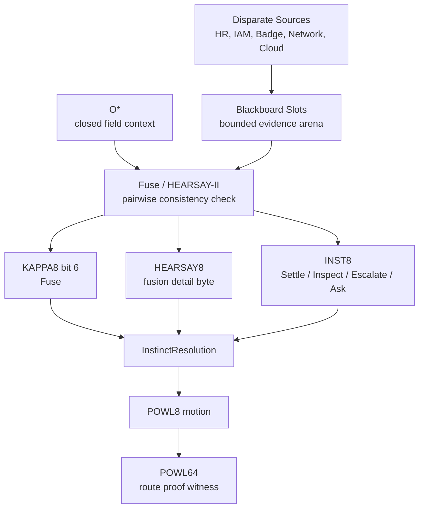
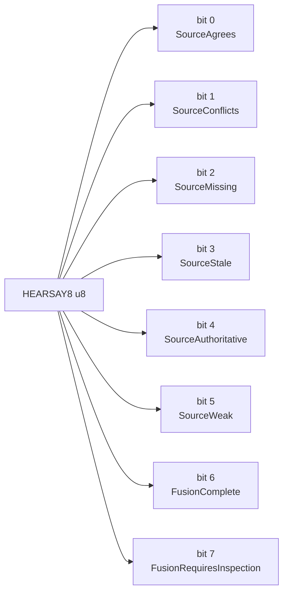
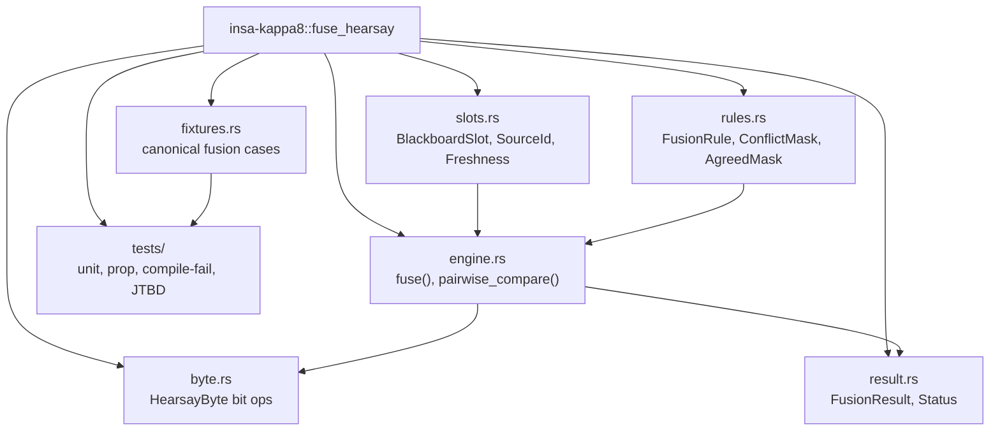
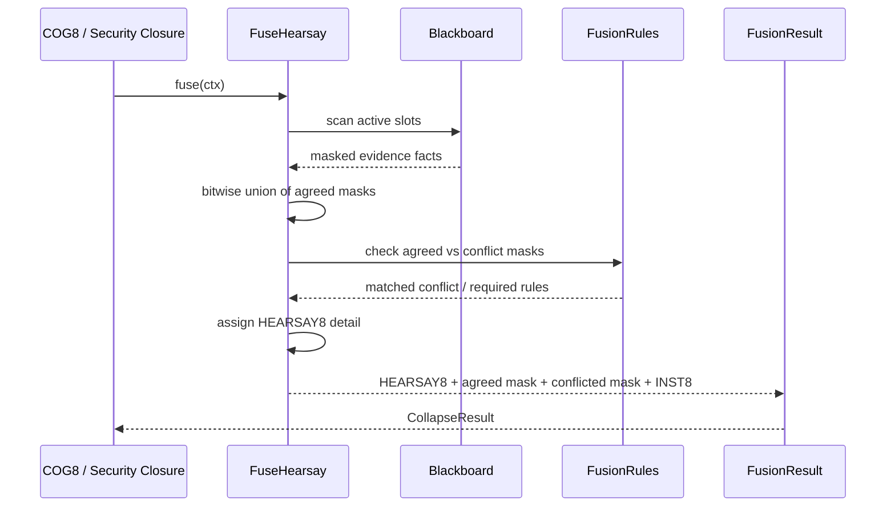
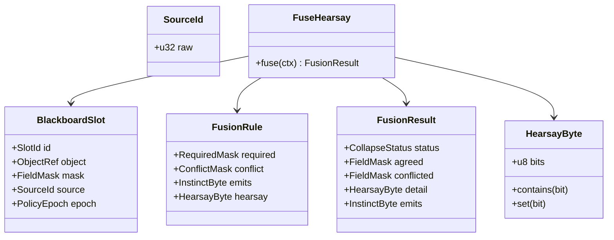
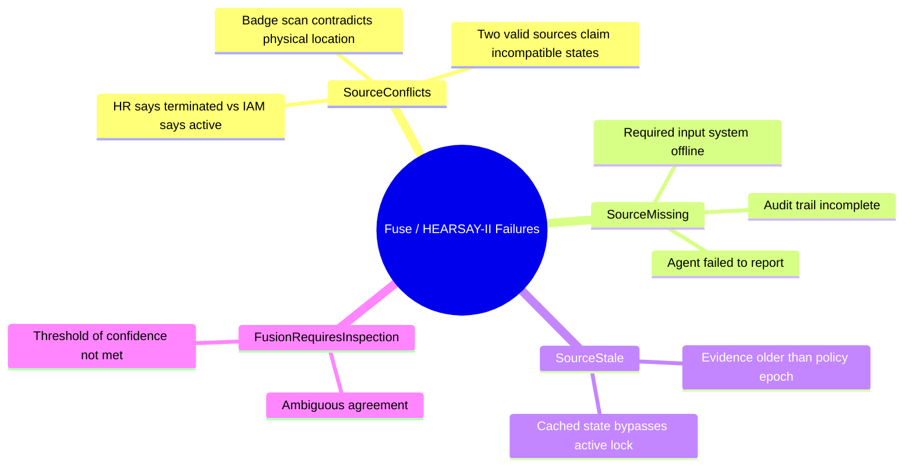
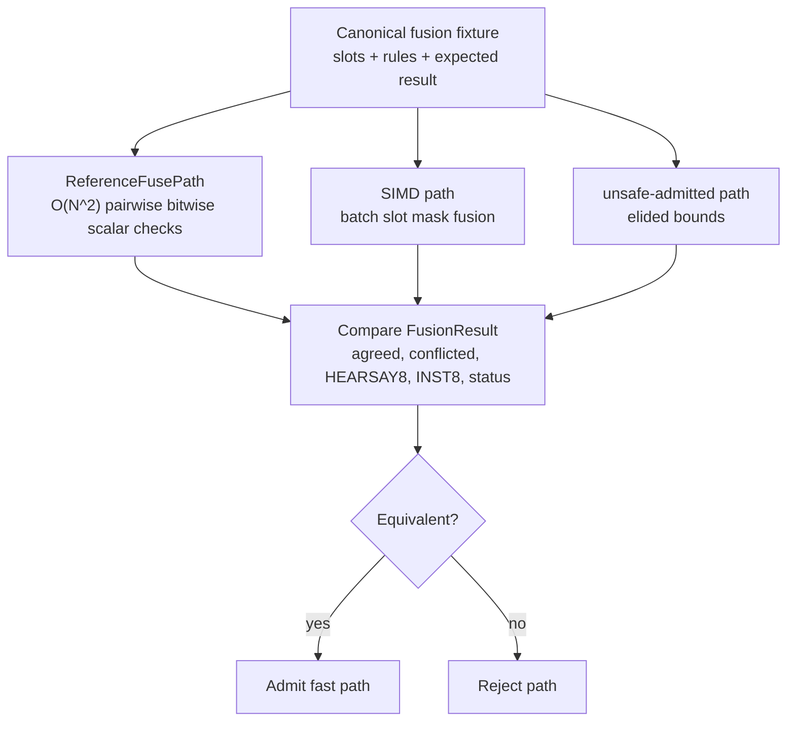
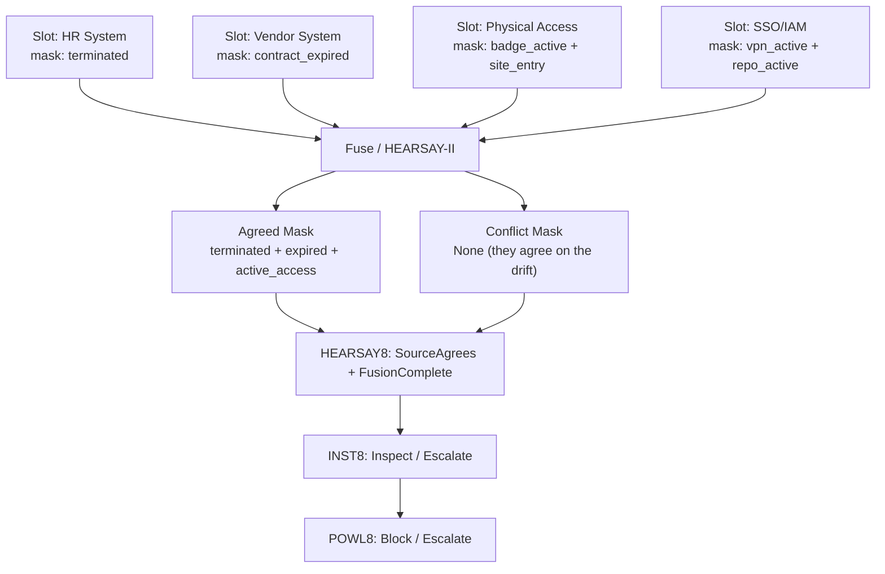

# KAPPA Template 04: Fuse / HEARSAY-II

Core meaning:
**Fuse = combine multi-source evidence into a single coherent field while detecting and bounding contradictions.**

This comes after Prove / Prolog because even proven facts must be resolved when multiple disparate systems claim conflicting truth about the same object.

---

## 1. Role in the INSA pipeline

---

## 2. Internal 8-bit architecture: HEARSAY8

Semantic law:
* Success-like bits: SourceAgrees, SourceAuthoritative, FusionComplete
* Failure-like bits: SourceConflicts, SourceMissing, SourceStale, SourceWeak, FusionRequiresInspection

---

## 3. Rust module/component diagram

---

## 4. Execution flow / sequence

---

## 5. Type / data model

---

## 6. Failure taxonomy

---

## 7. Reference vs fast-path admission

---

## 8. JTBD instantiation: Access Drift case

Case:
terminated contractor still has active badge, VPN, repo access, vendor relationship, and recent site/device activity.

Fuse / HEARSAY-II is responsible for confirming that the disparate systems actually represent a real drift and aren't just stale caching.

