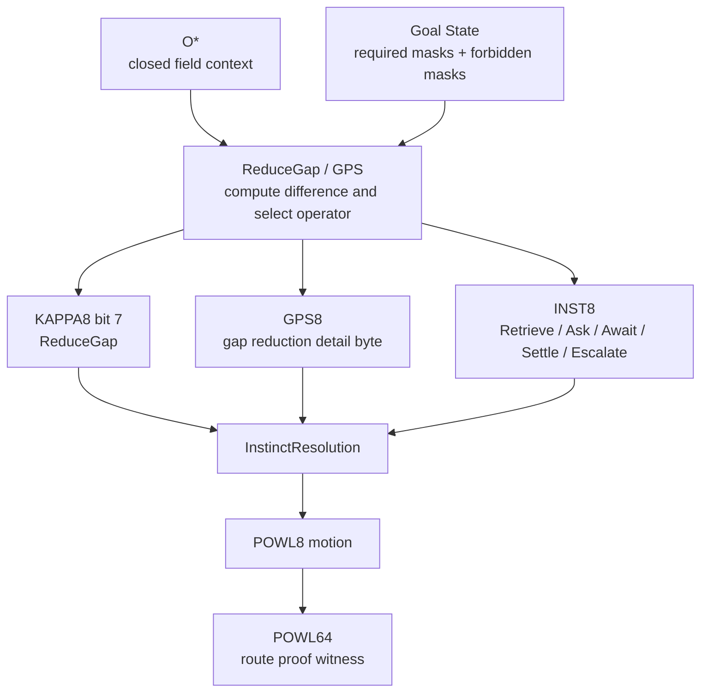
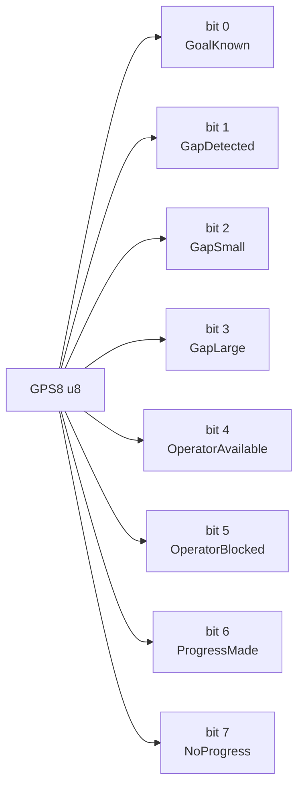
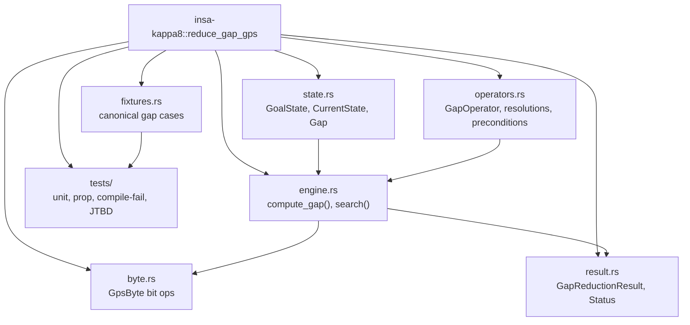
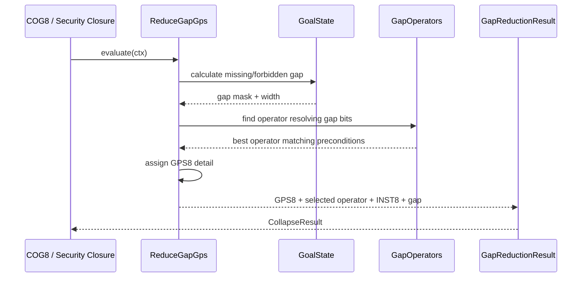
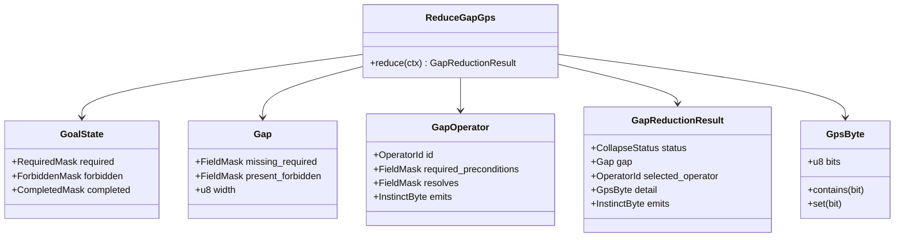
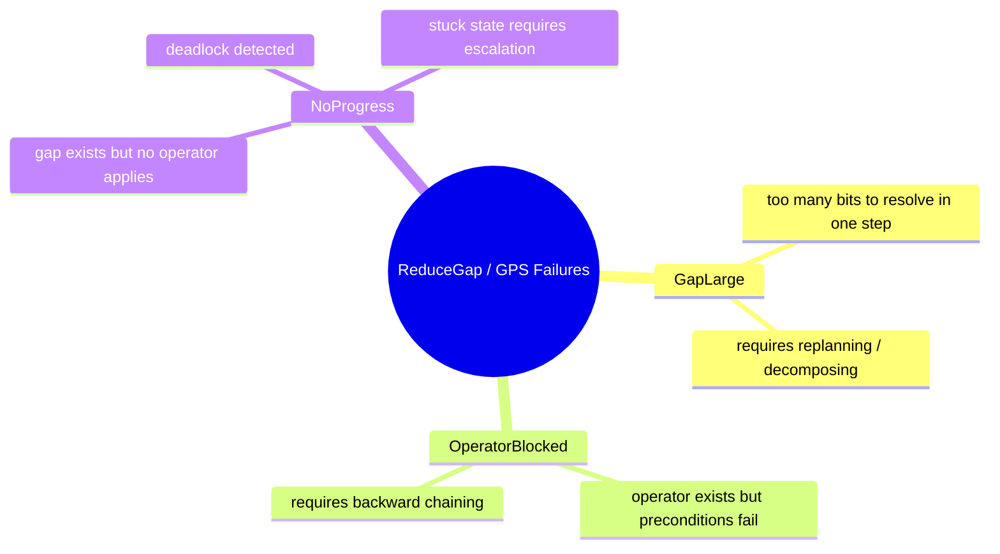
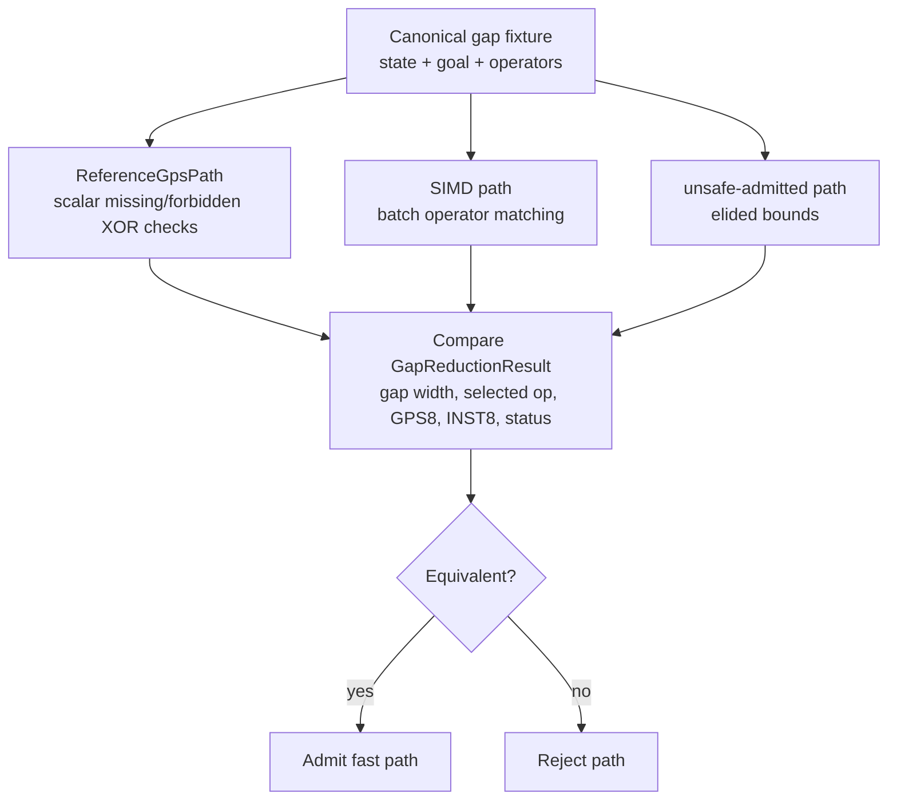
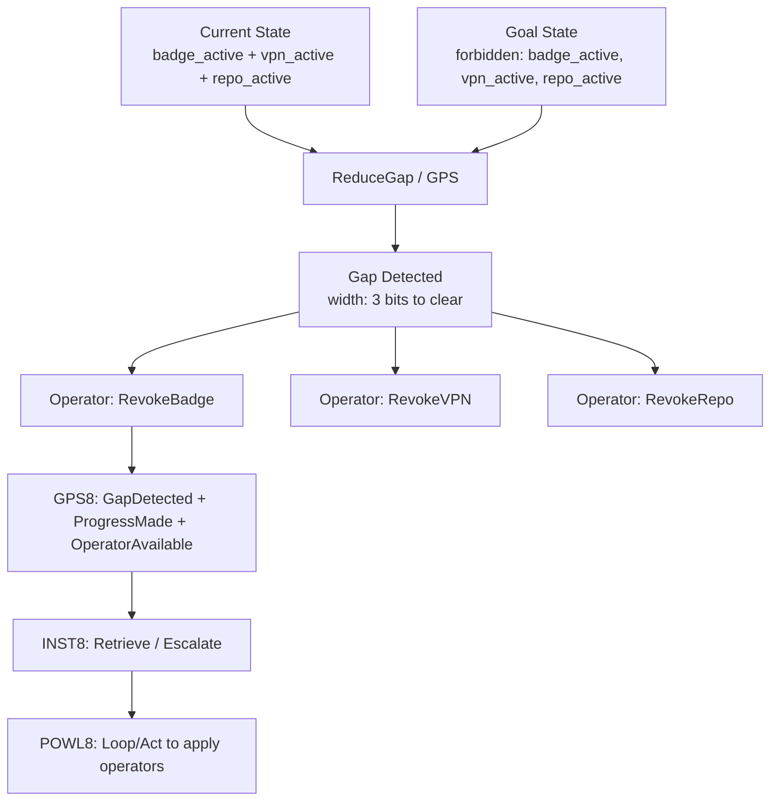

# KAPPA Template 05: ReduceGap / GPS

Core meaning:
**ReduceGap = determine the deterministic bounded delta needed to transition the current state to the goal state.**

This comes after Fuse / HEARSAY-II because once the field is coherent, the system must decide *what exact operations* are needed to reach compliance.

---

## 1. Role in the INSA pipeline

---

## 2. Internal 8-bit architecture: GPS8

Semantic law:
* Success-like bits: GoalKnown, OperatorAvailable, ProgressMade
* Failure-like bits: GapDetected, GapLarge, OperatorBlocked, NoProgress

---

## 3. Rust module/component diagram

---

## 4. Execution flow / sequence

---

## 5. Type / data model

---

## 6. Failure taxonomy

---

## 7. Reference vs fast-path admission

---

## 8. JTBD instantiation: Access Drift case

Case:
terminated contractor still has active badge, VPN, repo access, vendor relationship, and recent site/device activity.

ReduceGap / GPS is responsible for calculating exactly what operations are required to reach the PolicyCompliant state.

