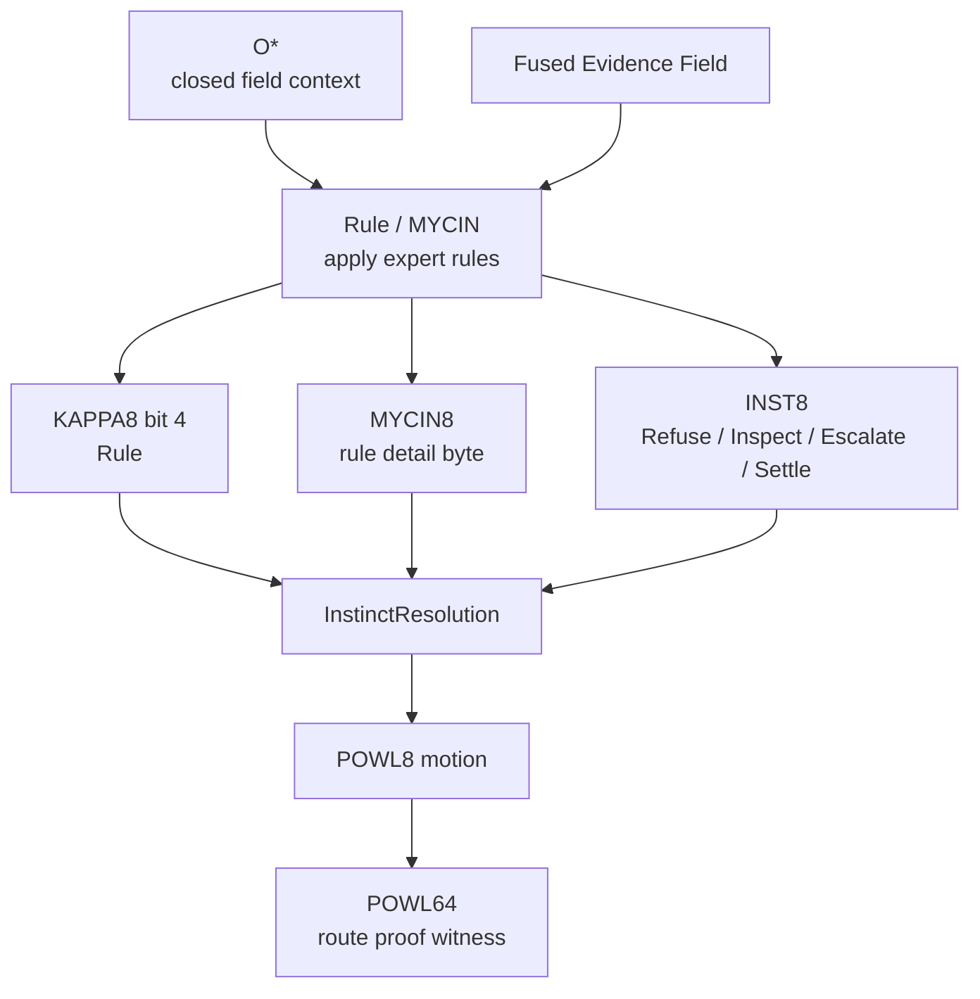
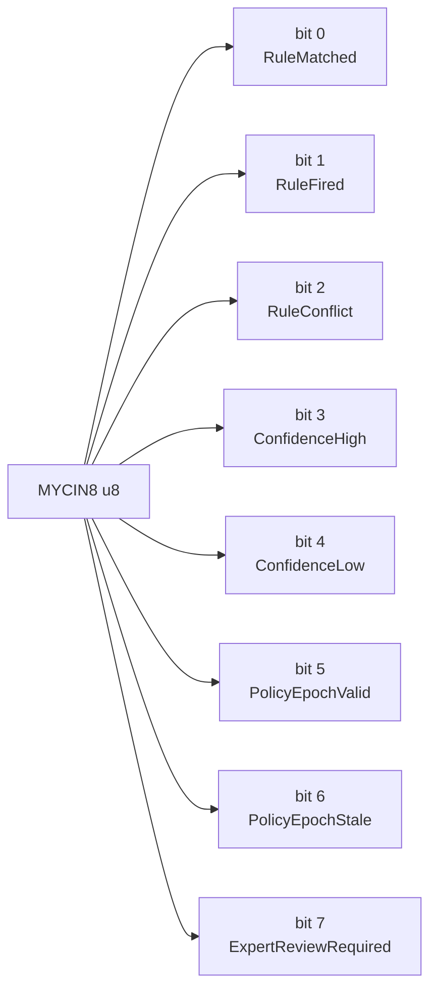
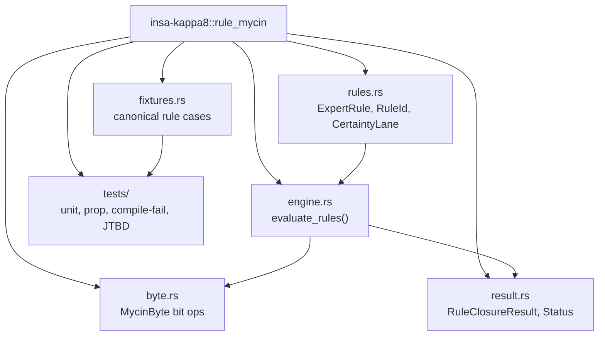
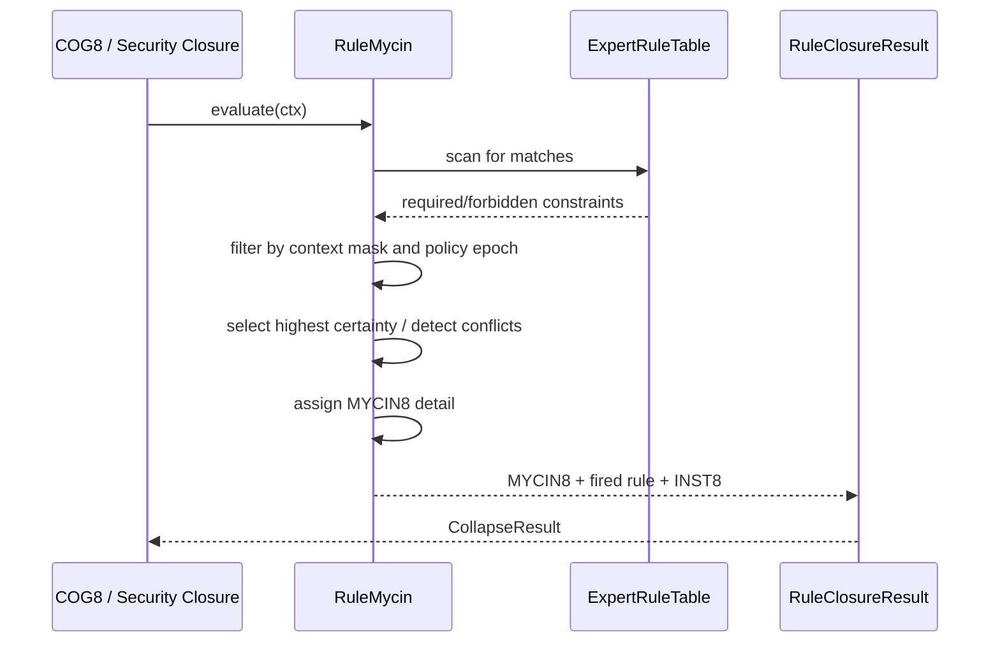
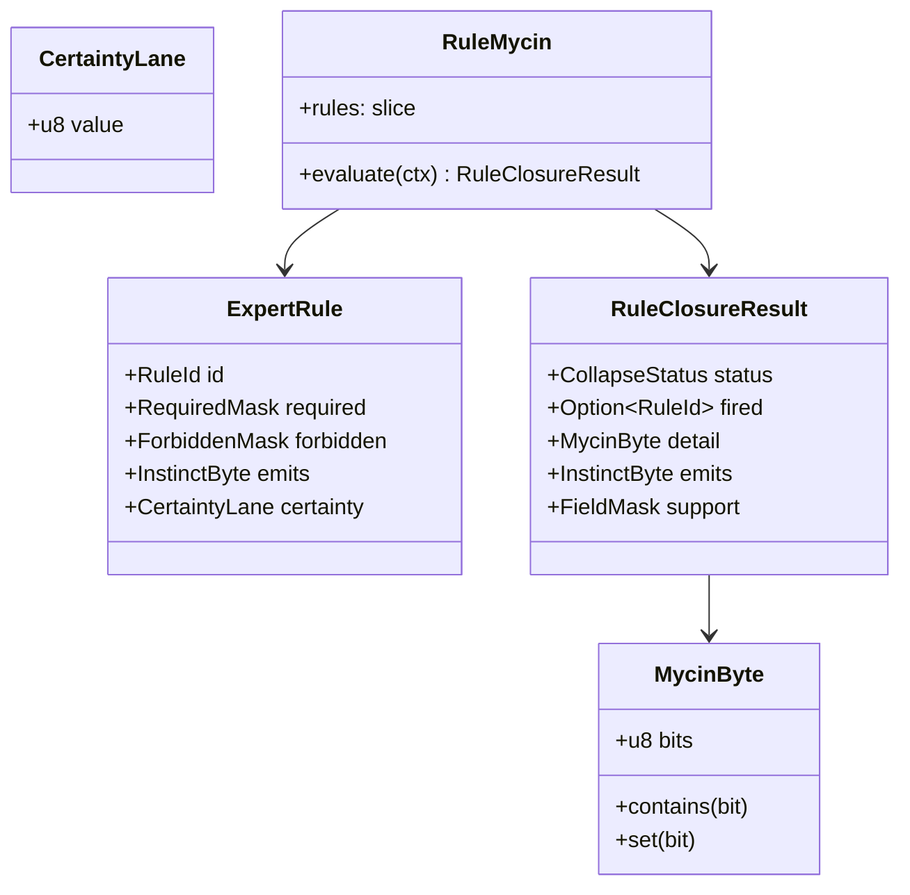
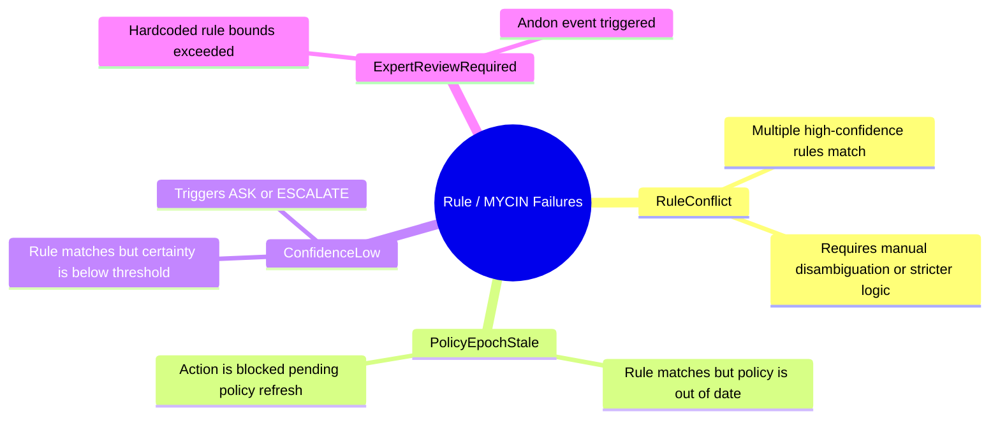
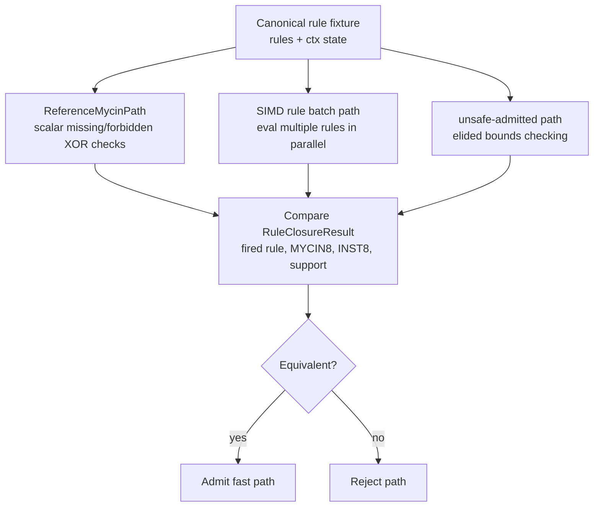
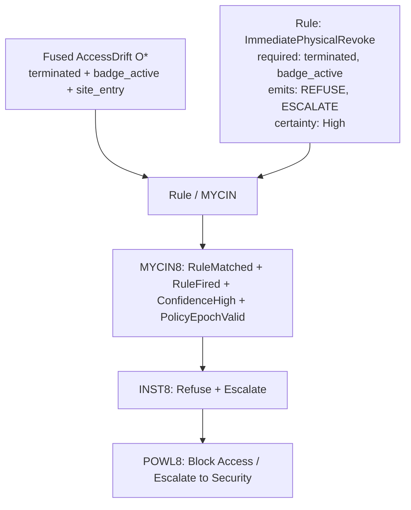

# KAPPA Template 06: Rule / MYCIN

Core meaning:
**Rule = bounded application of expert rules over verified evidence fields, yielding a deterministic certainty conclusion.**

This comes after Fuse / HEARSAY-II because rules must operate on resolved, non-conflicting field states.

---

## 1. Role in the INSA pipeline

---

## 2. Internal 8-bit architecture: MYCIN8

Semantic law:
* Success-like bits: RuleMatched, RuleFired, ConfidenceHigh, PolicyEpochValid
* Failure-like bits: RuleConflict, ConfidenceLow, PolicyEpochStale, ExpertReviewRequired

---

## 3. Rust module/component diagram

---

## 4. Execution flow / sequence

---

## 5. Type / data model

---

## 6. Failure taxonomy

---

## 7. Reference vs fast-path admission

---

## 8. JTBD instantiation: Access Drift case

Case:
terminated contractor still has active badge, VPN, repo access, vendor relationship, and recent site/device activity.

MYCIN evaluates the specific enterprise security policies (e.g., "Terminated users must lose physical access immediately").

