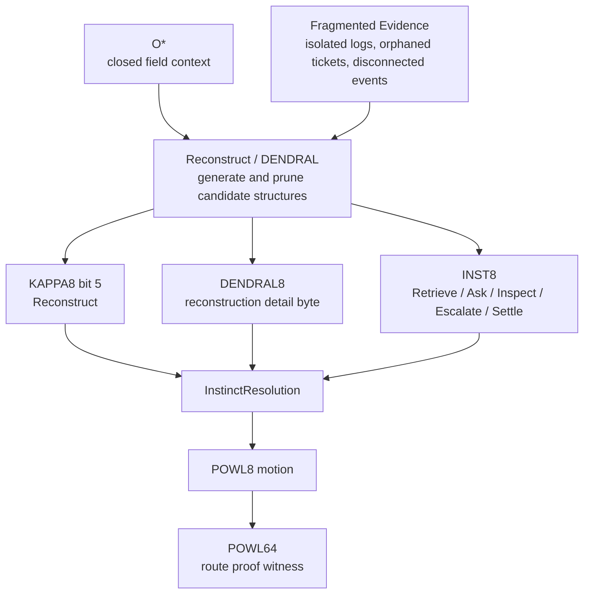
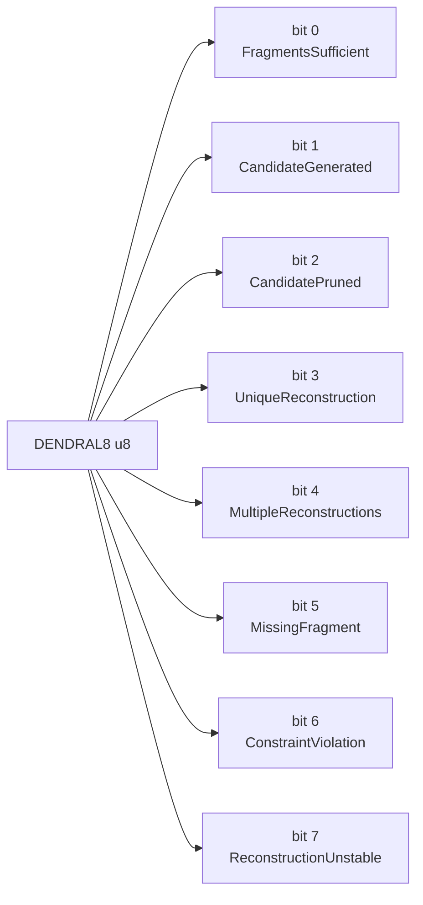
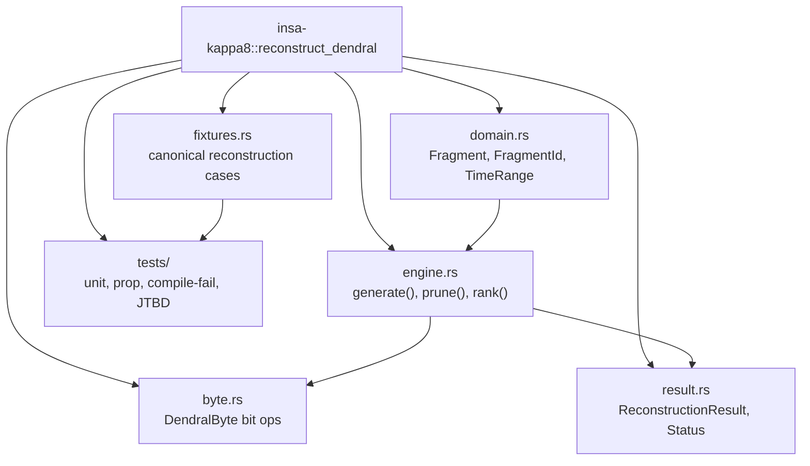
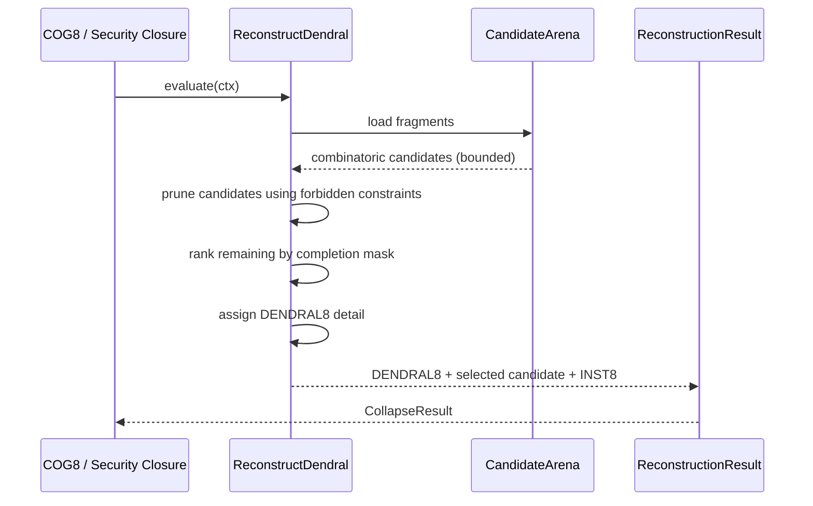
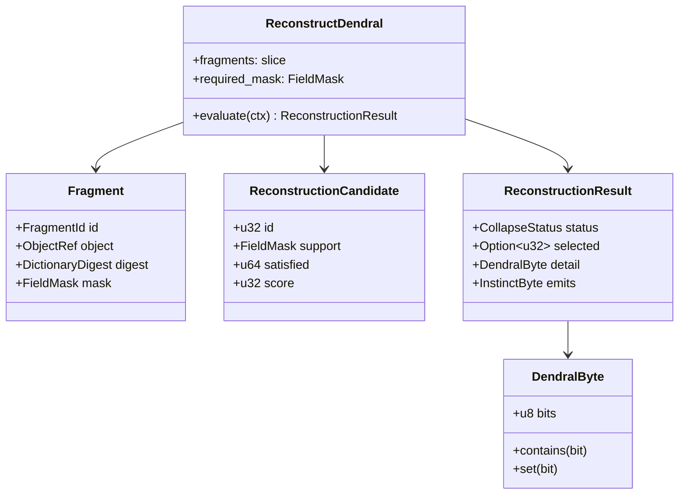
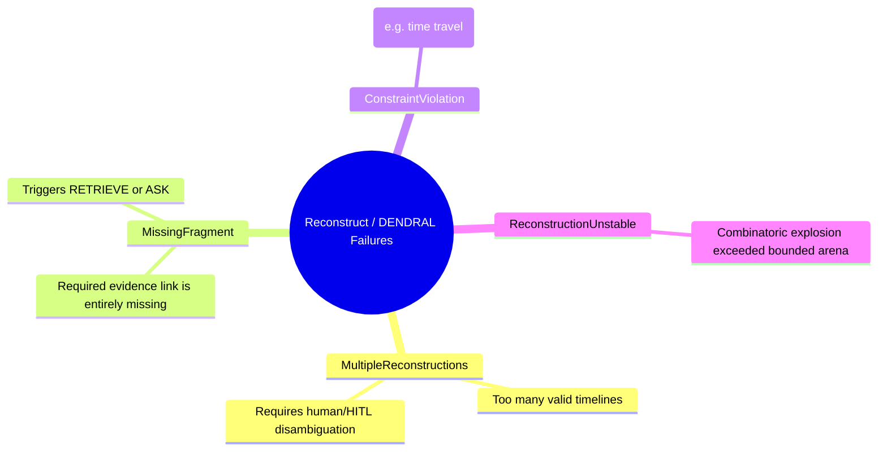
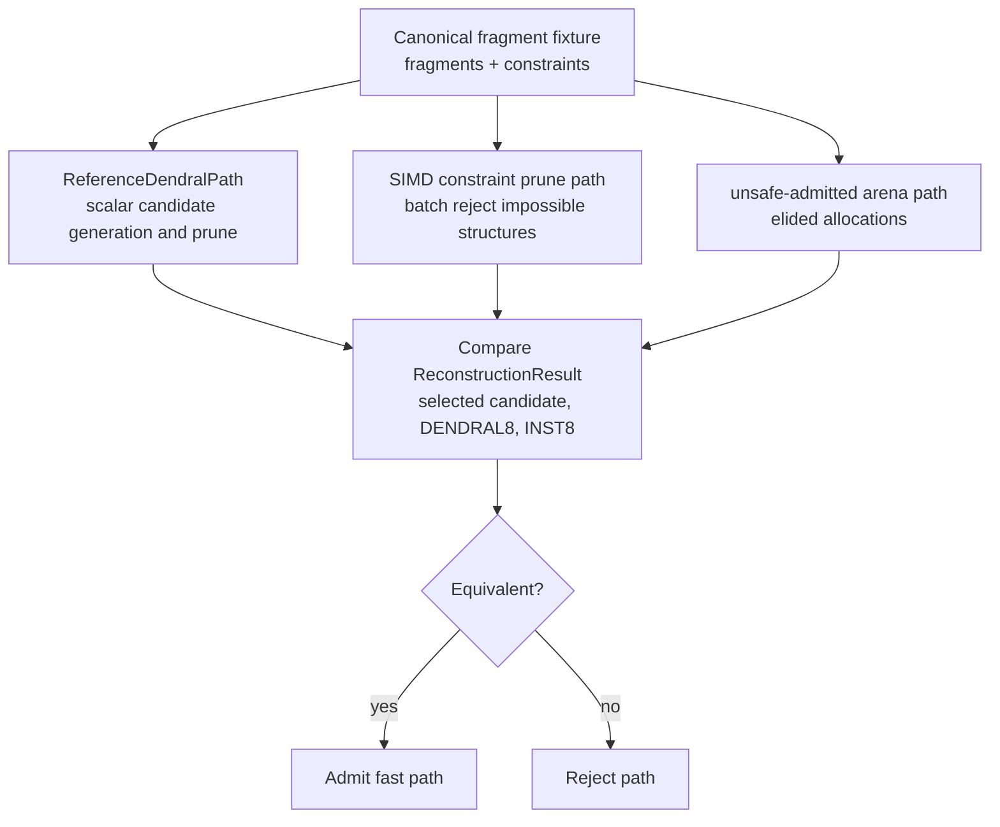
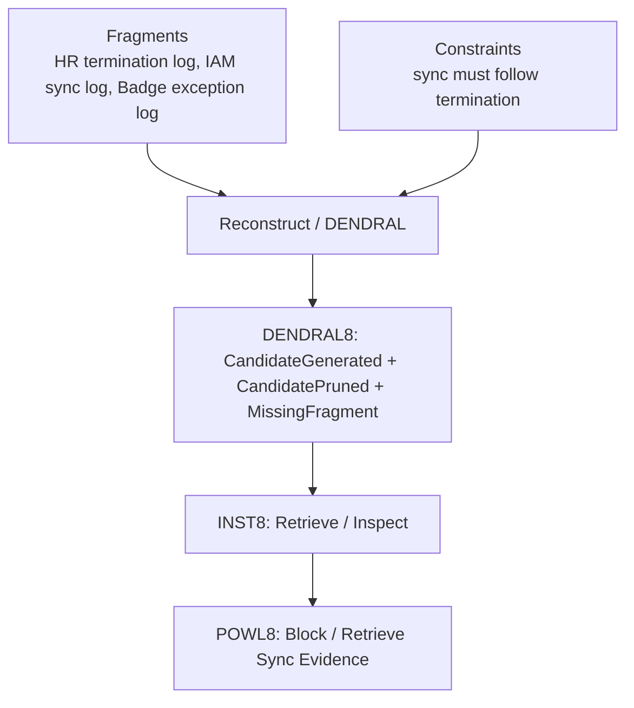

# KAPPA Template 07: Reconstruct / DENDRAL

Core meaning:
**Reconstruct = infer hidden structure or full timelines from fragmented evidence while rejecting impossible combinations.**

This is crucial because enterprises often only have partial logs, and need a deterministic way to prove what happened without hallucinating.

---

## 1. Role in the INSA pipeline

---

## 2. Internal 8-bit architecture: DENDRAL8

Semantic law:
* Success-like bits: FragmentsSufficient, CandidateGenerated, CandidatePruned, UniqueReconstruction
* Failure-like bits: MultipleReconstructions, MissingFragment, ConstraintViolation, ReconstructionUnstable

---

## 3. Rust module/component diagram

---

## 4. Execution flow / sequence

---

## 5. Type / data model

---

## 6. Failure taxonomy

---

## 7. Reference vs fast-path admission

---

## 8. JTBD instantiation: Access Drift case

Case:
terminated contractor still has active badge, VPN, repo access, vendor relationship, and recent site/device activity.

DENDRAL reconstructs the timeline of access: Did the termination event reach the downstream systems but fail to process, or was it never sent?

