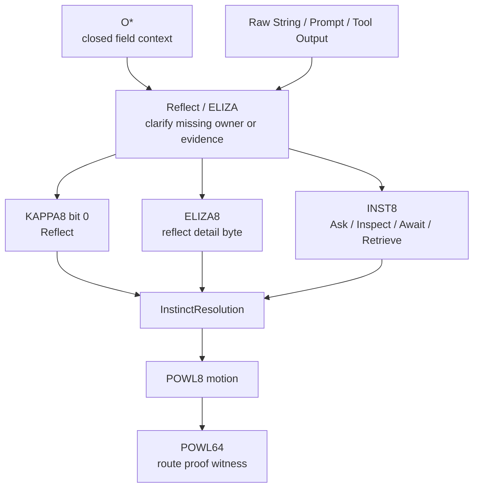
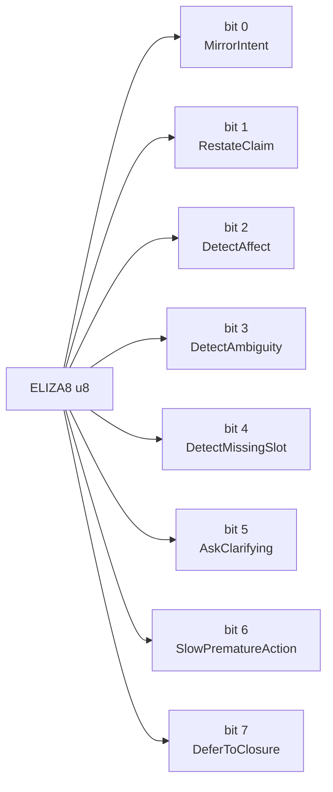
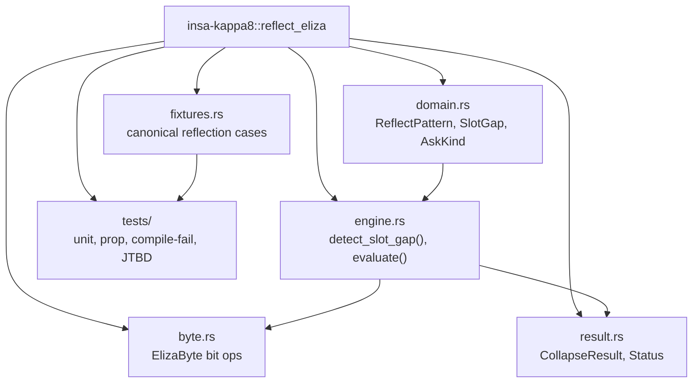
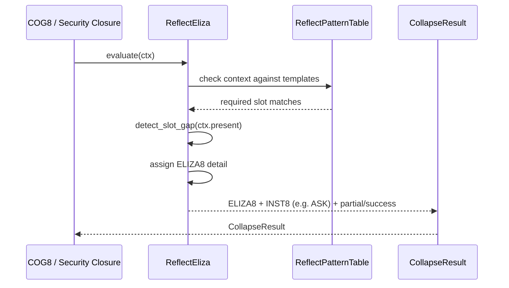
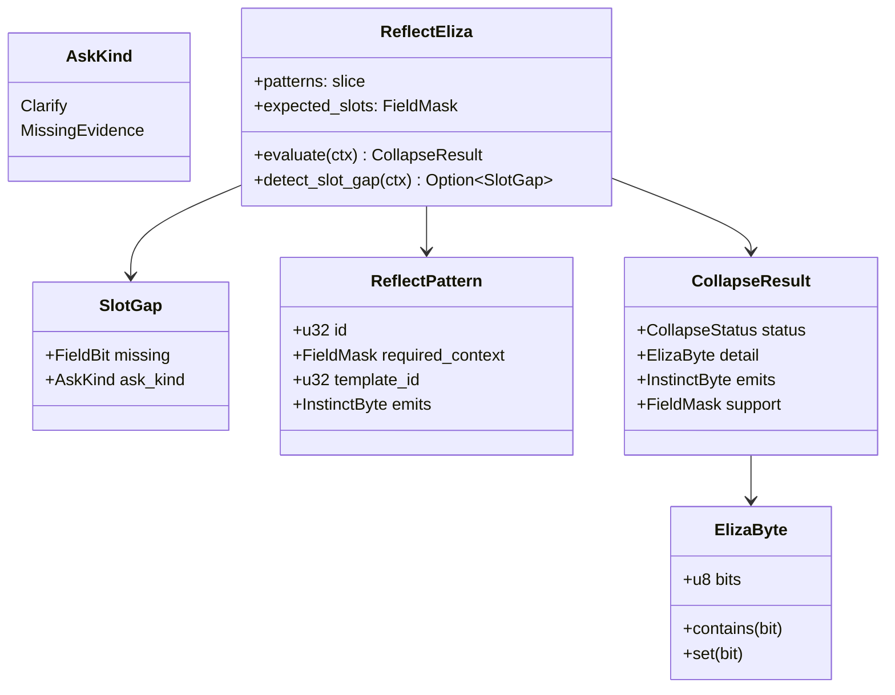
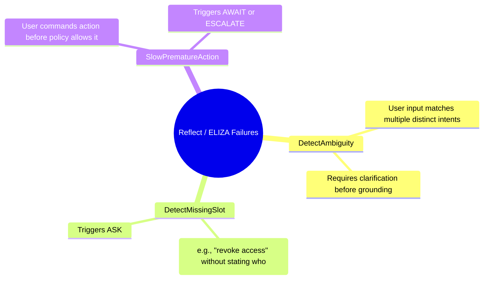
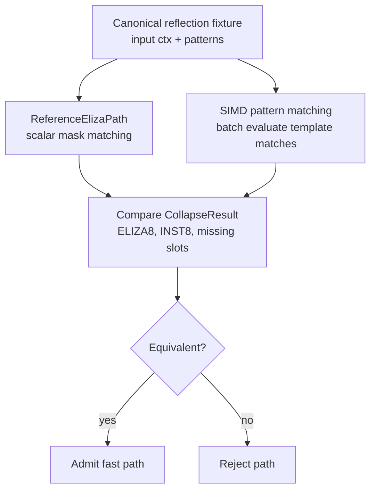
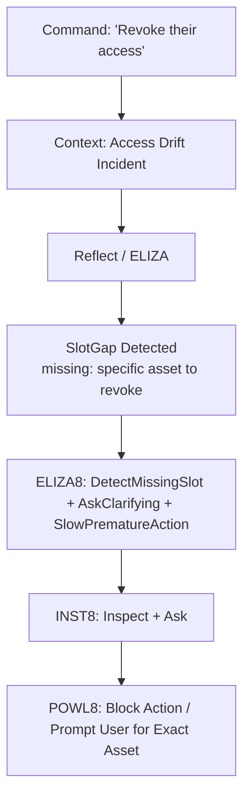

# KAPPA Template 08: Reflect / ELIZA

Core meaning:
**Reflect = restate, clarify, and constrain language-based input before committing it as authoritative execution intent.**

This operates early in the pipeline when raw strings (human speech, agent tool outputs, unstructured logs) first enter the system.

---

## 1. Role in the INSA pipeline

---

## 2. Internal 8-bit architecture: ELIZA8

Semantic law:
* Success-like bits: MirrorIntent, RestateClaim, AskClarifying, DeferToClosure
* Failure-like bits (requiring human loop): DetectAmbiguity, DetectMissingSlot, SlowPrematureAction

---

## 3. Rust module/component diagram

---

## 4. Execution flow / sequence

---

## 5. Type / data model

---

## 6. Failure taxonomy

---

## 7. Reference vs fast-path admission

---

## 8. JTBD instantiation: Access Drift case

Case:
terminated contractor still has active badge, VPN, repo access, vendor relationship, and recent site/device activity.

A Security Operator (or Agent) commands: 'Revoke their access.'
ELIZA prevents raw string action.

