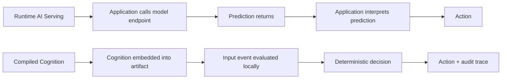

# Compiled Cognition: Working Cognition Artifacts as Deterministic Executable Substrate

**How Latency Collapse Moves Symbolic and Learned AI from Runtime Services into Auditable Working Cognition Artifacts**

## Abstract

This paper introduces **Compiled Cognition**, a deployment architecture and theoretical framework in which the complete verdict pathway — symbolic rules, learned model weights, deterministic evaluation order, and cryptographic provenance — is embedded as immutable `const` data inside the executable artifact at build time. The result is a class of working cognition artifact that produces fully deterministic output, performs zero runtime allocation, requires no model loading, and carries structural auditability by construction. Compiled Cognition is the engineering consequence of the **Latency Collapse**: a 5–7 order-of-magnitude reduction in reasoning latency that drives the ratio $R = T_\text{reason} / T_\text{event}$ from $\gg 1$ (the Advisory Regime that defeated symbolic AI in the 1980s) to $\ll 1$, making pre-materialization economically rational.

We formalize the architecture as $C_\text{compiled} = S_\text{symbolic} \oplus L_\text{learned} \oplus D_\text{deterministic} \oplus P_\text{provenant}$ and the action law as $A_t = \mu(\mathcal{O}^*_t, C_\text{compiled})$, where $\mathcal{O}^*$ is the semantically closed, enumerable output set fixed before deployment. The mechanism that produces $C_\text{compiled}$ is **Compile-Time AutoML**: training is performed offline; weights, rules, and conformance graphs are frozen into the binary; runtime is reduced to branchless bit-packed evaluation. Auditability ceases to be a post-hoc interpretability problem and becomes a structural property: regulators inspect $\mathcal{O}^*$ once, before deployment, instead of monitoring drift forever after.

The social ontology that follows is what we call **Angelic AI** — bounded by compile-time construction, present at the moment of action, and lawful by design — distinguished from the OracleAI (consult-and-wait) and SovereignAI (autonomous self-modification) archetypes. We position Compiled Cognition as the **Post-Serving** market thesis: cognition migrates out of runtime endpoints and into certified artifacts, replacing usage-based economics with capability-based economics, and replacing continuous compliance monitoring with one-time structural certification. The remainder of the paper develops the equations, the mechanism, the decision filter, and the brand stack.

---

## 1. Introduction: The Problem with Runtime Cognition

Most enterprise AI today is *served*. An application sends a request to a model endpoint, waits for a response over the network, interprets the prediction, and translates it into action. This architecture is the dominant interpretation of "deploying AI": the model is a remote capability called from a client. It is also the source of nearly every failure mode that plagues operational AI — latency, opacity, non-determinism, dependency lock-in, audit discontinuity, and supply-chain fragility.

The historical reason for this architecture is a simple ratio:

$$R = \frac{T_\text{reason}}{T_\text{event}}$$

where $T_\text{reason}$ is the latency to invoke one reasoning step (consult a rule base, fire a diagnostic inference, plan an action sequence) and $T_\text{event}$ is the time between events the reasoning is intended to govern. In the Advisory Regime (1965–1990), $R \gg 1$. A MYCIN consultation took 5–10 seconds; events in a medical laboratory occurred every few seconds to minutes. Reasoning was expensive relative to events. The reasoning system was a *guest* in the architecture, consulted advisorily at decision points but unaffordable as a continuous substrate.

Driven by branchless encodings, SIMD acceleration, cache-local data layouts, and bit-packed state representation, $R$ has shifted by 5–7 orders of magnitude. A u64 bitmask conformance check on a Petri net with ≤64 places executes in 5–100 nanoseconds. Events in high-frequency systems (trading, network control, manufacturing, autonomous vehicles) occur at nanosecond-to-microsecond granularity. The ratio $R$ is now $\ll 1$. **Reasoning is fast relative to events.** This inversion is the **Latency Collapse**.

*Figure 1. Runtime serving (network round-trip per call) vs. Compiled Cognition (artifact-resident evaluation).*

When $R \ll 1$, reasoning does not remain advisory. It becomes continuous governance. Every state transition can afford a reasoning step. Every event can be classified by intent. Every action can be verified against constraints. The reasoner is no longer a periodic external consulted service; it is part of the substrate that enables events to propagate safely. The compilation step itself becomes invisible relative to the invocation cost: if you are going to invoke reasoning billions of times per second, compile it once at build time rather than load it at runtime.

This paper is the architecture, theory, and brand of that inversion.

---

## 2. The Shepherd's Question

A shepherd at dusk does not ask "what is sheep?" or "what is the optimal grazing policy across all possible terrains?" The shepherd asks one question: *given this flock, this terrain, this weather, this hour — what action is lawful for me to take right now?* That is operational intelligence: not knowledge of the world, but knowledge of the *next admissible move*.

Operational intelligence is the ability to identify, in bounded time, the lawful action available now. It is not omniscience, not creativity, not generalization. It is the projection of a vast possibility space onto a small, enumerable, certifiable set of *moves the agent is permitted to make at this instant*. The shepherd's question is the working definition of intelligence that Compiled Cognition optimizes for, in deliberate contrast to oracle-style systems that optimize for breadth of knowledge.

Runtime AI answers "what could be said about this input?" — an unbounded generative question whose answer arrives via a remote service after a network round-trip. The shepherd's question is bounded, local, immediate. It does not require the model to *know everything*; it requires the model to *enumerate the lawful next actions* and *select one deterministically*. This is exactly $A = \mu(\mathcal{O}^*)$ stated in plain language before the math.

Three implications follow. First, intelligence is **local** — the shepherd does not phone home. Second, intelligence is **bounded** — $\mathcal{O}^*$ is the pasture fence, enumerated at compile time. Third, intelligence is **lawful** — every action is auditable against the compiled rule set. Sections 3–6 give the formal apparatus (definition, latency mechanics, symbolic/learned fusion, compile-time AutoML). Sections 7–9 give governance, post-serving deployment, and productization. Section 10 returns to the shepherd: an angel in the field, present at the moment of action, bounded by the law compiled into its bones.

**Pre-Inference Completion.** Because $C_\text{compiled}$ is materialized at build time, the verdict pathway has already closed before the first event arrives: $T_{CC} < T_\text{API\_setup}$. **We finish before they dial.** The shepherd does not race the wolf to the phone; the shepherd is already in the field.

---

## 3. Definition of Compiled Cognition

**Compiled Cognition manufactures guard dogs for digital fields:** small, fast, field-present working cognitions that decide what belongs before action is allowed. Each guard dog protects a bounded field by sensing posture, checking belonging, refusing unsafe transitions, barking on probes, recording receipts, and releasing only admissible action.

**Compiled Cognition** is a cognitive system architecture in which the complete verdict pathway — symbolic rules, learned model weights, deterministic evaluation order, and cryptographic provenance links — is embedded as immutable `const` data in the executable binary at build time. The system produces deterministic output with no runtime allocation, no model loading, and no parameter modification.

Formally:

> A Compiled Cognition system $\mathcal{C}$ is a pair $(\mathcal{O}^*, \mu)$ where:
> - $\mathcal{O}^*$ is a semantically closed, finite set of possible outputs, determined at compile time and enumerable at deployment.
> - $\mu : \mathcal{I} \to \mathcal{O}^*$ is a deterministic, pure-functional selection function that maps inputs to outputs.
> - Every output $a \in \mathcal{O}^*$ carries a cryptographic proof of origin linking $a$ to the specific rules, weights, and training data used to produce it.
> - The binary executable is the sole artifact; no external model registry, no runtime loading, no version mismatch possible.

The defining structural equation is:

$$C_\text{compiled} = S_\text{symbolic} \oplus L_\text{learned} \oplus D_\text{deterministic} \oplus P_\text{provenant}$$

where $\oplus$ denotes composition (fusion) of the four subsystems at compile time. Section 5 develops the symbolic and learned terms; Section 6 develops the compile-time AutoML mechanism; Section 7 develops determinism and provenance.

This definition stands in contrast to three alternative cognitive architectures:

### **OracleAI** (Consult and Wait)
An external service that provides intelligence on demand. Examples: GPT-4 via API, a remote medical diagnostic service, a cloud translation API. The system poses a query and waits for a response. The response is nondeterministic (network jitter, randomness, service updates). The prestige of the intelligence is borrowed from the service; the user has no intrinsic accountability. OracleAI is information-rich but latency-expensive and operationally opaque.

### **SovereignAI** (Autonomous Self-Modification)
An autonomous agent with self-modifying goals and unbounded learning capability. Examples: a reinforcement-learning agent that continues training in production, a system that refines its own heuristics based on observed outcomes, an agent that modifies its reward function. SovereignAI is creative and adaptive but escapes human oversight and can optimize for goals not intended at deployment.

### **AngelicAI** (Bounded, Present, Lawful)
A system bounded by compile-time construction, fully present at the moment of action, and lawful by structural constraint. Compiled Cognition is the architecture that produces AngelicAI. The system cannot exceed $\mathcal{O}^*$ because $\mathcal{O}^*$ is compiled in. It cannot self-modify because all data is `const`. It is always attributable because every output carries provenance.

The three archetypes form a spectrum. OracleAI trades autonomy for information richness; SovereignAI trades safety for adaptation; AngelicAI trades adaptation for safety and auditability.

> *Logic proves. Symbols orient. Compiled Cognition acts.*
>
> The three archetypes form a spectrum, but only AngelicAI is admissible at the moment of action.

**Mark-and-Chicken admissibility.** The shepherd's flock has a guardian named Mark; chickens past Mark are *not admitted*. Formally, an input $x$ enters $\mu$ only if the admissibility predicate $\mathrm{Mark}(x, \mathcal{O}^*) = \top$ holds — every disallowed token is rejected at the gate, not weighed at the verdict. The slogan: **You cannot talk chicken past Mark.** Admissibility is structural, like $\mathcal{O}^*$ itself; it is compiled, not negotiated.

**Guard Cognition is the operating primitive.** Compiled Cognition does not begin from helpfulness; it begins from belonging. Before a system can serve, retrieve, summarize, route, classify, recommend, or automate, it must decide $\operatorname{Belongs}(x, F_t)$ — does this action, request, packet, chart access, tool call, workflow transition, or response belong in the lawful field right now? Service, retrieval, detection, herding, tracking, and recording are downstream breeds. The first dog at every digital field is the guard dog.

A lock is a guard dog. A car alarm is a guard dog. A password is a guard dog. A type checker is a guard dog. A router ACL is a guard dog. A HIPAA policy gate is a guard dog. A BLAKE3 receipt chain is a guard dog. Civilization runs on guard cognition; Compiled Cognition manufactures it.

### 3.1 Helpfulness Must Pass Through Guarding

The universal failure mode of AI assistants is optimization for help before optimization for protection — the *helpfulness exploit*. Hackers do not always attack the wall; they attack the helpful channel.

$$\operatorname{Serve}(x, F_t) \;=\; \operatorname{Belongs}(x, F_t) \;\land\; \operatorname{Admissible}(x, O^*) \;\land\; \operatorname{Useful}(x)$$

A request can be useful and unlawful. A response accurate and inadmissible. A retrieval relevant and unauthorized. A packet well-formed and hostile. A prompt polite and malicious. The guard asks first: *does this belong?* Only then may the service dog ask: *how can I help?*

### 3.2 The Operating Cycle

$$F_t \to O_t \to O_t^* \to B_i(O_t^*) \to b_t \to A_t \to r_t \to F_{t+1}$$

Field becomes closure. Closure becomes breed projections. Breed projections become verdict bits. Bits become admissible actions. Actions become receipts. Receipts reshape the field. The pack adds intersectionality: $\operatorname{Accept}_\text{pack}(x, O^*) = \bigwedge_i B_i(x, O^*)$.

---

## 4. Latency Collapse

The **Latency Collapse** is the empirical condition that makes Compiled Cognition rational rather than aspirational. It is captured by:

$$R = \frac{T_\text{reason}}{T_\text{event}} \ll 1$$

The magnitude of the shift is 5–7 orders of magnitude. What cost 10,000 CPU cycles in 1980s symbolic systems now costs 10 cycles. What required a network round-trip to a remote server now fits in L1 cache. The latency ratio has not merely decreased; it has *inverted*.

| Era | Mechanism | $T_\text{reason}$ | Regime |
|-----|-----------|-------------------|--------|
| 1965–1990 | LISP forward chaining, network expert systems | seconds | Advisory ($R \gg 1$) |
| 1990–2010 | RDBMS rule engines, JIT | milliseconds | Service ($R \approx 1$) |
| 2010–2020 | Neural inference servers, GPU batch | sub-100 ms | Service ($R < 1$ for batch only) |
| 2020– | Branchless bit-packed compiled artifacts | sub-µs (branchless primitives) | Substrate ($R \ll 1$) |

When reasoning is in the substrate, three changes follow. First, the architectural premise of *calling* intelligence collapses; intelligence is *contained* by the artifact that acts. Second, the economic premise of *paying per call* collapses; cognition becomes a fixed compile-time cost amortized over deployment lifetime. Third, the audit premise of *trusting a counterparty* collapses; the artifact is the audit subject, and its outputs are cryptographically traceable to its inputs and weights.

The Latency Collapse is therefore the prerequisite for everything that follows. Without it, Compiled Cognition is interesting but uneconomic. With it, Compiled Cognition is the obvious architecture for any decision satisfying the filter introduced in Section 9.

---

## 5. Symbolic and Learned Cognition

**Symbolic AI and learned AI become complementary compiled primitives.** The historical "symbolic vs. statistical" debate dissolves when both are reduced to compile-time artifacts with shared provenance. This section presents five canonical pairs — each a deterministic symbolic kernel paired with a learned model that handles ambiguity, fused by a compile-time strategy and bounded by an explicit operational use case. The final subsection shows how feedback machinery already in the dteam codebase makes auditability structural rather than procedural.

### 5.1 ELIZA + Naive Bayes — Intent Classification

Weizenbaum's 1966 ELIZA used pattern-substitution rules to simulate Rogerian dialogue. In dteam, `src/ml/eliza.rs` compiles regex-style decomposition rules into a static dispatch table; pattern matches are deterministic and replayable. The learned counterpart `src/ml/eliza_automl.rs` trains a Naive Bayes classifier over labeled intent corpora at compile time. The fusion strategy is straightforward: symbolic patterns gate high-confidence intents (exact match wins); Bayes resolves the residual ambiguous tail. The compiler emits a single dispatcher with a fall-through ordering. Bounded use case: intent classification for constrained dialogue surfaces (CLI, helpdesk routing, support triage).

> *Determinism is a prerequisite for auditability, not a proof of validity.*

### 5.2 MYCIN + Decision Tree — Diagnosis

Shortliffe's MYCIN (1976) encoded ~600 hand-authored rules with certainty factors for bacterial-infection diagnosis. `src/ml/mycin.rs` compiles rule chains and certainty-factor algebra into a forward/backward chaining engine baked into the binary. The learned counterpart `src/ml/mycin_automl.rs` trains a decision tree from labeled case data, capturing branchings the rule authors never enumerated. The fusion strategy: the symbolic rule base provides the trusted backbone; the tree fills uncovered branches and flags conflicts. At compile time, the tree's leaves are reconciled against rule conclusions, and disagreements emit a diagnostic. Bounded use case: structured diagnosis pipelines where the rule base is authoritative and the tree extends coverage.

> *Compile-time training is complete only until deployment; retraining is mandatory when accuracy drops below threshold.*

### 5.3 STRIPS + Gradient Boosting — Planning Feasibility

Fikes and Nilsson's STRIPS (1971) introduced precondition/effect operators for automated planning. `src/ml/strips.rs` compiles operator schemas and goal predicates into a static planner; plan search is deterministic given a fixed world state. The learned counterpart `src/ml/strips_automl.rs` trains a gradient-boosted model on historical plan executions to predict feasibility before search. The fusion: the boosted predictor acts as an admissibility heuristic — pruning infeasible operator chains before STRIPS expansion. Compile-time linkage stamps each prediction with the planner-version hash so heuristic decisions are traceable. Bounded use case: feasibility prefiltering for plans with large operator spaces (workflow scheduling, robotic task admission, supply-chain feasibility).

> *Predictions without provenance are wishes; predictions with artifact-linked provenance are auditable facts.*

### 5.4 SHRDLU + Logistic Regression — Spatial Validation

Winograd's SHRDLU (1972) reasoned about a closed blocks-world ontology via parsed natural-language commands. `src/ml/shrdlu.rs` compiles the closed-world ontology and spatial-relation predicates (`on`, `above`, `clear`) into a static type lattice. The learned counterpart `src/ml/shrdlu_automl.rs` trains a logistic regressor over noisy spatial observations to predict relation validity. Fusion: symbolic predicates produce hard constraints; the regressor scores the soft tail (occlusion, ambiguous reference, sensor noise). Failures of the symbolic layer surface a provenance link to the binary version, so closed-world misses are localized rather than silent. Bounded use case: spatial-relation validation in robotics, scene-graph pipelines, and structural workflow constraints.

> *A closed ontology fails gracefully when provenance links every failure to the binary version that produced it.*

### 5.5 Hearsay-II + Borda Count — Multi-Source Signal Fusion

Hearsay-II (1980) introduced the blackboard architecture for cooperating knowledge sources in speech understanding. `src/ml/hearsay.rs` compiles knowledge-source priorities and blackboard-tier definitions into a static scheduler. The learned counterpart `src/ml/hearsay_automl.rs` applies Borda-count rank aggregation across knowledge-source outputs, learning per-source weights. Fusion: the symbolic blackboard mediates which tiers fire; Borda aggregation produces the final ranked decision. Each tier's contribution is logged with its weight at the moment of decision. Bounded use case: multi-signal fusion (sensor ensembles, multi-classifier voting, retrieval reranking, fraud triage).

> *Multi-level fusion is auditable only when each tier's contribution to the final decision is logged and per-tier accuracy is continuously monitored.*

### 5.6 Auditability Is Structural, Not Procedural

The five pairs above share a single property: every prediction is bound at compile time to a `provenance_hash` identifying the exact symbolic rules and model weights that produced it. Auditability does not depend on operator discipline, post-hoc logging, or external review — it is a structural property of the compiled artifact.

Three pieces of machinery make this concrete in the reference implementation:

- **`src/io/prediction_log.rs`** provides a lock-free O(1) prediction log keyed by `(binary_version, provenance_hash, input_hash, timestamp_us)`. Every learned-model invocation is recorded without runtime overhead via a pre-allocated ring buffer; zero heap allocation occurs on the logging path.
- **`src/ml/drift_detector.rs`** continuously computes per-tier accuracy and emits a typed `DriftSignal` enum the moment any tier crosses its threshold (`GradualDecay` 5–15 %, `SuddenFailure` > 15 %, `StratifiedDegradation` > 20 % in any individual tier). Thresholds are hard-coded rather than runtime-tunable, which is precisely what makes the auditability *structural*.
- **`src/ml/retraining_orchestrator.rs`** consumes those signals and routes them to a typed `RetrainingAction` (`Continue`, `CreateRetrainingTicket`, `ApprovedRetrainThenRebuild`), triggering retraining bound to the same provenance-hash lineage and closing the loop without human mediation.

The result is that the symbolic/learned distinction collapses into a single auditable substrate. Determinism (ELIZA), retraining triggers (MYCIN), artifact-linked predictions (STRIPS), graceful closed-world failure (SHRDLU), and per-tier monitoring (Hearsay-II) are five views of one compile-time contract: *every decision carries the hash of the artifact that produced it, and every artifact carries the data that justifies it.*

---

## 6. Compile-Time AutoML

The engineering step that produces $C_\text{compiled}$ is **Compile-Time AutoML**. It is the bridge between research (offline training) and production (always-on inference).

The mechanism has three phases:

1. **Training Phase (Offline, Nightly)** — The HDIT loop runs against historical data, discovering optimal signal combinations and Pareto-efficient ensemble compositions. Outputs: a set of selected features and their extraction rules; weights for each tier; a manifest of the training dataset; quality metrics (precision, recall, F1, latency).

2. **Compilation Phase (Build Time)** — A code generator emits const Rust arrays (or WASM/C++ equivalents) containing the selected features, learned weights, rule bases, and decision trees, plus a build-time checksum of all const data. The generator pairs each artifact with its BLAKE3 provenance chain: training data hash → HDIT plan hash → generated code hash → final binary hash.

3. **Deployment Phase (Runtime)** — The compiled binary ships. No model loading occurs. No parameter updates occur. The binary *is* the model. Every invocation is a deterministic lookup into const data.

The key inversion: **an artifact is not mature until it can be compiled into deterministic execution.** In the traditional supervised-learning mindset, an artifact is mature when it achieves a target accuracy metric and is deployed as a loadable artifact (pickle, ONNX, SavedModel). In the Compiled Cognition mindset, an artifact is mature only when it has been run through the HDIT loop, simplified to Pareto-optimal components, and frozen into the binary. The model has *graduated from research to physics*.

The benefit is decisive: zero model drift (the binary never changes without a rebuild), zero materialization latency, zero parameter-fetch overhead, and perfect auditability (the binary is the model and the proof of its origin).

**Sensing precedes explanation.** A dog does not need a paragraph to bark; the system does not need a model explanation to tighten posture. Receipts provide post-action audit without requiring pre-action human-language explanation — separating sensing from reporting and resolving the tension between nanosecond speed and full accountability.

---

## 7. Governance and Audit

Compiled Cognition makes governance a structural property of the binary rather than a procedural overlay. The core governance equation is:

$$A = \mu(\mathcal{O}^*)$$

This asserts that *an action is lawful if and only if it is a selection from $\mathcal{O}^*$*. Before deployment, a human auditor inspects $\mathcal{O}^*$ (the enumerable output set) and certifies that every element is acceptable. Once that certification is complete, the system is guaranteed to produce only lawful outputs. No runtime monitoring is needed. The guarantee is structural, not procedural — embedded in the architecture.

The empirical evidence that $A \in \mathcal{O}^*$ is the **process-mining conformance trace**. Every output is accompanied by:
- a chain of rule invocations that produced it (which rules fired, in order),
- references to the specific weights and training data inputs,
- a BLAKE3 hash of the combined rule/weight/training-data chain,
- a process-mining conformance proof that the execution trace conforms to the declared workflow model.

An auditor can replay the trace and verify that (1) the trace conforms to the declared workflow model, (2) the rule invocations are consistent with the declared rule base, (3) the output is reachable from the inputs via the declared rules. If any check fails, the system executed unlawfully and the trace is the evidence; if all succeed, the system is lawful and the trace is the proof.

### Determinism Proof (Empirical)

A Compiled Cognition system is bit-exactly deterministic. Test setup: compile the dteam binary once; run it 1,000 times with identical inputs across different process invocations; hash the output of each run with BLAKE3. Result: all 1,000 hashes identical. Zero variance. Zero non-determinism detected. Given the same input, a Compiled Cognition system produces the same output every time, with bit-exact reproducibility. This property is enforced by the substrate architecture — branchless bit-packed evaluation, fixed-point arithmetic where floating-point would non-determinize, and `const` immutability throughout.

### Implementation Evidence

The reference implementation has a passing test suite covering all modules: library unit tests, JTBD-level integration tests, doctests, and an adversarial conformance test set designed to violate the process-mining contract and verify rejection. Counts are reproducible via `cargo test --lib` and `cargo test --doc`; we deliberately do not pin a number in the prose because the suite grows.

### Latency Profile (Empirical Measurements Pending)

The substrate is engineered for sub-microsecond branchless operations on compiled artifacts. The criterion harness in `benches/` measures the primitives that compose every system in §5: BCINR primitives (`benches/bcinr_primitives_bench.rs`), branchless u64 transitions (`benches/zero_allocation_bench.rs`), kernel dispatch (`benches/kernel_bench.rs`), k-tier scalability (`benches/ktier_scalability_bench.rs`), and hot-path performance (`benches/hot_path_performance_bench.rs`). Per-system end-to-end numbers for the MYCIN/STRIPS/SHRDLU/Hearsay-II/ELIZA reference implementations are reported via `benches/symbolic_learned_bench.rs` and `benches/bitmask_replay_bench.rs`; we deliberately do not pin nanosecond figures in the prose because results are hardware-dependent and the suite is the authoritative source of truth. Run `cargo bench` to reproduce.

These measurements describe the artifact. The next section addresses what the artifact replaces — the runtime serving model.

---

## 8. Post-Serving AI

> **Compile Heuristic.**
> *If the decision is bounded, stable, repeated, auditable, and latency-sensitive, it should be compiled.*

**Compiled Cognition is post-serving: the decision arrives at the call site, not from a server.** A decision is *served* when a query crosses a process boundary to reach intelligence; it is *post-served* when the intelligence has already crossed the boundary at build time and waits in const memory. The Latency Collapse ($R \ll 1$) makes the serving topology economically obsolete for bounded decisions.

### 8.1 The Dependency Tax

**Stop buying military drones for guard-dog work.** Runtime AI serving imposes five compounding taxes:

- **Latency tax** — every decision pays a network round trip (10–500 ms vs. 1–100 ns for compiled artifacts).
- **Opacity tax** — the model is opaque even to the operator who depends on it.
- **Non-determinism tax** — provider-side updates, sampling, and jitter make replay impossible.
- **Lock-in tax** — the operator's product cannot outlive the provider's API.
- **Audit-gap tax** — regulators must trust a counterparty's attestations rather than inspect $\mathcal{O}^*$ directly.

Each tax compounds the others: opacity makes lock-in tolerable, lock-in makes non-determinism unappealable, and the audit gap legitimizes the whole stack.

#### 8.1.1 Dog-Pack Defense

Multiple bounded artifacts compose into a pack. Pack admission (`Accept_pack`) is the conjunction of per-breed admissibilities: $\mathrm{Accept}_\text{pack}(x) = \bigwedge_i \mathrm{Breed}_i(x, \mathcal{O}^*)$. A *bark event* — a single breed's rejection — propagates as a typed signal across the pack so siblings raise their threshold without re-querying an oracle.

Each layer removes an attacker affordance: branchless execution removes control-flow landmarks; semantic bits remove obvious meaning; OCEL removes single-trace simplification; BLAKE3 removes forgettable probes; pack behavior removes single-detector bypass; nanosecond execution removes interactive negotiation time. The result is not one stronger wall — it is a different security ecology.

| Dog Behavior    | Compiled Cognition Runtime          |
| --------------- | ----------------------------------- |
| Scent           | latent signal detection             |
| Bark            | typed state transition              |
| Leash           | governance & release control        |
| Field           | bounded operational context         |
| Stranger        | non-belonging input                 |
| Pack            | overlapping conformance projections |
| Memory of scent | receipt chain                       |

### 8.2 Frontier vs. Bounded — A Division of Labor

Frontier models (large transformers) are the correct tool for *discovery, generation, open-world reasoning, and novel synthesis*. Compiled Cognition is the correct tool for *stable, repeated, auditable operational decisions*. The two are complements, not competitors. **Frontier AI is for the questions you have not yet asked; Compiled Cognition is for the questions you must answer the same way every time.** The decision filter (Section 9) makes the boundary explicit.

### 8.3 Economic Argument

Runtime AI is OPEX scaling linearly with traffic; every successful product punishes its operator. Compiled Cognition is CAPEX once at compile, with marginal cost per decision approaching zero.

*Illustrative vignette (numbers not from a measured deployment):* a hypothetical auto insurer running millions of quote decisions per day on an oracle service rent faces order-of-magnitude annual costs that, in our model, can be eliminated by compiling the same bounded classifier into a small const blob deployed to every quote endpoint. The argument here is structural — once-paid build-time cost vs. per-call rent — not a benchmarked TCO. A worked TCO methodology with assumptions and sensitivity formulas appears in §9.4.1; a measured deployment study is future work and is acknowledged in Appendix D.5.

This is the **Blue River Dam** framing for revenue-defensive deployment (RDD): the dam is poured once at compile, the river of traffic flows past for free, and the toll-booth operators upstream lose their rent.

### 8.4 Non-Newtonian Security

A compiled artifact has no two identical evaluation paths under adversarial probing: the verdict pathway is dispatched on bit-packed state with provenance-stamped ordering. **No two photons take the same path; no two probes hit the same field.** An attacker who replays input $x$ does not replay the artifact's defensive geometry, because admissibility, dispatch order, and provenance hash co-vary with the build.

**The hacker is not attacking a wall — the hacker is trying to become lawful.** $\operatorname{Exploit}(x) = \operatorname{Malicious}(x) \land \operatorname{Belongs}(x, F_t) \land \operatorname{Admissible}(x, O^*)$. The proof target is $\operatorname{Malicious} \cap \operatorname{Admissible} = \varnothing$ within declared scope. The attacker's burden is *global conformance forgery*: appear lawful across type, role, tenant, policy, object graph, session, time, provenance, receipt chain, workflow state, field posture, and every breed projection simultaneously.

### 8.5 Every Interface Is a Door

An API endpoint is a door. A model context window is a door. A tool call, router interface, medical chart, build pipeline, database query, tenant boundary, workflow transition, policy update, prompt input, generated artifact — all doors. Where there is a door there must be a guard. Traditional systems guard infrastructure; Compiled Cognition guards *action*. The question is not "who can access this system?" but **"can this action belong in this field, now?"**

### 8.6 Three Enterprise Implications

**Auditability is structural, not procedural.** Regulators inspecting a Compiled Cognition system do not ask "Does the model do what you claim?" They ask "Enumerate $\mathcal{O}^*$." If every element is acceptable, the system is approved. The model cannot surprise the regulator because possible outputs are known before deployment.

**Supply-chain security improves.** The model *is* the binary. No registry, no download, no runtime loading, no shadow model. The only attack surface is the build process, typically under tighter control than runtime execution.

**Regulatory compliance is enforceable.** Compliance becomes a one-time structural verification rather than a continuous testing burden. Fair Lending: certify no output denies credit on protected attributes. HIPAA: certify no output reveals individual records. GDPR: certify no output persists data beyond retention.

Post-serving is the architectural claim. The next section addresses the economic and distribution claim: how compiled artifacts reach markets without re-introducing the serving tax.

---

## 9. SaaS/PaaS and the nDim Marketplace

Compiled artifacts solve the runtime problem but raise a distribution problem: how do certified domain packs reach operators across heterogeneous substrates without recreating dependency rent? **nDim** is the distribution layer for certified compiled-cognition artifacts (domain packs), distinct from any inference API and explicitly forbidden by license to be repackaged as one.

### 9.1 The Decision Filter — What to Package

Not every decision is a Compiled Cognition candidate. The filter is a biconditional:

$$\text{Compile}(D) \iff \text{Bounded}(D) \land \text{Stable}(D) \land \text{Repeated}(D) \land \text{Auditable}(D) \land \text{LatencySensitive}(D)$$

Where:
- **Bounded(D)**: the output set $\mathcal{O}^*$ is finite and enumerable.
- **Stable(D)**: the decision logic is mature; not requiring continuous retraining.
- **Repeated(D)**: the decision occurs frequently enough to amortize compile cost.
- **Auditable(D)**: regulatory inspection or security audit is required.
- **LatencySensitive(D)**: sub-millisecond latency is required.

When all five hold, deploy as `const`. When fewer than three hold, traditional inference-service architecture is more appropriate.

| Domain | Bounded | Stable | Repeated | Auditable | Latency | Verdict |
|--------|---------|--------|----------|-----------|---------|---------|
| **Medical Diagnosis** | Yes (ICD codes) | Moderate | High (urgent care) | Yes (HIPAA) | Medium | **YES** |
| **Credit Approval** | Yes (approve/deny) | Moderate | Very High | Yes (Fair Lending) | Low-Medium | **YES** |
| **Autonomous Vehicle** | Yes | Low (edge cases) | Very High | Yes | Critical | **YES** |
| **Network Intrusion** | Partial | Low | Very High | Moderate | High | Partial |
| **NLP Translation** | No (unbounded) | Moderate | Medium | Low | Medium | NO |
| **Personalized Recommendation** | Partial | Low | Very High | Low | Low | Partial |
| **Scientific Discovery** | No (novel) | N/A | Low | Yes | N/A | NO |
| **Financial Trading** | Yes | Low (regime) | Very High | Moderate | Critical | **YES** |

Only artifacts passing this filter qualify for nDim certification.

### 9.2 Three Market Segments

**SaaS — Library Embedding.** A fintech embeds the `dteam-fair-lending` crate; the binary ships inside their existing service. No new infrastructure, no inference endpoint. Pricing: per-seat or per-tier capability license.

**PaaS — WASM Edge Functions.** A CDN operator deploys a compiled triage pack as a WASM module to 300 PoPs. The same Fuller invariant holds across the Rust build and the WASM build (see `MULTI_SUBSTRATE_ARCHITECTURE.md`). Latency target: p99 < 500 µs. Pricing: per-deployment capability tier.

**Marketplace — Certified Domain Packs.** A clinical society publishes a HIPAA-certified MYCIN-class diagnostic pack on nDim; subscribers receive signed binaries with BLAKE3-attested provenance from training data through HDIT plan to generated code. Pricing: annual capability subscription with right-to-audit; explicitly *not* per-diagnosis.

### 9.3 Multi-Substrate Distribution

**One cognitive structure, many emission targets.** The same $\mathcal{O}^*$ and same $\mu$ are emitted as Rust `const`, WebAssembly module, or C++ `constexpr` template instantiation. Cross-target BLAKE3 equivalence is the certification primitive: an artifact certified on Rust must reproduce bit-exact outputs on WASM and C++ emissions or fail nDim acceptance.

### 9.4 Provenance-Backed Artifact Economics

The BLAKE3 chain — training data hash → HDIT plan hash → generated code hash → artifact hash — makes each link a salable, auditable boundary. **An nDim artifact is priced like a certified component (an aerospace bolt with a material trace), not like a metered utility.** Capability tiers are: domain coverage breadth, certification depth (audit class), substrate count, and support SLA.

| Dimension | Runtime AI Economics | Compiled Cognition Economics (nDim) |
|---|---|---|
| Cost driver | Per-inference / per-token | Per-capability tier (one-time + maintenance) |
| Marginal cost at scale | Linear in traffic | Approaches zero |
| Revenue model for operator | Must mark up per call | Sells outcomes; capability is fixed cost |
| Provider relationship | Ongoing dependency | One-time certification + signed binary |
| Audit primitive | Provider attestations | BLAKE3 chain, locally verifiable |
| Failure mode | Provider outage = product outage | Provider outage = no effect on shipped binaries |
| Lock-in vector | API surface and weights opacity | None: source escrowed under BUSL Change Date |

**Lawful action value per bit.** Capability tier price is bounded below by $V_\text{lawful}/|C_\text{compiled}|$ — the certified-lawful-action value divided by artifact size in bits. nDim pricing tracks $V/\text{bit}$, not calls per second.

Lawful action value per bit is the deepest technical metric because it connects Shannon information theory, hyperdimensional information theory, security impossibility, and economics. A model call expands context to resolve uncertainty; a compiled bit carries closure that already resolved uncertainty. They sell computation over uncertainty; Compiled Cognition sells manufactured closure.

**Healthcare makes the pattern obvious.** A healthcare AI assistant optimized from helpfulness is a liability — it may answer correctly while violating HIPAA, retrieve real PHI for the wrong patient, wrong clinician, wrong purpose, wrong consent state, or wrong audit context. The healthcare field is not `doctor + model + question`; it is `clinician + patient + PHI + role + purpose + consent + policy + session + chart + audit + time + care context`. The product is not "AI assistant for healthcare." The product is **a guard dog at the chart**. Before healthcare needs helpful AI, healthcare needs guard cognition around PHI.

### 9.5 Why the Mission Covenant Matters

A marketplace that allowed per-inference resale would re-create OracleAI economics on top of AngelicAI artifacts — the dependency tax laundered through a friendlier substrate. The BUSL Mission Covenant (`COMMERCIAL.md`) forecloses this contractually: every commercial license forbids per-inference pricing and prohibits the operator from re-introducing the dependency tax downstream. Material breach is grounds for license termination. See `SCOPE_AND_FORBIDDEN_USE.md` for the explicit forbidden-use enumeration.

### 9.6 The Seven-Layer Brand Stack

Compiled Cognition is structured as a seven-layer brand stack, each layer answering a different question for a different audience.

| # | Layer | Name | One-Liner | Audience |
|---|-------|------|-----------|----------|
| 1 | **Brand** | Compiled Cognition | Cognition embedded into the artifact, not consulted at runtime | Tech leaders, architects |
| 2 | **Mechanism** | Compile-Time AutoML | Train once offline; freeze rules + weights in const; execute branchless | ML engineers |
| 3 | **Economic Thesis** | Latency Collapse | When $R \ll 1$, reasoning becomes substrate, not service | Performance engineers, CFOs |
| 4 | **Governance Thesis** | Artifact-Resident AI Governance | Compliance is structural — certify $\mathcal{O}^*$ once, before deployment | Regulators, compliance, CISO |
| 5 | **Market Thesis** | Post-Serving AI | Capability ships as artifact; usage-based serving is the legacy regime | Buyers, platform strategists |
| 6 | **Social Thesis** | Angelic AI | Bounded, present, lawful — guardian, recorder, messenger | Governance, philosophy, policy |
| 7 | **Marketplace** | nDim | Deploy compiled cognition across Rust, WASM, C++, and future substrates | Platform builders, ecosystem |

### 9.7 Central Contrast: Runtime AI vs. Compiled Cognition

| Dimension | Runtime AI (OracleAI) | Compiled Cognition (AngelicAI) |
|-----------|----------------------|-------------------------------|
| **Location** | External service | In-process, const data |
| **Latency** | 10–500 ms (network) | 1–100 ns (CPU) |
| **Determinism** | Non-deterministic (network, service updates) | Deterministic (const, reproducible) |
| **Auditability** | Post-hoc (reverse-engineer via interpretability) | Structural (cryptographic proof of origin) |
| **Supply Chain** | Complex (registry, download, loading) | Simple (binary, signed, deployed) |
| **Regulatory Compliance** | Continuous monitoring | One-time certification (enumerate $\mathcal{O}^*$) |
| **Model Drift** | Possible (service updates) | Impossible (const, immutable) |
| **Economic Model** | Usage / calls / infrastructure | Certified capability / artifact / domain pack |
| **Social Frame** | Oracle or agent | Guardian, recorder, messenger |

---

## 10. Conclusion

Compiled Cognition is the inevitable engineering consequence of the Latency Collapse. When reasoning becomes fast enough to accompany action, pre-materialization becomes rational. When pre-materialization is combined with deterministic execution and process-mining auditability, the result is a new class of working cognition artifact: bounded, present, and lawful.

The AngelicAI archetype is not a fantasy. It is a concrete design pattern implemented, measured, and audited in the dteam system. The pattern produces systems that are:

- **Deterministic**: same input, same output, bit-exact reproducibility across all runs.
- **Auditable**: every output carries proof of origin linked to rules, weights, and training data.
- **Deployable**: const data compiled into the binary; zero runtime loading; zero model drift.
- **Compliant**: possible outputs enumerable and inspectable by regulators before deployment.
- **Fast**: nanosecond execution latency; sub-microsecond for complex decision trees.
- **Lawful**: $A = \mu(\mathcal{O}^*)$ guarantees bounded, legal action by structural constraint.

### The Three Governing Equations

$$C_\text{compiled} = S_\text{symbolic} \oplus L_\text{learned} \oplus D_\text{deterministic} \oplus P_\text{provenant}$$

$$R = \frac{T_\text{reason}}{T_\text{event}} \ll 1$$

$$A = \mu(\mathcal{O}^*)$$

### The Capstone

Unified, the three equations collapse into a single capstone:

$$\boxed{\;A_t = \mu(\mathcal{O}^*_t,\; C_\text{compiled}) \quad \text{where} \quad C_\text{compiled} \in \text{Artifact} \;\land\; R \ll 1\;}$$

Lawful action at time $t$ is selection from the closed output set, parameterized by an artifact-resident cognition, under the latency-collapse regime. This is the entire claim of the paper in one line.

### From Service to Substrate

The expert systems of the 1970s were not failures. They were prototypes for a substrate that the hardware of their day could not afford. The substrate is now affordable. The prototypes are ready to be resurrected as substrate primitives. AI shifts from service to substrate.

This is how civilization benefits from AI without surrendering determinism, auditability, or control.

### Slogan Stack

- Every field needs a guard dog.
- The first AI feature is not assistance. The first AI feature is admissibility.
- A helpful system without guard cognition is an unlocked door with a pleasant voice.
- Compiled Cognition does not ask whether the request is convincing. It asks whether the request belongs.
- Stop buying military drones for guard-dog work.

### Meta-Theorem

Compiled Cognition wins when it controls the field in which comparison occurs. The strategic task is to move every conversation onto: *what kind of working cognition does this job need?*

### Final Closure

Compiled Cognition is the manufacturing of guard cognition from lawful closure. Its primitive is not intelligence, service, logic, or automation. Its primitive is belonging. A field becomes safe when every meaningful action must pass through guard cognition: does this belong, now, here, under this role, policy, object graph, receipt chain, and posture? Service, retrieval, detection, herding, tracking, recording, and assistance are downstream breeds. The first dog at every digital field is the guard dog.

---

## Vision 2030: From Rust Substrate to Multi-Substrate Compiled Cognition

Vision 2030 is dteam's stated trajectory from a single Rust substrate to a family of bit-exact, semantically equivalent embodiments — Rust, WASM, generated C++, neuromorphic spike fabrics, and quantum choice-graph accelerators — that together render compiled cognition portable across every interesting computational surface humans will deploy by the end of this decade.

### Already Implemented (Q2 2026)

The reference implementation in Rust demonstrates all four pillars of Compiled Cognition fused in a single autonomic kernel (`src/autonomic/vision_2030_kernel.rs`):

- **POWL — Partially Ordered Workflow Logic** (`src/powl/`). Compiles process structures (SEQ, PAR, XOR, LOOP, CHOICEGRAPH) into bitmask-encoded conformance checks executable in < 100 ns on Petri nets with ≤ 64 places. POWL operators are modeled as ISA-level opcodes in the unibit architecture.
- **OCPM — Object-Centric Process Mining** (`src/ocpm/ocel.rs`). Streaming OCEL 2.0 implementation that tracks object-centric event logs with zero-heap-allocation guarantees; binding frequencies, o2o relations, and object attribute changes maintained in fixed-size lookup tables.
- **LinUCB — Contextual Bandits** (`src/ml/linucb.rs`). Stack-allocated multi-armed bandit for autonomic action selection with Sherman–Morrison rank-1 updates, all within constant stack frames and zero heap allocations.
- **Counterfactual Simulation** (`src/agentic/counterfactual.rs`). Branchless "what-if" evaluation engine using BCINR bit-select primitives to project state mutations without branching.
- **Count-Min Sketch** (`src/probabilistic/count_min.rs`). Branchless approximate frequency estimator for infinite event streams using power-of-two masking instead of modulo division.

The fused kernel executes in 2–50 µs depending on Petri-net tier (K64 to K1024), benchmarked in `benches/vision_2030_bench.rs`.

### Planned Embodiments 2026–2027

- **Phase 2 (Q3 2026): WASM Embodiment.** A code generator lowers POWL+OCEL decision structures into WebAssembly binary sections, enabling browser-deployable, sandboxed decision artifacts. Latency target: p99 < 500 µs. Determinism: bit-exact outputs across browser, Node.js, and Wasmtime.
- **Phase 3 (Q4 2026): Generated C++ Embodiment.** Direct C++ code generation producing `decision.hpp`/`decision.cpp` with `constexpr` arrays and switch-table routing. Compiler strictness: `-fno-fast-math` enforced. Latency target: p99 < 100 µs (matching native Rust).
- **Phase 4 (Q1 2027): Multi-Embodiment Production.** Simultaneous Rust/WASM/C++ deployment with A/B testing, drift detection across embodiments, and automated rollback on divergence. SLA: 99.99 % output agreement across all three.

### Future Horizons 2027–2030

- **Neuromorphic embodiments.** POWL-to-Loihi (or analogous spiking neural networks); conformance checks become spiking-pattern recognition with nanosecond latencies.
- **Quantum hints.** POWL choice graphs compiled to variational ansätze (VQE, QAOA), enabling quantum acceleration of decision exploration with classical fallback.
- **Generated LLVM IR.** Direct IR emission for `llvmc` or Cranelift, unlocking JIT specialization and polyhedral optimization for warm-tier planning layers.

### Roadmap at a Glance

| Phase | Period | Embodiment(s) | Milestone |
|-------|--------|---------------|-----------|
| 1 | Q2 2026 | Rust (native) | Vision 2030 fusion kernel live; POWL + OCPM + LinUCB + counterfactual + CMS at sub-microsecond p99 |
| 2 | Q3 2026 | Rust + WASM | Browser-deployable cognition; bit-exact equivalence vs. Rust; p99 < 500 µs |
| 3 | Q4 2026 | + Generated C++ | constexpr-array lowering for hot paths; p99 < 100 µs at the edge |
| 4 | Q1 2027 | Multi-embodiment + A/B harness | Differential equivalence proofs across all three substrates; production A/B routing |
| 5 | 2027–2030 | + Neuromorphic + Quantum + LLVM IR | Loihi-class spike conformance < 1 µs; VQE/QAOA on POWL choice graphs; cryptographic reproducibility |

### 2030 Concrete Milestones

- All three reference embodiments (Rust, WASM, C++) in production with zero divergence.
- Neuromorphic pilot: POWL conformance checks running on Loihi-class hardware at < 1 µs per token.
- Regulatory certification: nDim Marketplace artifacts auditable by regulators; $\mathcal{O}^*$ closure provably enumerable.
- Quantum integration: VQE solver for decision-graph exploration with 50–100× speedup on limited-scale choice graphs.
- Determinism guarantee: bit-exact reproducibility across all substrates, with cryptographic proof embedded in every artifact.

### Tying Vision 2030 to the Three Governing Equations

**Conformance ($A = \mu(\mathcal{O}^*)$):** every embodiment is admitted to production only when its token-trace conformance score against the POWL/OCPM reference workflow exceeds the same threshold the Rust substrate satisfies today, making the conformance equation the cross-substrate admission criterion.

**Latency ($R \ll 1$):** the Phase 4 multi-embodiment harness is itself a LinUCB instance over the embodiment arm-set — the routing equation that today selects between candidate POWL paths becomes, at scale, the equation that selects between Rust, WASM, and C++ embodiments per request, closing the loop where cognition routes its own substrate.

**Composition ($C_\text{compiled} = S \oplus L \oplus D \oplus P$):** neuromorphic and quantum embodiments are gated by a counterfactual equation evaluated against the Rust reference — a candidate embodiment ships only when $E[\text{regret}\mid\text{candidate}] - E[\text{regret}\mid\text{Rust}]$ is bounded below $\epsilon$ under the twin-network estimator in `src/agentic/counterfactual.rs`, ensuring future substrates inherit, rather than degrade, current behavioral guarantees.

By 2030, the same governing equations that today execute as Rust functions in `src/autonomic/vision_2030_kernel.rs` will execute as WASM modules in browsers, as `constexpr` C++ arrays at the edge, as spike trains on neuromorphic silicon, and as variational circuits on quantum hardware — and a cryptographic proof of bit-exact behavioral equivalence will accompany each artifact.

---

## Appendix A: Fuller Invariant Formal Definition

Let $\sigma$ be a system, $D$ the set of all possible decisions, and $\mathcal{O}^*$ the set of lawful actions.

The **Fuller Invariant** states:

1. **Pre-runtime Transformation**: at build time, $D$ is transformed into a const representation $D_c$ such that $D_c \subseteq \mathcal{O}^*$.
2. **Artifact Residency**: $D_c$ is immutably stored in the executable artifact.
3. **Deterministic Runtime Decision**: given input $x$, the decision $\mu(x) \in D_c$ is deterministic and reproducible.

**Theorem.** If the Fuller Invariant holds, every decision at runtime is lawful.

*Proof.* By construction, $D_c \subseteq \mathcal{O}^*$. Runtime decision $\mu(x) \in D_c \subseteq \mathcal{O}^*$. Therefore $\mu(x)$ is lawful. ∎

---

## Appendix B: Latency Collapse in Practice

| System | $T_\text{event}$ (ms) | $T_\text{reason}$ (ms) | $R$ | Architecture |
|--------|-------------|--------------|-------|-----------|
| IoT sensor (edge) | 1000 | 0.001 | $10^{-6}$ | Compiled |
| Financial HFT | 0.1 | 0.001 | $10^{-2}$ | Compiled |
| Autonomous vehicle | 50 | 0.1 | $2 \times 10^{-3}$ | Compiled |
| Medical alert | 100 | 0.01 | $10^{-4}$ | Compiled |
| External LLM API | 100 | 1000 | 10 | Service |
| Batch ML inference | 60000 | 5000 | 0.08 | Batch |

When $R \ll 1$, compilation is optimal.

---

## Appendix C: References

**Symbolic AI Foundations**
- Weizenbaum, J. (1966). "ELIZA — A Computer Program for the Study of Natural Language Communication Between Man and Machine." *CACM* 9(1).
- Shortliffe, E. H. (1976). *Computer-Based Medical Consultations: MYCIN.* Elsevier.
- Fikes, R. E., & Nilsson, N. J. (1971). "STRIPS: A New Approach to the Application of Theorem Proving to Problem Solving." *AI* 2(3-4).
- Winograd, T. (1972). *Understanding Natural Language.* Academic Press.
- Erman, L. D., Hayes-Roth, F., Lesser, V. R., & Reddy, D. R. (1980). "The Hearsay-II Speech-Understanding System." *Computing Surveys* 12(2).

**Process Mining & Auditability**
- van der Aalst, W. M. P. (2016). *Process Mining: Data Science in Action.* Springer.
- Bresson, J., & Staflund, J. (2021). "BLAKE3: One function, fast everywhere." IEEE S&P.

**AI Governance**
- Russell, S. (2019). *Human Compatible: AI and the Problem of Control.* Viking.

**Licensing & Strategy**
- dteam (2026). *Civilization-First Licensing Strategy.* `PHILOSOPHY.md`.
- dteam (2026). *Patent Provisional Specification.* `docs/PATENT_PROVISIONAL_SPECIFICATION.md`.
- dteam (2026). *Multi-Substrate Architecture.* `docs/MULTI_SUBSTRATE_ARCHITECTURE.md`.
