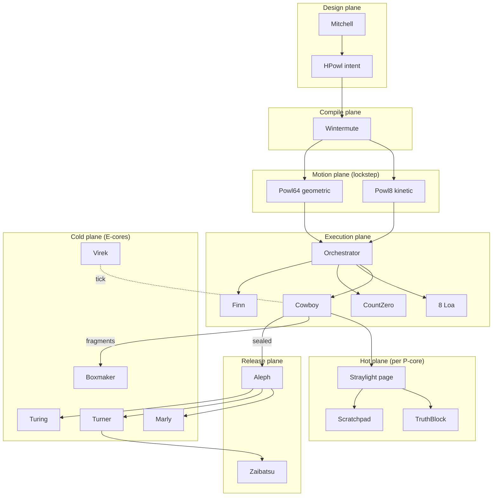
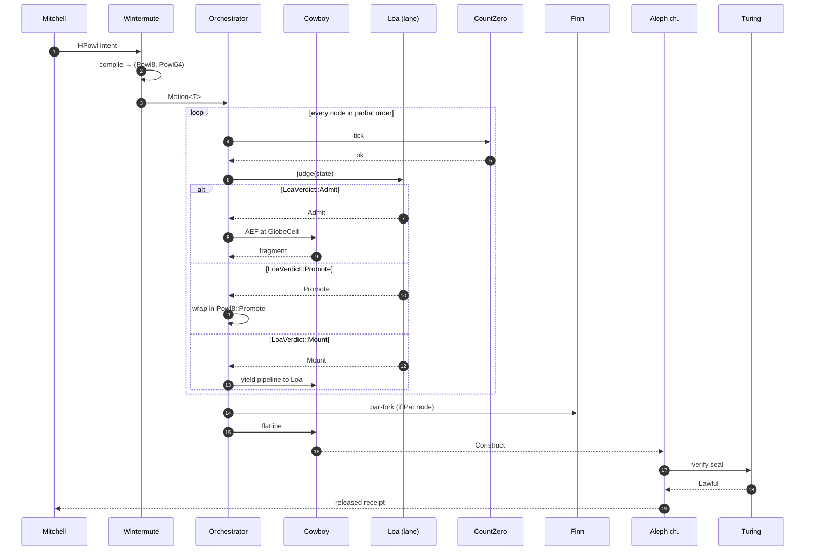

# 45 — POWL8 × POWL64: How the Two Languages Orchestrate Everything

> **Naming note (added retroactively):** This document was written before
> the canonical-names pass in doc 48. Where the text says `Cowboy`, read
> `Runner` (or `fn step(…)`); `Loa` → `LanePolicy`; `Finn` → `Broker` /
> `SpscRing`; `Aleph` → `Snapshot { inner, … }`. The Gibson names are
> literary framing; the canonical names are what the source code uses.
> See `docs/opus/47` and `docs/opus/48` for the full glossary.
> Shipped as code in `unibit-powl` and `unibit-orchestrator` crates
> (doc 58).

## The two POWLs

Everything in the archive so far has used "POWL" as a single language.
That was imprecise. POWL actually has two dialects, one per ladder:

```
POWL8    — the kinetic dialect.
           Talks about work tiers (8¹ … 8⁸).
           Schedules instructions, dispatches superops, ticks CZI.
           Data plane.

POWL64   — the geometric dialect.
           Talks about residence tiers (64¹ … 64³ and beyond).
           Names places, routes between Decks, addresses Alephs.
           Control plane.
```

A motion is a POWL8 program running over a POWL64 address space. The
orchestrator is the translator between them.

---

## POWL8 — the kinetic dialect

```rust
/// POWL8 — a partial-order program over instruction tiers.
///
/// Each node is one of the eight tier classes; edges are must-precede
/// constraints. The compiler (Wintermute) emits the UInstr stream in
/// any total order that respects the partial order.
pub enum Powl8<const T: WorkTier>
where [(); T.words()]:,
{
    /// A single fused admit-commit-emit at tier T.
    Aef(FieldLane, Intensity),

    /// Two subprograms must run in order; the second sees the first's
    /// Scratchpad as its Truth.
    Seq(Box<Powl8<T>>, Box<Powl8<T>>),

    /// Two subprograms run concurrently on different P-cores.
    /// Each owns its own Scratchpad slice; reduce on commit.
    Par(Box<Powl8<T>>, Box<Powl8<T>>),

    /// Choice: run whichever one admits first; losers are rolled back
    /// using the DeltaRing.
    Choice(Box<Powl8<T>>, Box<Powl8<T>>),

    /// Tier change. Up (Promote) is cold; down (Demote) is hot.
    Promote(Box<Powl8<{ next_tier(T) }>>),
    Demote(Box<Powl8<{ prev_tier(T) }>>),

    /// CZI tick and exit if tripped.
    Watchdog,

    /// Loa mount point — delegate this subtree to a named Loa.
    Mounted(LoaName, Box<Powl8<T>>),
}

#[derive(Clone, Copy)]
pub enum Intensity { Feel, Run, Force }
```

**Grammar rule:** every POWL8 node implicitly ticks CZI on entry.
Missing the tick is a compile error (enforced by a derive macro on
`Powl8`). This is how Count Zero's liveness guarantee stays branchless.

---

## POWL64 — the geometric dialect

```rust
/// POWL64 — a partial-order program over residence coordinates.
///
/// Each node is a place in the 64^n address space. Edges are route
/// constraints: to visit node B after A, the route from A's cell to
/// B's cell must be geometrically lawful (see doc 19, globe math).
pub enum Powl64 {
    /// A single attention cell visit. (Domain, Cell, Place) triple.
    Place(GlobeCell),

    /// Sequential geodesic — from this cell to that cell, via the
    /// shortest lawful path. The orchestrator is free to choose the
    /// path; only endpoints are fixed.
    Geodesic(Box<Powl64>, Box<Powl64>),

    /// Parallel occupation — two places held simultaneously. Requires
    /// two Decks or two L1D slots on separate cores.
    Concur(Box<Powl64>, Box<Powl64>),

    /// Branch — visit whichever place admits first at POWL8 level.
    Fork(Box<Powl64>, Box<Powl64>),

    /// Residence change — promote to a warmer cache tier, or demote.
    Residence(ResidenceTier, Box<Powl64>),

    /// Aleph entry — enter a recursive Construct as if it were a
    /// nested globe. Depth-bounded.
    Descend(Box<Powl64>),
}

#[derive(Clone, Copy)]
pub struct GlobeCell {
    pub domain: u16,   // 64 domains
    pub cell:   u16,   // 64² = 4,096 cells per domain
    pub place:  u16,   // 64 places per cell
}
```

**Grammar rule:** every POWL64 edge carries a residence constraint.
Two adjacent places must be co-resident at the same or warmer tier, or
the edge must be an explicit `Residence(...)` promote/demote. This is
how cache-miss discipline becomes syntactic.

---

## The product: a motion is (POWL8, POWL64) lockstep

```rust
/// A Motion is a pair of programs executed in lockstep.
///
/// POWL8 drives the instruction stream; POWL64 drives the address
/// stream. The orchestrator guarantees that at every point in the
/// schedule, the POWL8 instruction is legal for the POWL64 residence.
#[repr(C, align(64))]
pub struct Motion<const T: WorkTier>
where [(); T.words()]:,
{
    pub kinetic:   Powl8<T>,
    pub geometric: Powl64,
    pub budget:    CzBudget,
    pub seal_mode: ReceiptMode,
}
```

**Lockstep invariant:** `kinetic` and `geometric` share the same
partial-order shape. An AEF node in POWL8 must align with a Place node
in POWL64. A Seq in POWL8 must align with a Geodesic in POWL64. A Par
with a Concur. A Choice with a Fork. Violating alignment is a
compile-time error (enforced by the `Motion::new` constructor's type
bounds).

```rust
impl<const T: WorkTier> Motion<T>
where [(); T.words()]:,
{
    pub fn new(kinetic: Powl8<T>, geometric: Powl64) -> Result<Self, MismatchError> {
        if !shape_match(&kinetic, &geometric) { return Err(MismatchError); }
        Ok(Self { kinetic, geometric, budget: CzBudget::default(), seal_mode: ReceiptMode::Fragment })
    }
}
```

---

## The Orchestrator

The Orchestrator is a single struct that consumes a `Motion` and drives
the whole cast — Cowboy, Loa, CZI, Finn, Turing — to a sealed receipt
or a quarantine.

```rust
pub struct Orchestrator<const T: WorkTier>
where [(); T.words()]:,
{
    pub cowboy:      Cowboy<T>,
    pub pantheon:    [Loa; 8],
    pub czi:         CountZero,
    pub finn:        Option<Arc<Finn>>,
    pub aleph_depth: u32,
}

impl<const T: WorkTier> Orchestrator<T>
where [(); T.words()]:,
{
    pub fn run(&mut self, motion: Motion<T>) -> Outcome {
        self.step(&motion.kinetic, &motion.geometric)
    }

    fn step(&mut self, k: &Powl8<T>, g: &Powl64) -> Outcome {
        self.czi.tick();
        if self.czi.is_tripped() { return Outcome::CountZero; }

        match (k, g) {
            // Atomic admission — POWL8::Aef × POWL64::Place.
            (Powl8::Aef(lane, intensity), Powl64::Place(cell)) =>
                self.admit_at(*lane, *intensity, *cell),

            // Sequential — a then b, route geodesic.
            (Powl8::Seq(a, b), Powl64::Geodesic(ga, gb)) => {
                let ra = self.step(a, ga);
                if ra.denied() { return ra; }
                self.step(b, gb)
            }

            // Parallel — each half runs on a separate P-core if
            // possible; Finn brokers their fragment streams.
            (Powl8::Par(a, b), Powl64::Concur(ga, gb)) =>
                self.par_step(a, b, ga, gb),

            // Choice — Loa-directed tie-break; losers roll back via
            // DeltaRing.
            (Powl8::Choice(a, b), Powl64::Fork(ga, gb)) =>
                self.choice_step(a, b, ga, gb),

            // Tier changes — POWL8 and POWL64 tier edges must align.
            (Powl8::Promote(inner), Powl64::Residence(r, place))
                if warmer(*r) => self.promote_step(inner, r, place),
            (Powl8::Demote(inner), Powl64::Residence(r, place))
                if cooler(*r) => self.demote_step(inner, r, place),

            // Watchdog — explicit CZI check (no-op if already ticked).
            (Powl8::Watchdog, _) => Outcome::Admitted(0),

            // Mounted — hand this subtree to the named Loa.
            (Powl8::Mounted(name, inner), g_any) =>
                self.mount_step(*name, inner, g_any),

            // Aleph descent — recurse into a nested Construct.
            (_, Powl64::Descend(inner)) => self.descend(k, inner),

            _ => Outcome::Mismatch,
        }
    }
}

pub enum Outcome {
    Admitted(u128),     // fragment
    Denied(u128, IceKind),
    Mismatch,
    CountZero,
    Mounted(LoaName),
    Quarantined,
}
```

---

## How the cast fits into the Orchestrator

### Cowboy — the executor at one `Aef × Place` node

At every leaf pair `(Aef, Place)`, the Cowboy runs a single
admit-commit-emit over its Straylight page. One cycle.

### Loa — the field daemons at every lane check

Before emitting the AEF, the Orchestrator polls the lane's Loa:

```rust
fn admit_at(&mut self, lane: FieldLane, intensity: Intensity, cell: GlobeCell) -> Outcome {
    let loa = &mut self.pantheon[lane as usize];
    let state = self.cowboy.observe_at(cell);
    match loa.judge(state) {
        LoaVerdict::Admit   => Outcome::Admitted(self.cowboy.run_at(lane, cell)),
        LoaVerdict::Warn    => { self.cowboy.strike(); Outcome::Admitted(self.cowboy.run_at(lane, cell)) }
        LoaVerdict::Deny    => Outcome::Denied(0, IceKind::White),
        LoaVerdict::Promote => Outcome::Denied(0, IceKind::Gray),  // caller wraps in Promote
        LoaVerdict::Mount   => Outcome::Mounted(loa.name),
    }
}
```

### CZI — at every `step` call

The first line of every recursive `step` is `self.czi.tick()`. Missing
this is a type error because `Powl8::Watchdog` is auto-inserted by the
POWL8 derive macro at every boundary.

### Finn — at every `Par × Concur` fork

```rust
fn par_step(&mut self, a: &Powl8<T>, b: &Powl8<T>, ga: &Powl64, gb: &Powl64) -> Outcome {
    let finn = self.finn.as_ref().expect("Par requires Finn");
    let left  = spawn_on_core(2, || self.clone().step(a, ga));
    let right = spawn_on_core(3, || self.clone().step(b, gb));
    let la = left.join();
    let ra = right.join();
    finn.seal_pair(la, ra)
}
```

### Aleph — at every `Descend`

```rust
fn descend(&mut self, k: &Powl8<T>, inner: &Powl64) -> Outcome {
    self.aleph_depth += 1;
    if self.aleph_depth > Aleph::MAX_DEPTH { return Outcome::Quarantined; }
    let r = self.step(k, inner);
    self.aleph_depth -= 1;
    r
}
```

### Turner, Marly, Boxmaker, Virek — side-plane

The orchestrator does not call these directly on the hot path. They
live on E-cores:

- **Turner** consumes sealed Alephs from the Orchestrator's output
  channel and moves them across zaibatsu.
- **Marly** walks the receipt chain the Orchestrator has produced,
  attributes fragments.
- **Boxmaker** consumes orphaned fragments (from flatlined cowboys)
  and assembles new Alephs.
- **Virek** takes one Construct and re-admits it in an infinite loop
  on its own E-core, feature-gated.

---

## The orchestration diagram



---

## The orchestration sequence



---

## Why POWL8 and POWL64 must be separate

The temptation is to write one language. Three reasons to keep them
apart:

1. **Different partial orders.** POWL8's partial order is over *time*
   (seq/par/choice). POWL64's partial order is over *space*
   (geodesic/concur/fork). Fusing them hides the cache-residence
   constraint inside the time dimension, which is how you accidentally
   schedule an AEF against a cold address.

2. **Different compilers.** POWL8 is compiled by MuStar against the
   UInstr opcode space (doc 40). POWL64 is compiled by the router
   against the globe graph (doc 19). One compiler per dialect keeps
   each optimizer honest.

3. **Different failure modes.** A POWL8 failure is a denial (admission
   rejected by a Loa). A POWL64 failure is a miss (cell not resident,
   geodesic not lawful). Conflating the two hides which one tripped.

The lockstep invariant gives you the benefits of one language without
the costs.

---

## The full dependency stack

```
┌────────────────────────────────────────┐
│ HPowl intent                (Mitchell) │  design
├────────────────────────────────────────┤
│ Motion<T> = (Powl8, Powl64) (Wintermute)│  compile
├────────────────────────────────────────┤
│ Orchestrator<T>             (dteam)    │  schedule
├────────────────────────────────────────┤
│ Cowboy + Loa + CZI + Finn   (matrix,   │  execute
│                              count-zero)│
├────────────────────────────────────────┤
│ UInstr stream               (unibit-isa)│  dispatch
├────────────────────────────────────────┤
│ admit_eight / commit_tile   (unibit-hot)│  hot kernel
├────────────────────────────────────────┤
│ Straylight pinned L1D       (unibit-phys│  residence
│                              + hardware)│
├────────────────────────────────────────┤
│ Construct → Aleph → Turing  (unios)    │  release
└────────────────────────────────────────┘
```

Each layer reads only one layer down. POWL8 never reaches into
`admit_eight`; `admit_eight` never sees POWL64. The Orchestrator is the
only place the two dialects meet, and it treats them as a pair of
programs in lockstep — never as one.

---

## The sentence

**POWL8 is the kinetic dialect that schedules one admit-commit-emit per
cycle; POWL64 is the geometric dialect that routes across the globe;
the Orchestrator runs them in lockstep, turning Mitchell's HPowl intent
into a Cowboy's fragment stream by polling eight Loa at every Place,
ticking the CountZero watchdog at every edge, handing Par nodes to
Finn, Aleph descents to a depth counter, and sealed Constructs to the
Turing Police — and that lockstep is the orchestration of every crate
in the stack.**
