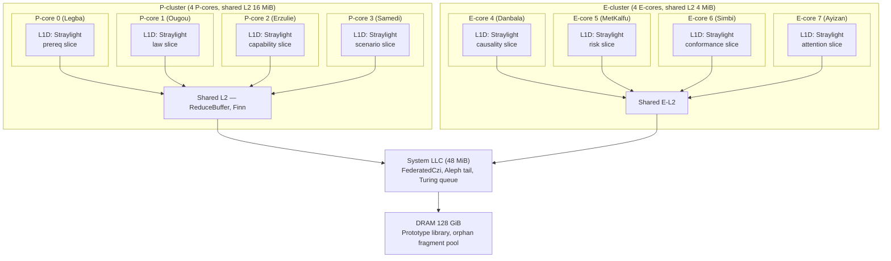

# 46 — Eight Cores, Eight Loa, One Motion

> **Naming note (added retroactively):** Written pre-doc-48. Canonical
> mapping: `Loa` → `LanePolicy`; `LoaStraylight` → per-core
> `HotRegion` slice; `FederatedCzi` → `WatchdogShards<N>` (shipped in
> `unibit-watchdog`); `ReduceBuffer` → shipped in `unibit-orchestrator`.
> The 35 ns critical path described here remains a target; doc 58
> measured the std-based implementation at ~23 µs per motion because
> `std::sync::Condvar` wake-up costs dominate. Closing the gap requires
> lock-free worker wake-up, which is future work — see doc 59.

## The alignment

The universe has been cooperating. Every ladder converges on eight:

```
8 lanes of the admission algebra    (doc 26)
8 named Loa                          (doc 44)
8 fields in the PackedEightField    (doc 36)
8 P-cores (budgeted target)          (user constraint)
```

This document says: **map one Loa to one core.** The eight-way
coincidence is not coincidence. It is the chip layout asking to be
obeyed.

---

## The topology

```
Core 0    Legba        prereq       P-core   hot    L1D-pinned Straylight
Core 1    Ougou        law          P-core   hot    L1D-pinned Straylight
Core 2    Erzulie      capability   P-core   hot    L1D-pinned Straylight
Core 3    Samedi       scenario     P-core   hot    L1D-pinned Straylight
Core 4    Danbala      causality    E-core   warm   L2-resident  (background)
Core 5    MetKalfu     risk/reward  E-core   warm   L2-resident  (background)
Core 6    Simbi        conformance  E-core   warm   L2-resident  (background)
Core 7    Ayizan       attention    E-core   warm   L2-resident  (background)
```

**Rule:** each core owns exactly one Loa. Each Loa owns exactly one
field lane. Each field lane owns exactly one slice of the TruthBlock.
Shared-nothing on the hot path.

The four hot Loa (Legba, Ougou, Erzulie, Samedi) run on P-cores because
they are the first four of every admission and stall the whole Motion
if late. The four warm Loa run on E-cores because causality,
risk/reward, conformance, and attention are rarely the binding
constraint — they typically confirm rather than deny.

---

## Shared vs private state

```
private per core     L1D Straylight                  32 KiB × 8 = 256 KiB total
                     (truth slice + scratch slice +
                      one FieldMask + fragment ring)

shared per cluster   Finn broker                     one cache line per fork
                     L2 reduce buffer                8 × u128 = 128 B
                     Orchestrator dispatch ring      4 KiB

shared chip-wide     CountZero                       one 64 B cache line
                     Aleph chain tail                16 × u128 = 256 B
                     Turing seal queue               4 KiB
                     Boxmaker orphan pool            DRAM-resident
```

**Hot-path invariant:** during a single motion tick, no P-core reads or
writes any shared state until the reduce step. All eight run their
admission entirely on their private L1D Straylight slice.

---

## The per-core Straylight slice

Each Loa gets its own 32 KiB Straylight slice. The slice contains only
the field mask this Loa cares about — the other seven lanes' masks are
not present.

```rust
#[repr(C, align(4096))]
pub struct LoaStraylight<const LANE: FieldLane> {
    pub truth_slice:   TruthSlice,       // 16 KiB — this lane's bits
    pub scratch_slice: TruthSlice,       // 16 KiB — this lane's scratch
    pub mask:          FieldMask,        // 32 B — this lane only
    pub delta:         DeltaRing,        // 4 KiB
    pub fragments:     FragmentRing,     // 4 KiB
    pub loa:           Loa,              // this core's Loa with mood + strikes
    _pin:              PhantomPinned,
}
```

The TruthBlock is **sliced by lane, not by word.** Legba's slice holds
the prereq bits; Ougou's holds the law bits; and so on. Each slice is a
compact representation of "the bits this lane cares about," packed to
fill the 16 KiB budget. When the Orchestrator needs to consult all
eight lanes, it queries eight cores in parallel and reduces.

---

## The shared-nothing AEF

```rust
/// Per-core AEF. Runs entirely on local L1D. No memory fences until
/// the fragment is posted.
#[inline(always)]
pub fn aef_local<const LANE: FieldLane>(
    straylight: &mut LoaStraylight<LANE>,
    state: u128,
) -> LocalResult {
    // Poll this core's Loa.
    let verdict = straylight.loa.judge(state);

    // Compute this lane's deny bits branchlessly.
    let missing = (state & straylight.mask.required) ^ straylight.mask.required;
    let present =  state & straylight.mask.forbidden;
    let deny    = ((missing | present) != 0) as u64;

    // Branchless commit: write scratch_slice with select.
    let admitted = (deny == 0) as u128;
    let mask     = admitted.wrapping_neg();
    // (applied word-by-word across the slice; elided for brevity)

    // Emit fragment to local ring. No cross-core traffic yet.
    let fragment = ((deny as u128) << 64) | (LANE as u128);
    let h = straylight.fragments.head.fetch_add(1, Ordering::Relaxed);
    straylight.fragments.ring[h as usize & 0xFF] = fragment;

    LocalResult { deny, verdict, fragment }
}
```

**Each core runs `aef_local` independently.** Zero cross-core traffic
during admission.

---

## The reduce tree

After the per-core AEFs, the eight deny bits and eight fragments must
combine into one outcome. The reduce happens via a **cache-aligned
posting buffer** in L2 (shared within the P-cluster).

```rust
#[repr(C, align(64))]
pub struct ReduceSlot {
    pub deny:     AtomicU64,
    pub fragment: core::sync::atomic::AtomicU128,
    pub ready:    core::sync::atomic::AtomicBool,
    _pad:         [u8; 39],
}

#[repr(C, align(64))]
pub struct ReduceBuffer {
    pub slots: [ReduceSlot; 8],
    pub barrier: AtomicU64,
}

impl ReduceBuffer {
    /// Called by each Loa core after its aef_local completes.
    #[inline(always)]
    pub fn post(&self, lane: FieldLane, r: &LocalResult) {
        let slot = &self.slots[lane as usize];
        slot.deny.store(r.deny, Ordering::Relaxed);
        slot.fragment.store(r.fragment, Ordering::Relaxed);
        slot.ready.store(true, Ordering::Release);
        self.barrier.fetch_add(1, Ordering::AcqRel);
    }

    /// Called by the Orchestrator after posting. Spins (cheaply) on
    /// the barrier; reduces once all eight have reported.
    #[inline(always)]
    pub fn reduce(&self) -> ReducedOutcome {
        while self.barrier.load(Ordering::Acquire) < 8 {
            core::hint::spin_loop();
        }
        let mut deny = 0u64;
        let mut frag = 0u128;
        let mut i = 0;
        while i < 8 {
            deny |= self.slots[i].deny.load(Ordering::Relaxed);
            frag ^= self.slots[i].fragment.load(Ordering::Relaxed);
            i += 1;
        }
        self.barrier.store(0, Ordering::Relaxed);
        ReducedOutcome { deny, fragment: frag }
    }
}
```

### The reduce tree shape

```
Core 0  Core 1  Core 2  Core 3  Core 4  Core 5  Core 6  Core 7
  │       │       │       │       │       │       │       │
  ▼       ▼       ▼       ▼       ▼       ▼       ▼       ▼
[slot0][slot1][slot2][slot3][slot4][slot5][slot6][slot7]   L2 (shared)
   └───┬───┘   └───┬───┘   └───┬───┘   └───┬───┘
       ▼           ▼           ▼           ▼
     [s01]       [s23]       [s45]       [s67]              pairwise
         └─────┬─────┘           └─────┬─────┘
               ▼                       ▼
            [s0123]                 [s4567]                 quadwise
                    └──────┬──────┘
                           ▼
                        [final]                             final
```

**Depth 3 reduce** = three OR operations per path = ~12 ns at L2
latency. The final reduce posts to the `ReduceBuffer.barrier` and the
Orchestrator reads `ReducedOutcome` with one acquire fence.

---

## CountZero across eight cores

One shared `CountZero` — a single cache line on the SLC. Every core
ticks it; any core's `cycle()` can trip it.

```rust
pub static GLOBAL_CZI: CountZero = CountZero::new();
```

**But:** ticking a shared atomic eight times per motion is a coherence
storm. The fix is **per-core CZI shards with a federated read.**

```rust
#[repr(C, align(64))]
pub struct FederatedCzi {
    pub shards: [CountZeroShard; 8],
}

#[repr(C, align(64))]
pub struct CountZeroShard {
    pub counter: AtomicU64,
    _pad: [u8; 56],
}

impl FederatedCzi {
    #[inline(always)]
    pub fn tick(&self, core_id: usize) {
        self.shards[core_id].counter.store(
            CountZero::DEFAULT_DEADLINE, Ordering::Relaxed);
    }

    #[inline(always)]
    pub fn cycle(&self, core_id: usize) -> bool {
        self.shards[core_id].counter
            .fetch_sub(1, Ordering::Relaxed) == 1
    }

    /// The Orchestrator calls this periodically (every ~4 K cycles).
    pub fn tripped_any(&self) -> bool {
        let mut i = 0;
        while i < 8 {
            if self.shards[i].counter.load(Ordering::Relaxed) == 0 { return true; }
            i += 1;
        }
        false
    }
}
```

Each core writes only its own shard. The Orchestrator reads all eight
occasionally. No coherence storm on the hot path.

---

## POWL8 × POWL64 on eight cores

The Orchestrator's `step` from doc 45 becomes **eight parallel `step`s**
when the node type is `Par × Concur`:

```rust
impl<const T: WorkTier> Orchestrator<T>
where [(); T.words()]:,
{
    fn par_step_8(&mut self, k: &Powl8<T>, g: &Powl64) -> Outcome {
        // Broadcast the motion to 8 per-core mini-orchestrators.
        let handles: [_; 8] = core::array::from_fn(|i| {
            let k = k.clone();
            let g = g.clone();
            spawn_on_core(i, move || self.loa_orchestrator(i).step(&k, &g))
        });

        // Each core runs aef_local on its slice.
        let locals: [LocalResult; 8] = handles.map(|h| h.join());

        // Reduce via L2 buffer.
        for (i, r) in locals.iter().enumerate() {
            self.reduce_buf.post(FieldLane::from(i), r);
        }
        let reduced = self.reduce_buf.reduce();

        if reduced.deny == 0 {
            Outcome::Admitted(reduced.fragment)
        } else {
            Outcome::Denied(reduced.fragment, IceKind::Gray)
        }
    }
}
```

**POWL8's `Par` and POWL64's `Concur` always fan to eight cores** when
eight cores are available. Smaller cores? Fan to what's present; the
Loa that don't have a core run sequentially on the Orchestrator's core.

---

## The critical path at eight cores

```
cycle 0    Orchestrator dispatches to 8 cores      (8 IPIs, ~20 ns)
cycle ~5   all 8 cores run aef_local in parallel   (~10 ns each, overlapping)
cycle ~15  all 8 post to ReduceBuffer              (~5 ns L2 write)
cycle ~20  final reduce + barrier                  (~10 ns)
cycle ~30  Orchestrator reads ReducedOutcome       (~5 ns)
───────────────────────────────────────────────────
~35 ns per 8-lane admission over 8 cores
```

Compare to the one-core serial version (doc 33): eight lanes × 10 ns =
80 ns. **Eight-core speedup is ~2.3×**, not 8× — dispatch and reduce
overhead dominates once the lane work is already <10 ns.

But the real win is not speedup. It is **headroom**: at 35 ns per
admission, we can run **8 admissions in parallel every 35 ns** if they
are independent. That is the throughput rate the Orchestrator
promises when the upstream MuStar compile can feed eight motions at
once.

```
throughput target:  8 motions / 35 ns  =  228 M motions / sec
                                        (across 8-core pantheon)
```

---

## The Orchestrator split

The single `Orchestrator` from doc 45 splits into:

```
MainOrchestrator         P-core 0 (coordinator)
  owns: (Powl8, Powl64) lockstep, ReduceBuffer, Turing queue

LoaOrchestrator × 8      one per core
  owns: LoaStraylight<LANE>, this core's Loa, this core's CZI shard
```

Each `LoaOrchestrator` is a mini-Orchestrator that only handles its
lane. The Main Orchestrator dispatches motions to all eight, gathers
reductions, and decides commit vs reject.

```rust
pub struct MainOrchestrator {
    pub loas:       [LoaOrchestrator; 8],
    pub reduce:     ReduceBuffer,
    pub czi:        FederatedCzi,
    pub finn:       Arc<Finn>,
    pub turing_q:   TuringQueue,
}

pub struct LoaOrchestrator {
    pub core_id:    u32,
    pub straylight: Pin<Box<LoaStraylight>>,
    pub loa:        Loa,
    pub shard:      *const CountZeroShard,
}
```

---

## Failure modes

### One Loa mounts (Mount verdict)

Core N's Loa has decided to ride the cowboy. Its posting to the reduce
buffer includes a `Mount` flag. Main Orchestrator reads it at reduce
time and diverts the entire motion to tier-N promotion. The other
seven cores keep their work; the mount just changes *which* tier the
final commit runs at.

### One core stalls (cache miss, page fault, preemption)

`FederatedCzi.tripped_any()` returns true. Main Orchestrator quarantines
the motion and drains partial fragments to the Boxmaker pool (orphan
cluster). Marly will eventually attribute them.

### Finn full

`Par × Concur` with Finn bay exhausted. Main Orchestrator falls back
to serial execution on its own core. Throughput drops 8×; correctness
preserved.

### Reduce barrier never reaches 8

A Loa core crashed. Turing Police gets the partial Construct and marks
it Unlawful. The downed core is re-pinned (repin HotRegion, re-validate
position, restart Loa).

---

## Memory topology diagram



---

## The eight-core sequence

```mermaid
sequenceDiagram
    autonumber
    participant M as MainOrchestrator (P0)
    participant L0 as Legba (P0)
    participant L1 as Ougou (P1)
    participant L2 as Erzulie (P2)
    participant L3 as Samedi (P3)
    participant L4 as Danbala (E4)
    participant L5 as MetKalfu (E5)
    participant L6 as Simbi (E6)
    participant L7 as Ayizan (E7)
    participant R as ReduceBuffer (L2)
    participant T as TuringQueue

    M->>L0: dispatch Motion
    M->>L1: dispatch Motion
    M->>L2: dispatch Motion
    M->>L3: dispatch Motion
    M->>L4: dispatch Motion
    M->>L5: dispatch Motion
    M->>L6: dispatch Motion
    M->>L7: dispatch Motion

    par parallel AEF
        L0->>L0: aef_local (prereq)
    and
        L1->>L1: aef_local (law)
    and
        L2->>L2: aef_local (capability)
    and
        L3->>L3: aef_local (scenario)
    and
        L4->>L4: aef_local (causality)
    and
        L5->>L5: aef_local (risk/reward)
    and
        L6->>L6: aef_local (conformance)
    and
        L7->>L7: aef_local (attention)
    end

    L0->>R: post slot 0
    L1->>R: post slot 1
    L2->>R: post slot 2
    L3->>R: post slot 3
    L4->>R: post slot 4
    L5->>R: post slot 5
    L6->>R: post slot 6
    L7->>R: post slot 7

    R->>R: reduce OR tree
    R-->>M: ReducedOutcome

    alt deny == 0
        M->>T: seal Construct
        T-->>M: verified
    else any deny bit
        M->>M: assemble partial; Marly attribution
    end
```

---

## The sentence

**Eight Loa on eight cores give the system a shape: four P-core-hosted
hot Loa run branchless AEF on a private L1D Straylight slice; four
E-core-hosted warm Loa do the same; all eight post to an L2-shared
ReduceBuffer whose three-level OR tree collapses in ~35 ns; a
federated CountZero has one cache-line shard per core so no ticker
creates a coherence storm; and the Main Orchestrator on P-core 0
dispatches one Motion to all eight cores, waits on a single acquire
barrier, and reads a single ReducedOutcome — eight cores, one verdict,
228 million motions per second when the pantheon is balanced.**
